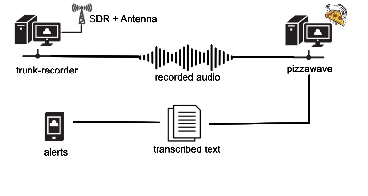
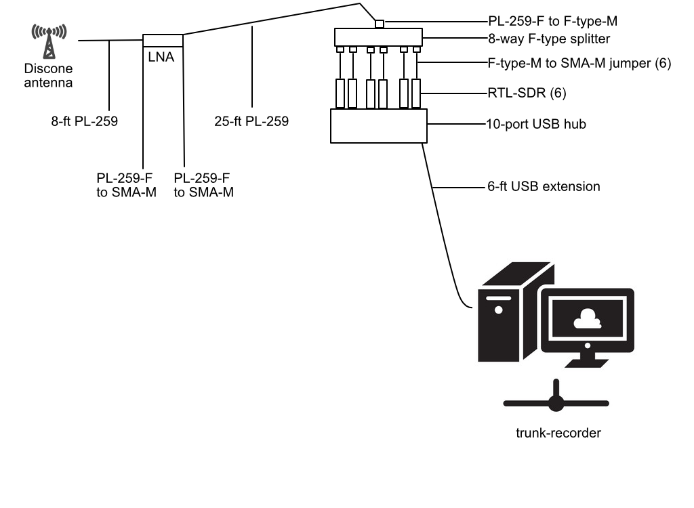

# Introduction
 `pizzawave` is a set of cross-platform .NET applications and tools for processing audio data streamed by the [callstream plugin](https://github.com/lilhoser/callstream) of [trunk-recorder](https://github.com/robotastic/trunk-recorder). The audio data consists of calls recorded by trunk-recorder from conventional and trunked radio systems, such as local fire/rescue/EMS. `pizzawave` tooling transcribes these calls to text using [OpenAI's Whisper AI model](https://openai.com/research/whisper) as exposed through [whisper.net toolchain](https://github.com/sandrohanea/whisper.net). Among other features, the application allows you to monitor and set alerts for keywords of interest.

The `pizzawave` Visual Studio solution consists of these tools:
* **pizzaui** - Windows-only .NET Forms UI application ([README](../pizzaui/README.md))
* **pizzapi** - Cross-platform Avalonia UI for Linux/macOS/Windows ([README](pizzapi.md))
* **pizzacmd** - Cross-platform .NET command line application ([README](../pizzacmd/README.md))
* **pizzalib** - Cross-platform .NET library used by all applications ([README](../pizzalib/README.md))

## Quick Start

1. **Install .NET 9.0** - Download from [dotnet.microsoft.com](https://dotnet.microsoft.com/download/dotnet/9.0)
2. **Clone and build** - `git clone` this repo, then `dotnet build`
3. **Configure** - Run the app once to generate default settings, then edit `settings.json`
4. **Connect** - Configure trunk-recorder with callstream plugin to send audio to your pizzawave instance

See [Quick Start Guide](quickstart.md) for detailed instructions.

# Requirements

Regardless of whether you choose to use the UI, command line application, or roll your own application that uses the cross-platform library, you will need to observe these requirements:

* A Linux system running trunk-recorder with the [callstream plugin](https://github.com/lilhoser/callstream) configured correctly
* An operating system capable of running .NET 9.0 runtime (e.g, Win, Lin or Mac)
    * The pizzawave tools currently target .NET 9.0, but if you are building from source, earlier versions should work as well.
* The requirements as specified in the tool of choice:
    * `pizzaui`: Windows-only | [README](../pizzaui/README.md)
    * `pizzapi`: Cross-platform (Linux/macOS/Windows) | [README](pizzapi.md)
    * `pizzacmd`: All supported platforms | [README](../pizzacmd/README.md)
    * `pizzalib`: All supported platforms | [README](../pizzalib/README.md)

# Architecture



As shown in the illustration, pizzawave uses a `server`-`client` model, where the server is either the pizzawave UI (`pizzaui` on Windows, `pizzapi` on Linux/macOS) or command line application (`pizzacmd`), and the client is one or more trunk-recorder systems. This design allows pizzawave to accept radio transmissions from multiple instances of trunk-recorder, which might be recording audio data from separate SDR device arrays monitoring broadcasts from different trunked radio systems.

Pizzawave listens for audio data from trunk-recorder systems, translates the data into textual transcriptions using Whisper AI, and processes alert rules to notify you of interesting broadcasts.

Note that it is possible (and even desirable) to run `pizzawave` on the same system running trunk-recorder. In this setup, you would of course need to use `pizzacmd` or `pizzapi` which are cross-platform.

# Building from Source

See [Building Guide](building.md) for detailed instructions for all platforms.

## Quick Build Reference

### Windows
Use Visual Studio Community Edition (free) or `dotnet build` from command line.

### Mac and Linux

* [Install .NET 9.0](https://learn.microsoft.com/en-us/dotnet/core/install/)
* Clone this repo
* CD into repo source
* Run `dotnet build --runtime <RID>` where [RID can be found here](https://learn.microsoft.com/en-us/dotnet/core/rid-catalog)

Build output is organized in the `artifacts/` folder by project.

### Developing on Linux/Mac

Use VS Code with the C# extension. To debug, use a launch configuration such as:

```
{
    "version": "0.2.0",
    "configurations": [
        {
            "type": "coreclr",
            "request": "launch",
            "preLaunchTask": "dotnet: build /home/<USER>/pizzawave/pizzacmd/pizzacmd.csproj",
            "program": "/home/<USER>/pizzawave/artifacts/pizzacmd/bin/Debug/net9.0/pizzacmd",
            "name": "Test pizzawave",
            "args": ["--talkgroups=/home/<USER>/my_talkgroups.csv"]
        }
    ]
}
```

# Configuration

Pizzawave configuration lives in `<user profile>/pizzawave/settings.json`. Locations by platform:
* **Windows**: `C:\Users\<user>\AppData\Roaming\pizzawave\settings.json`
* **Linux**: `~/.config/pizzawave/settings.json`
* **macOS**: `~/.config/pizzawave/settings.json`

Please see the READMEs for each individual tool you are using for what settings options are available and how to use them in your setup. `pizzaui` and `pizzapi` include a graphical settings editor, but you can always create the file manually. If you run the UI or command line application without a settings file, the default one will be created in the location specified above.

_Important_: Make sure your `trunk-recorder` system is configured to connect to the right IP address. In an exotic scenario where you're running `pizzacmd` from both a Windows host system and a WSL2 Ubuntu system, the host system and the virtual Ubuntu system will have different IP addresses! In this scenario, you might forget to set the correct IP address on the `trunk-recorder` system, and only one of these machines will receive audio data, while the other might be stuck on this:

```
StreamServer Verbose: 1 : 3/22/2024 3:39 PM: Listening on port 9123
```

# Deployment

See [Deployment Guide](deployment.md) for detailed instructions on deploying to:
* **WSL2** - Test on Windows using Windows Subsystem for Linux
* **Raspberry Pi** - Deploy using .deb package for ARM64 devices
* **Linux servers** - Run as a systemd service

## Quick Deploy Reference

### Raspberry Pi (ARM64)
```bash
sudo dpkg -i pizzapi_*.deb
sudo apt-get install -f  # Install dependencies
```

### WSL2 (x64)
```bash
sudo dpkg -i pizzapi_*.deb
sudo apt-get install -f  # Install dependencies
```

# Running

## Live captures

To create a live audio capture within PizzaUI, navigate to `File`->`Call Manager`->`Start`. This will connect to the `callstream` plugin running on your configured trunk-recorder system.

Whether you use `pizzaui`, `pizzacmd` or your own .NET application built on `pizzalib`, all calls streamed in real-time from a `callstream` server will be stored in a `capture`, which is a folder in the root working directory (`<user profile>\pizzawave\`). When you stop your live session with the `callstream` server, the `capture` is ended and a new capture will be created if you reconnect later. Older captures can be loaded in `pizzawave` tooling later by opening the `capture` folder directly.

The `capture` folder consists of:

* `calljournal.json`: Each line contains a JSON-serialized `TranscribedCall` structure. The audio data can be linked to this record via the `Location` field.
* `<timestamp>.mp3`: call audio files

The call journal can be deserialized into a list of `TranscribedCall` objects using `NewtonSoft.Json` as follows:

```
var lines = File.ReadAllLines("calljournal.json");
var calls = new List<TranscribedCall>();
foreach (var line in lines)
{
    var call = (TranscribedCall)JsonConvert.DeserializeObject(line, typeof(TranscribedCall))!;
    calls.Add(call);
}
```

## Offline captures

The [callstream plugin](https://github.com/lilhoser/callstream) allows you to redirect call records to an SFTP server. These call records are stored on disk in a raw binary format identical to data streamed to a live capture. These are referred to as `offline captures` in pizzawave parlance. The `callstream` plugin uploads offline capture records to the SFTP server according to the following naming and organization convention:
* YEAR
    * MONTH
       * DAY
           * HOUR
               * YEAR-MONTH-DAY.HOURMINUTESECOND.bin.bin

Offline captures can be loaded at any directory level by `pizzaui` or by the following code (`pizzalib` required):

```
var targets = Directory.GetFiles(offlineDir, "*.*", SearchOption.AllDirectories).ToList();
foreach (var file in targets)
{
    using (var stream = new MemoryStream(File.ReadAllBytes(file)))
    {
        var wavStream = new WavStreamData(m_Settings);
        var cancelSource = new CancellationTokenSource();
        var result = await wavStream.ProcessClientData(stream, cancelSource);
        if (result)
        {
            var call = new TranscribedCall();
            call.UniqueId = Guid.NewGuid();

            try
            {
                var jsonObject = wavStream.GetJsonObject();
                call.StopTime = jsonObject["StopTime"]!.ToObject<long>();
                call.StartTime = jsonObject["StartTime"]!.ToObject<long>();
                call.CallId = jsonObject["CallId"]!.ToObject<long>();
                call.Source = jsonObject["Source"]!.ToObject<int>();
                call.Talkgroup = jsonObject["Talkgroup"]!.ToObject<long>();
                call.PatchedTalkgroups = jsonObject["PatchedTalkgroups"]!.ToObject<List<long>>();
                call.Frequency = jsonObject["Frequency"]!.ToObject<double>();
                call.SystemShortName = jsonObject["SystemShortName"]!.ToObject<string>();
            }
            catch (Exception ex)
            {
                var err = $"Unable to parse JSON data: {ex.Message}";
                throw new Exception(err);
            }
            
            try
            {
                //
                // Transcribe the wav audio
                //
                call.Transcription = await m_Whisper.TranscribeCall(wavStream.GetRawStream());
                wavStream.RewindStream();
            }
            catch (Exception ex)
            {
                throw; // back up to worker thread
            }
        }
    }
}
```

Offline captures are slow to load, because many audio recordings are being transcribed at one time (whereas in live mode, calls are transcribed as they are received over the air). As a result, after an offline capture is loaded, the contained call records are also exported to a live capture for easier retrieval later.

## Alerts when loading captures

Alerts are NOT processed when older captures are loaded, for both live and offline captures. You can see what alerts would match a loaded capture by navigating to `View`->`Show alert matches only`.

# Other

## Diagnostics

All logs, model files, settings files, and alert data can be found in your operating system's user profile folder.
* `alerts` - this folder contains WAV data for matched alerts
* `Logs` - this folder contains all log files
* `model` - this folder contains all auto-downloaded GGML model files

If your logs are not detailed enough, adjust the `TraceLevelApp` parameter in `settings.json`.

## What's up with the name?
I dunno, I like pizza and Teenage Mutant Ninja Turtles, so it seemed to work.

## My trunk-recorder/SDR setup

For those that are new to SDRs (also check out this [Getting Started Guide](getting_started_with_sdrs.md)), I thought it might be helpful to show how I setup my SDR array:



The discone antenna is mounted about 20 feet in the air above my workshop, using a 1.5" PVC mast and a sturdy set of stand-off mounts. I have a short 8-ft run of UHF cable that brings the signal indoors to a wall-mounted, inline amplifier, which then connects to a 25-ft run of UHF cable that splits the signal 6-ways to an SDR array. I did my best to match up the impedence among all these cables and adapters to 50-ohm. For a similar rig that favors transmission insteead of Rx-only, 75-ohm would be better.

Here is the parts list, all of which can be purchased on Amazon:
* [Discone antenna](https://www.amazon.com/dp/B00QVPGKHU)
* [Skywalker 12" stand-off brace mounts for mast](https://www.amazon.com/dp/B008USJ1CW)
* [PL-259/UHF cable](https://www.amazon.com/dp/B08F74ZJ8B)
* [RTL-SDR Blog LNA](https://www.amazon.com/dp/B07G14Q6XX)
* [PL-259/UHF-F to F-type-M](https://www.amazon.com/dp/B0C36VGYKZ)
* [PL-259/UHF-F to SMA-M](https://www.amazon.com/dp/B00CVQOOAI)
* [DirecTV F-type 8-way splitter](https://www.amazon.com/gp/product/B0045DVIP4)
* [F to SMA jumpers](https://www.amazon.com/gp/product/B09GVSHQJX)
* Other adapters you might need: [SMA adapters](https://www.amazon.com/dp/B07FDHBS19)), [F-type to SMA adapters](https://www.amazon.com/dp/B0814BQHJN) and [these too](https://www.amazon.com/dp/B09KB9RM6Q)
* [RTL-SDR v4 dongles](https://www.amazon.com/dp/B0CD745394)
* [10-port USB hub](https://www.amazon.com/dp/B098KZMR4J) with sufficient port spacing for side-by-side RTL-SDR dongles!
* [Monoprice USB extension cable](https://www.amazon.com/dp/B00AA0U08M)

Also, here are some sample configurations to get you started:
* [trunk-recorder with callstream and two SDRs](sample-config-callstream.json)
* [trunk-recorder with callstream, openMhz and two SDRs](sample-config-openmhz.json) - requires an openmhz account and related API key

See [Configuration Examples Explained](config-examples-explained.md) for a detailed walkthrough of these settings.

## Resources

* If you're struggling to setup trunk-recorder, I recommend [this extremely well-written intro guide](https://www.andrewmohawk.com/2020/06/12/trunked-radio-a-guide/).
* Use [this tool](https://alertapi.alertpage.net/sdr/) to calculate some trunk-recorder configuration parameters like center frequency and to understand how many SDR dongles you will need to cover channels of interest
* Other trunk-recorder related projects performing transcription:
    * [trunk-transcribe](https://github.com/CrimeIsDown/trunk-transcribe)
    * [trunk-recorder-stack](https://github.com/ge0metrix/trunk-recorder-stack)
    * [tr-uploader](https://github.com/TheGreatCodeholio/icad_tr_uploader) and [icad_tone_detection_api](https://github.com/TheGreatCodeholio/icad_tone_detection_api)