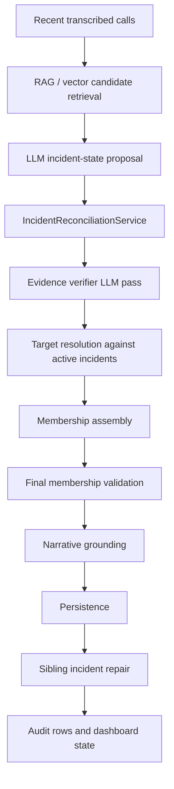

# Incident Architecture Diagnosis and V2 Redesign

Date: 2026-06-18

This document diagnoses the current PizzaWave incident-generation architecture and
sets the direction for a side-by-side v2 pipeline. It is intentionally blunt:
the current incident stack drifted into a regex-and-guard accretion pattern. The
LLM is often producing useful hypotheses, but the server-side acceptance logic is
spread across too many layers, so each observed false join or false reject became
another local rule.

The target direction is not "more regex, better regex." The target is a
structured evidence pipeline where the LLM predicts grounded claims with source
spans, and the server owns deterministic guardrails, conflict checks, persistence,
and replay-measured acceptance.

## Empirical Baseline

Observed from the repo and OT quality endpoints on 2026-06-18:

- The initial diagnosis input cited about 223 regex or pattern-use hits in
  `pizzad`.
- A current direct repo scan after the 2026-06-18 bake shows the problem is at
  least that large:
  - 310 direct regex API references using `Regex`, `GeneratedRegex`, or
    `RegexOptions`.
  - 360 hits when `IsMatch` and `Matches(...)` call sites are included.
- The densest current regex and pattern concentrations are:
  - `IncidentCandidateValidator`: 68 direct regex API references, 104 including
    `IsMatch`.
  - `TranscriptLocationService`: 53 hits.
  - `AutomaticInsightsService`: 39 direct regex API references.
  - `CallAnchorExtractionService`: 36 direct regex API references, 37 including
    `IsMatch`.
  - `IncidentNarrativeGrounder`: 25 direct regex API references, 26 including
    `IsMatch`.
- Latest 8-hour OT quality sample:
  - 4316 calls.
  - 313 AI requests.
  - 170 evidence-verifier runs.
  - 35 incidents.
  - 39 creates.
  - 56 updates.
  - 89 rejects.
- Infrastructure was not the main limiting factor in the sample:
  - queue pressure was clean;
  - Qdrant was active;
  - embeddings were healthy;
  - AI routing was not blocked;
  - verifier truncation existed but was not the dominant problem.

The primary failures were incident-quality failures: wrong membership, missed
membership, unsupported titles, unsupported locations, semantic-only joins, and
over-pruned continuations.

## Current Pipeline

The current live pipeline is effectively this:



Each step has valid intent, but the authority boundaries are blurred:

- The LLM proposes event identity, incident identity, title, detail, category,
  and call membership.
- RAG and vector similarity select candidate calls, but those scores can still
  influence membership through later paths.
- The evidence verifier can retain, add, or drop calls, but final server code can
  then re-add or preserve calls through existing-incident or sibling-repair logic.
- Validation, narrative grounding, category normalization, RAG candidate filters,
  and sibling repair each contain event concept logic.
- Weak transcript locations sometimes act as positive anchors, sometimes as
  blockers, and sometimes as title support.
- Existing incident title/detail can survive after membership changes, even when
  the retained calls no longer support the previous narrative.

The net effect is that no single object answers the basic question:

> What evidence proves this incident exists, where it is, which calls belong to
> it, which calls conflict with it, and which title/detail facts are grounded?

## Wrong Turns

### Keyword Fixes Became Incident Authority

Many corrections were rational in isolation. A row exposed a missed event:
rear-end crash, fixed-object collision, heart racing, road hazard, burglary,
tree down, windshield damage, welfare check, spoken-number address, or a
comma-separated address. The local fix was usually a regex or predicate guard.

That pattern solved narrow rows, but it also trained the codebase toward a
bad architecture: event existence became a keyword-taxonomy problem instead of
a grounded evidence problem.

Regex should be used for low-level extraction and normalization. It should not
be the final authority for whether a public-safety incident exists.

### The Same Taxonomy Was Duplicated

The same event concepts appeared in multiple forms across:

- incident validation;
- category normalization;
- narrative fallback;
- dominant evidence class;
- sibling merge compatibility;
- RAG candidate filtering;
- routine/noisy rejection rules.

This caused repeated misalignment. A wording could be recognized by one layer
and rejected by another. A title could be grounded by one layer and considered
unsupported by another. A candidate could pass event-class logic but fail final
membership logic because a different taxonomy was in use.

The recent `IncidentEvidenceClassifier` consolidation reduces duplication, but
it is only containment. It still uses regex as event evidence. It is not the
target design.

### RAG Similarity Was Allowed To Behave Like Proof

RAG and vector search are useful for retrieval. They are not same-incident proof.

Several false joins were caused or amplified by calls that were semantically
nearby: same symptom, same broad category, same hospital context, same traffic
theme, or same utility/fire wording. Those similarities are useful candidates
for review, but they must not survive persistence unless the server can find
source-backed evidence that the calls describe the same incident.

### Weak Locations Were Used In Conflicting Ways

Weak transcript locations are valuable. They are also noisy.

The current system learned several local distinctions:

- weak locations can block obviously conflicting existing-incident updates;
- weak locations should not always be positive membership anchors;
- narrative locations can help protect old incident membership;
- traffic lane or command phrases must not become street names.

Those distinctions are real, but they should live in one evidence model. Today
they are distributed across anchor extraction, validator logic, narrative
grounding, existing-incident guards, and sibling repair.

### Titles Were Treated As Both Input And Output

Titles and details are currently used as:

- model output;
- evidence verifier prompt input;
- incident identity context;
- location source;
- event type source;
- dashboard display text.

That conflates display text with evidence. A title should be derived from
accepted evidence, not preserved simply because it already exists or because
the model supplied it. If a title fact cannot be traced to retained source calls,
it should be rewritten or omitted.

### Late Guards Hid The Real Design Problem

Existing-anchor guards, sibling repair blockers, routine rollup recovery,
generic title rewrites, and single-call recovery branches all addressed real
failures. The problem is that they execute late, after earlier layers have made
partly incompatible decisions.

The server should make one coherent evidence decision, not a sequence of local
repairs after the candidate has already been shaped by previous repairs.

## Core Architectural Problem

The server does not have one canonical incident evidence object.

Instead, evidence is implicit in:

- model JSON;
- call IDs;
- RAG scores;
- extracted anchors;
- title/detail text;
- validator result subsets;
- verifier labels;
- sibling repair rules;
- audit reason strings.

Because authority is split, the system can answer "what happened" only by
reading a chain of side effects. That makes failures hard to explain and makes
patches local.

The right architecture must make evidence explicit before persistence.

## V2 Design Principles

1. Build side-by-side v2 first.
   Do not rewrite live incident persistence in place. Run v2 in shadow mode
   against the same calls and compare decisions.

2. Keep RAG as retrieval only.
   RAG can decide what the LLM or verifier reviews. It cannot decide membership.

3. Use the LLM for structured claims, not final authority.
   The LLM should identify candidate event facts and cite spans. The server
   decides whether those claims are grounded and compatible.

4. Make every persisted fact source-backed.
   Event type, location, membership, title, and detail should all trace back to
   retained calls and exact support spans or stored anchors.

5. Separate primary event calls from continuations.
   A transport, handoff, traffic-control, status, or on-scene update can belong
   to an incident, but it should not create the incident unless it contains its
   own primary event evidence.

6. Prefer explicit conflicts over score thresholds.
   Same symptom at different addresses should be a conflict, not a low score.
   A semantic neighbor with no shared event/location proof should be unrelated,
   not a maybe.

7. Delete old branches only after replay proves parity or improvement.
   The goal is simplification, but deletion must be measured.

## Canonical Evidence Model

V2 should produce a single evidence package before persistence:

```csharp
public sealed record IncidentHypothesis(
    string HypothesisId,
    string SystemShortName,
    IReadOnlyList<long> CandidateCallIds,
    double ModelConfidence,
    IReadOnlyList<EventEvidence> Events,
    IReadOnlyList<LocationEvidence> Locations,
    IReadOnlyList<MembershipEvidence> Membership,
    IReadOnlyList<ConflictEvidence> Conflicts,
    NarrativeEvidence Narrative);

public sealed record EventEvidence(
    string EventClass,
    string EventSubtype,
    string Strength,
    IReadOnlyList<long> SourceCallIds,
    IReadOnlyList<EvidenceSpan> Spans);

public sealed record LocationEvidence(
    string Kind,
    string Display,
    string NormalizedKey,
    string Confidence,
    IReadOnlyList<long> SourceCallIds,
    IReadOnlyList<EvidenceSpan> Spans);

public sealed record MembershipEvidence(
    long CallId,
    string Role,
    string Decision,
    IReadOnlyList<string> Reasons,
    IReadOnlyList<EvidenceSpan> Spans);

public sealed record ConflictEvidence(
    string ConflictType,
    IReadOnlyList<long> CallIds,
    string Reason,
    IReadOnlyList<EvidenceSpan> Spans);

public sealed record NarrativeEvidence(
    string Title,
    string Detail,
    IReadOnlyList<NarrativeFact> Facts);

public sealed record EvidenceSpan(
    long CallId,
    int StartChar,
    int EndChar,
    string Text);
```

This is a contract sketch, not a required exact implementation. The important
properties are:

- all evidence is explicit;
- every accepted call has a role;
- every conflict is explicit;
- title/detail facts are grounded;
- persistence reads one decision object, not scattered booleans.

## LLM Role

The LLM should:

- propose incident hypotheses;
- classify candidate calls as primary event, continuation, logistics, routine,
  unrelated, or conflicting;
- identify event facts with support spans;
- identify location facts with support spans;
- identify candidate narrative facts with support spans;
- explain relationship claims such as duplicate update, same event, continuation,
  handoff, or unrelated.

The LLM should not:

- choose final incident IDs;
- decide whether to update an existing incident;
- decide final persistence;
- keep unsupported title or detail facts;
- use RAG similarity as evidence;
- override server conflict rules.

## Server Role

The server should:

- validate every LLM span against the source transcript;
- validate model locations against stored anchors and low-level extractors;
- normalize locations and compare them through one compatibility service;
- reject or split hypotheses with incompatible concrete locations;
- distinguish primary event evidence from continuation evidence;
- enforce call ownership;
- decide create, update, split, reject, conclude, or no-op;
- derive final title and detail only from accepted narrative evidence;
- emit audit rows at the evidence-object level.

Server decisions should be explainable in terms of evidence objects, for example:

- `accepted:create: one primary event call with strong event evidence and concrete location`;
- `accepted:update: continuation call explicitly references existing event and shares route anchor`;
- `rejected:conflict: same symptom but incompatible concrete addresses`;
- `rejected:unsupported_narrative: title location not present in retained calls`;
- `rejected:semantic_only: RAG match has no shared event, location, or continuation evidence`.

## Regex Role

Regex remains useful, but only below the evidence layer.

Allowed uses:

- numeric and spoken address extraction;
- route, highway, mile marker, ramp, and direction normalization;
- obvious 10-code normalization;
- command/status/noise markers;
- punctuation cleanup;
- safe transcript span pre-processing.

Disallowed uses:

- deciding that an incident exists;
- deciding final event type;
- deciding final membership;
- deciding that two calls are the same incident;
- providing title support without source-span validation.

Any remaining regex should be:

- behind a named extractor or normalizer;
- covered by replay examples;
- treated as a source of candidate evidence, not final evidence.

## Empirical Validation Plan

Before v2 affects live persistence, build a replay corpus.

Data sources:

- `incident_operation_audit`;
- `evidence_verifier_runs`;
- `incidents`;
- `incident_calls`;
- call transcripts;
- call anchors;
- location dashboard rows;
- AI usage rows;
- `docs/ot-quality-watchlist.md`.

Label sources:

- watchlist `Negative proof caught and fixed` rows;
- watchlist `Proven improvement` rows;
- watchlist `Early clean signal` rows;
- watchlist `Watch-only` rows;
- current active incidents with known stale membership or stale title;
- recent audit rejects grouped by reason.

Failure classes to tag:

- false join;
- false reject;
- stale title;
- unsupported location;
- unsupported event type;
- semantic-only join;
- verifier miss;
- over-pruned continuation;
- same symptom at different address;
- transport or hospital handoff mistake;
- routine/status chatter accepted as incident;
- legitimate single-call event rejected;
- sibling repair error.

Replay output for each case:

- v1 decision;
- v2 decision;
- diff reason;
- accepted calls;
- rejected calls;
- title;
- detail;
- category;
- incident key target;
- evidence spans;
- conflicts;
- persistence decision.

Replay metrics:

- known-good incident preservation rate;
- known-false-join rejection rate;
- known-false-reject recovery rate;
- unsupported title/location rate;
- semantic-only join rate;
- continuation over-prune rate;
- unexplained decision rate.

Cutover gate:

- v2 must preserve known good incidents.
- v2 must reject known false joins.
- v2 must recover known false rejects when evidence is clear.
- v2 must reduce unsupported title and location cases.
- v2 must not increase semantic-only joins.
- v2 decisions must include auditable evidence spans.

## V2 Implementation Roadmap

### Phase 1: Documentation and Freeze

- Keep the autonomous bake loop paused.
- Do not add new live regex patches while v2 is being designed.
- Treat this document as the design baseline.
- Use read-only OT data for diagnosis and replay creation.

### Phase 2: Replay Harness

Build a replay tool that:

- exports recent audit rows and related calls;
- parses watchlist labels into stable case IDs;
- reconstructs current v1 decisions where possible;
- runs v2 shadow decisions;
- writes JSON reports under an artifact path, not production tables;
- reports metrics by failure class.

The first replay corpus should include the 2026-06-18 bake rows because they
contain dense examples of the current architecture failing under real traffic.

### Phase 3: Structured Evidence Extraction

Add v2 LLM schema and server verification in shadow mode:

- the LLM returns event, location, membership, conflict, and narrative claims;
- each claim includes source call IDs and spans;
- the server rejects claims whose spans do not match transcripts;
- the server produces a `PersistenceDecision` but does not persist it yet.

### Phase 4: Replace Decisions Incrementally

Replace live behavior only after replay and shadow metrics are better than v1.

Recommended cutover order:

1. Narrative grounding.
2. Membership assembly.
3. Sibling repair.
4. Existing incident target resolution.
5. Create/update/reject persistence.

This order reduces user-visible misinformation first, then reduces membership
drift, then replaces incident identity decisions.

### Phase 5: Delete Obsolete Scaffolding

After v2 owns decisions:

- remove duplicated event taxonomy;
- remove local event-authority regex branches;
- collapse final validation, assembler, and repair into one evidence decision
  engine;
- keep only low-level extractors and compatibility checks;
- update tests to assert evidence-object outcomes instead of branch-specific
  reason strings.

## Test Strategy

Use three layers.

### Unit Tests

Cover:

- claim span validation;
- location normalization and compatibility;
- event conflict detection;
- continuation classification;
- narrative fact grounding;
- persistence decision generation.

### Replay Tests

Cover labeled historical cases:

- concrete single-call event;
- multi-call event with noisy transcript variations;
- same event across talkgroups;
- same symptom at different addresses;
- transport or hospital handoff with parent event evidence;
- transport or hospital handoff without parent event evidence;
- generic traffic or status chatter;
- unsupported model title or location;
- existing incident update with conflicting located calls;
- sibling merge with conflicting narrative locations;
- RAG or semantic neighbor that is not the same incident.

### Shadow-Mode Tests

Run v2 read-only against live windows and compare:

- v1 accepted calls vs v2 accepted calls;
- v1 rejected calls vs v2 rejected calls;
- v1 title/detail vs v2 grounded narrative;
- v1 audit reason vs v2 evidence-object reason;
- v1 stale or unsupported facts vs v2 conflicts.

## Acceptance Criteria

The v2 architecture is ready to cut over only when:

- replay metrics show no regression on known good incidents;
- known false joins are rejected by explicit conflicts;
- known false rejects are recovered by source-backed evidence;
- titles and details are fully grounded in retained calls;
- RAG-only and semantic-only joins are rejected;
- transport, handoff, traffic-control, and routine/status calls are not primary
  event evidence unless they contain their own primary event support;
- every persisted decision can be explained by one `PersistenceDecision`.

## Immediate Next Work

The first three items below have started. The remaining work should continue in
order.

1. Create the replay harness.
2. Build the first labeled corpus from the 2026-06-18 audit rows and watchlist.
3. Add the v2 evidence schema in code without connecting it to persistence.
4. Add an LLM prompt/schema for structured claims with spans.
5. Replace provisional event hints with model-produced `IncidentHypothesisV2`
   objects.
6. Run v2 shadow decisions against recent OT data.
7. Compare v1 and v2 decisions before any live cutover.

No live deployment is required for this document.

## Current Implementation Status

Implemented on 2026-06-18:

- `IncidentHypothesisV2`, evidence records, narrative evidence, conflicts, and
  `PersistenceDecisionV2`.
- Source-span verifier for v2 evidence claims.
- Inert v2 shadow decision engine.
- V2 LLM prompt and JSON schema contract for structured hypotheses with source
  spans.
- Replay corpus builder for audit cases, baseline metrics, watchlist labels, and
  failure-class clusters.
- Read-only replay export script that fetches audit rows, quality metrics,
  watchlist labels, and referenced call transcripts.
- Read-only v2 hypothesis shadow runner that calls an OpenAI-compatible model,
  verifies model claims against exported transcripts, writes v2 decisions as
  artifacts, and never mutates production data.
- Shadow report script that compares v1 audit outcomes against supplied v2
  persistence decisions. The script no longer fabricates v2 decisions from
  keyword hints.

Latest local validation:

- Full test suite passed: 164/164.
- Latest exported replay corpus:
  - 80 cases.
  - 60 fetched call transcripts.
  - 91 watchlist labels.
  - baseline: 4321 calls, 322 AI requests, 178 evidence-verifier runs, 38
    incidents, 40 creates, 65 updates, 84 rejects, 7 AI failures, and 0
    truncations.
  - top audit clusters: 26 accepted membership-pruning cases, 24 accepted
    verifier-selection cases, 11 accepted creates, 7 rejected-other cases, 5
    transport/handoff rejects, 3 single-call gate rejects, 2 verifier-selection
    rejects, 1 location-conflict reject, and 1 unsupported-narrative reject.
- Latest shadow report without supplied v2 hypotheses:
  - 80 cases.
  - 61 v1 accepted.
  - 19 v1 rejected.
  - 0 v2 accepted.
  - 0 v2 rejected.
  - 80 missing v2 decisions.

Hypothesis validation run on 2026-06-19:

- Model: `qwen3.6-35b-a3b` through the local OpenAI-compatible endpoint.
- Input: first 10 replay cases from the latest corpus.
- Decision artifact:
  `artifacts/incident-replay-corpus/incident-v2-decisions-20260619T010138Z.json`.
- Shadow report:
  `artifacts/incident-replay-corpus/incident-shadow-report-20260619T011929Z.json`.
- Result:
  - 10 cases requested.
  - 9 model decisions produced.
  - 1 model request timed out.
  - 5 v2 decisions accepted.
  - 4 v2 decisions rejected.
  - 71 corpus cases remained missing v2 decisions because this was a bounded
    sample, not a full replay.
  - 5 sampled v1 accepted cases were preserved with the same accepted call set.
  - 1 sampled v1 rejected case remained rejected.
  - 3 sampled v1 accepted cases were rejected by v2.

What the hypothesis validation proved:

- The side-by-side architecture works mechanically: exported calls become model
  hypotheses, hypotheses become server decisions, and reports compare v1 and v2.
- Structured model claims can preserve known good incidents. The sample preserved
  the Food City fall/laceration incident and the Bow Street structure-fire
  incident with the same call sets as v1.
- Server guardrails can reject model-labeled routine activity without regex event
  keywords. After adding a structured guardrail for routine/admin event subtypes,
  a traffic-stop/status cluster was rejected because `traffic_stop` is not
  primary incident evidence.
- The current model contract is not yet reliable enough for cutover. Failures
  included malformed JSON, one timeout, omitted required membership rows before
  prompt tightening, model-provided offsets that were wrong, and paraphrased
  support text that failed source-transcript verification.

Design adjustment from validation:

- Asking the model for exact character offsets is brittle. The better contract is
  for the model to cite exact source text and call IDs; the server should resolve
  canonical offsets deterministically from transcripts. The shadow runner and C#
  v2 verifier now accept exact quoted text when offsets are wrong.

Early interpretation:

- The replay corpus and shadow-report machinery now work end to end.
- The server-side v2 guardrail object exists and is unit-tested.
- The v2 LLM contract exists and has been exercised against real replay cases.
- There is evidence that the architecture can preserve known good incidents and
  reject at least one routine/status class through structured server policy.
- There is not yet evidence that v2 is better than v1 overall. The sample is too
  small, and model output reliability is still the main blocker.
- The next major step is to run a larger labeled replay over both positive and
  negative watchlist cases, then harden model-output parsing and retry behavior
  around malformed JSON and request timeouts.

Targeted hypothesis validation run on 2026-06-19:

- Branch: `codex/incident-v2-shadow-replay`.
- Model: `qwen3.6-35b-a3b`.
- Input: 17 targeted audit cases selected to cover known good positives, v1
  rejects, transport/handoff rejects, unknown-model-ID rejects, unsupported
  narrative, location conflict, and routine/status traffic.
- Decision artifact:
  `artifacts/incident-replay-corpus/incident-v2-decisions-20260619T022848Z.json`.
- Shadow report:
  `artifacts/incident-replay-corpus/incident-shadow-report-20260619T025513Z.json`.
- Result:
  - 17 targeted cases requested.
  - 17 model decisions produced.
  - 0 model request errors.
  - 13 v2 decisions accepted.
  - 4 v2 decisions rejected.
  - 63 corpus cases remained missing because this run intentionally targeted a
    subset.
  - Among covered cases, 9 had the same accept/reject outcome as v1.
  - 8 had a changed accept/reject outcome.
  - 7 v1 accepted cases were preserved with the same call set.
  - 6 v1 rejected cases were recovered by v2.
  - 2 v1 rejected cases also rejected by v2.
  - 2 v1 accepted cases rejected by v2.

Promising recoveries:

- Row 30112: v1 rejected a two-call domestic dispute because pair similarity was
  too low; v2 accepted the domestic dispute at Teakwood off Arbor with both calls.
- Rows 30038, 30037, and 30036: v1 rejected otherwise plausible vehicle burglary,
  windshield damage, and tree-down incidents because of unknown model-supplied
  incident IDs; v2 accepted them as server-owned evidence decisions.
- Row 30034: v1 rejected unsupported narrative for the Walder Road medical call;
  v2 accepted a grounded medical-call fallback.
- Row 30051: v1 rejected a suicidal-subject report as lacking a strong event
  signal; v2 accepted it with source-backed evidence.

Promising preservations:

- Row 30111: Food City Lafayette fall/laceration preserved with the same three
  calls.
- Rows 30104 and 30083: Bow Street structure-fire incidents preserved with the
  same call sets.
- Rows 30042, 30046, and 30043: vehicle hazard, CPR-in-progress, and motor
  vehicle collision cases preserved.

Remaining failures and risks:

- Row 30101: v2 rejected the location-conflict case, but for bad model span
  references rather than an explicit structured conflict. The outcome was right;
  the explanation was not good enough.
- Row 30082: v2 correctly rejected standalone transport/handoff as lacking
  source-backed primary event evidence.
- Row 30109: v2 rejected a traffic-stop/status cluster; this is likely desirable
  if the cluster is routine status, but it still needs a label before counting as
  a true improvement.
- Row 30081: v2 rejected a v1 accepted create. This also looks likely routine or
  status-oriented, but it needs label review before counting as a true
  improvement.
- Row 30079: v2 accepted a subject/person-check style police cluster that may be
  routine rather than a public-safety incident. This is the clearest remaining
  false-positive risk in the targeted run.

Follow-up structured-guard validation:

- After the targeted run, row 30079 was confirmed as a false-positive risk: the
  model labeled a subject-location and warrant-check cluster as a police
  incident.
- Added a server-side structured guard for routine person, subject, identity,
  warrant, license, tag, non-emergency traffic-stop, transport, logistics, and
  administrative subtypes. This guard operates on model event labels and roles,
  not transcript regex.
- Full test suite after the guard and later verifier hardening: 164/164.
- Focused row 30079 recheck rejected the cluster with
  `no accepted call has source-backed primary event evidence`.
- Updated targeted decision artifact:
  `artifacts/incident-replay-corpus/incident-v2-decisions-20260619T025615Z-targeted-updated.json`.
- Updated targeted shadow report:
  `artifacts/incident-replay-corpus/incident-shadow-report-20260619T025745Z.json`.
- Updated covered-case result:
  - 17 targeted cases covered.
  - 12 v2 accepted.
  - 5 v2 rejected.
  - 6 v1 rejected cases recovered by v2.
  - 6 v1 accepted cases preserved with the same call set.
  - 2 v1 rejected cases also rejected by v2.
  - 3 v1 accepted cases rejected by v2; these need label review before being
    counted as true improvements or regressions.

Engineering implications:

- The v2 path is now worth expanding. It is no longer only a paper design.
- The server needs explicit structured policy for routine person checks,
  warrant/license/tag checks, and non-emergency traffic stops. That policy should
  operate on model roles and event subtypes, not transcript regex.
- The model should not be trusted to express conflicts consistently. The server
  must derive conflict evidence from accepted structured locations, people,
  vehicles, and event relationships after validating source quotes.
- Before any live shadow deployment, the replay runner should produce labels for
  true positive, false positive, true reject, and false reject, not just v1/v2
  diffs.

Full 80-case shadow validation on 2026-06-19:

- Branch: `codex/incident-v2-shadow-replay`.
- Corpus:
  `artifacts/incident-replay-corpus/incident-replay-corpus-20260618T235548Z.json`.
- Source model artifact:
  `artifacts/incident-replay-corpus/incident-v2-decisions-20260619T025835Z-full80-combined.json`.
- Final rescored v2 artifact:
  `artifacts/incident-replay-corpus/incident-v2-decisions-20260619T044439Z.json`.
- Final shadow report:
  `artifacts/incident-replay-corpus/incident-shadow-report-20260619T044445Z.json`.
- Full test suite after implementation changes: 164/164.
- Result:
  - 80 corpus cases.
  - 79 v2 decisions produced from raw hypotheses.
  - 1 missing v2 decision due to a prior model timeout or absent raw hypothesis.
  - v1 accepted 61 and rejected 19.
  - v2 accepted 57 and rejected 22.
  - 56 cases had the same accept/reject outcome.
  - 23 cases changed accept/reject outcome.
  - 43 cases had the same acceptance outcome and same call set.
  - 4 cases had the same acceptance outcome but different accepted call sets.
  - 10 v1 rejects were recovered by v2.
  - 13 v1 accepts were rejected by v2.
  - 9 cases were rejected by both v1 and v2.

What the full run supports:

- The core architectural hypothesis is supported: a side-by-side evidence object
  can be generated from live OT replay data, verified server-side, compared
  against v1, and reported without production mutation.
- Several v1 false rejects are recoverable without adding new transcript-keyword
  regex authority. The recovered examples include:
  - row 30112: two-call domestic dispute rejected by v1 due low pair similarity;
  - row 30051: suicidal-subject call rejected by v1 as lacking event signal;
  - rows 30038, 30037, and 30036: valid-looking burglary, windshield-damage, and
    tree-down incidents rejected by v1 due unknown model-supplied incident IDs;
  - row 30034: a concrete Walder Road medical call rejected by v1 because
    unsupported narrative lacked a fallback.
- Several v2 rejects of v1 accepts look desirable after transcript inspection:
  v1 accepted clusters of routine traffic stops, vehicle/tag checks,
  non-emergency status, roadway-clear/code status, and warrant/person checks.
  In those cases the v2 server policy rejected because no accepted call had
  source-backed primary event evidence.
- The v2 evidence contract also exposed model-output defects clearly:
  - some hypotheses had no `events` object even when the transcript contained an
    MVC or traffic accident;
  - some spans used ellipses or paraphrases instead of exact source quotes;
  - some hypotheses used invalid `call_id: 0`;
  - one run lacked a raw hypothesis for a v1-accepted case.

What the full run does not support yet:

- It does not support live cutover. The model contract is still too loose, and
  labels are not complete enough to call all 23 acceptance changes wins or
  regressions.
- It does not prove that v2 preserves every known good incident. Row 30073, an
  MVC with injuries at South Seminole Drive and Brainerd Road, was accepted by
  v1 but lacked a usable `events` object in the raw v2 hypothesis artifact.
  Row 30052, a traffic accident at Lee Highway and Hampton Park Drive, still
  failed because the model cited a combined ellipsis span instead of exact event
  support.
- It does not prove transport/handoff policy is correct. Rows 30044 and 30039
  were v1 transport/handoff rejects but v2 accepted the EMS assist at Bellingham
  Drive. That may be a true missed incident or a false transport-only recovery;
  it needs labeling before it counts as an improvement.

Design changes made from the full run:

- The source-span verifier now accepts exact quoted text when model offsets are
  wrong.
- The verifier also accepts quote-equivalent text after deterministic
  punctuation, casing, and whitespace normalization.
- The v2 shadow engine no longer rejects an entire hypothesis because one
  optional span is malformed. It requires grounded primary event evidence and
  grounded narrative facts, and treats unsupported optional spans as warnings.
- Membership can be retained when the call has grounded event evidence even if
  the membership row itself has a malformed quote. This keeps provenance strict
  without letting a bad membership span erase a valid event call.
- The shadow runner can now rescore existing raw hypothesis artifacts without a
  fresh model call. This makes prompt and server-policy iteration measurable and
  cheaper.

Next steps before any live system test:

1. Add stable human labels for the 23 acceptance changes from the full report:
   true improvement, true regression, acceptable difference, or unknown.
2. Tighten the v2 prompt/schema so `events` is mandatory in practice, spans must
   be exact source quotes, and ellipsis spans are explicitly invalid.
3. Add a server repair pass that can canonicalize valid quoted spans to offsets,
   but still rejects paraphrases and unsupported claims.
4. Add server-derived conflict evidence for locations, people, vehicles, and
   parent-event relationships instead of relying on the model to express
   conflicts.
5. Run another full replay with fresh model hypotheses after prompt changes.
6. Only after replay labels improve, wire v2 into live OT as read-only shadow
   telemetry. Do not replace persistence yet.

Labeled failure-corpus validation on 2026-06-19:

- Label seed:
  `docs/incident-v2-replay-labels.json`.
- Complete labeled decision artifact:
  `artifacts/incident-replay-corpus/incident-v2-decisions-20260619T124601Z-labeled-complete.json`.
- Complete labeled shadow report:
  `artifacts/incident-replay-corpus/incident-shadow-report-20260619T125135Z.json`.
- Complete label score:
  `artifacts/incident-replay-corpus/incident-shadow-label-score-20260619T125138Z.json`.
- Full test suite after the evidence-policy changes: 169/169.
- Label result:
  - 27 labels total.
  - 25 scored labels.
  - 2 review-only labels.
  - 25 scored labels passed.
  - 0 scored labels failed.
  - scored pass rate: 1.00.
- The two review-only rows are 30044 and 30039. V2 accepted an EMS assist on
  Bellingham Drive that v1 rejected as transport or handoff context. That may be
  correct, but it needs a domain policy decision before it is counted as either
  a win or a regression.

What changed in this iteration:

- Added a seed label file for the main full-run acceptance changes instead of
  arguing from raw v1/v2 diffs.
- Added a label scorer so replay output can be checked against expected accept
  or reject outcomes.
- Tightened the prompt and schema contract:
  - exact source quotes are required;
  - ellipsis and paraphrase spans are invalid;
  - every non-empty hypothesis must include source-backed primary event
    evidence;
  - every candidate call must have a membership row;
  - model-supplied `call_id: 0` is invalid.
- Added normalization for the local model's non-schema output shape when the
  endpoint rejects strict `response_format`.
- Added structured server policy for routine or administrative model labels:
  traffic stops, tag/license/warrant checks, person or subject checks, generic
  status updates, logistics, transport-only, and non-emergency administrative
  activity do not create incidents without source-backed primary event evidence.
- Changed model conflicts from final authority into claims. The server now treats
  only specific two-sided conflict types as blocking:
  - `location_conflict`;
  - `person_conflict`;
  - `vehicle_conflict`;
  - `parent_event_conflict`.
- Non-authoritative model conflict labels such as `unrelated_location` no longer
  get to drop a source-backed call by themselves. This recovered the overdose
  chain rows where the model marked the initial unconscious-person dispatch
  call 802437 as unrelated even though it was source-backed context for the same
  incident sequence.

Interpretation:

- The v2 architecture hypothesis is now empirically stronger than it was after
  the full 80-case raw diff. A small but targeted labeled corpus can be replayed,
  scored, and improved without mutating production data.
- The most important design lesson is not "the right regex fixed the cases." The
  fix was moving authority away from scattered transcript keywords and toward a
  structured evidence contract:
  - the model predicts claims and quotes;
  - the server validates quote support;
  - the server decides which claims are authoritative;
  - labels decide whether the behavior actually improved.
- This still does not justify live cutover. The current label set is too small
  and biased toward known failures. It is enough to continue v2 shadow work, not
  enough to replace v1 persistence.

Immediate next validation work:

1. Expand labels beyond the known failures. Include preserved positives,
   ordinary clean creates, ordinary clean updates, and known stale historical
   incidents.
2. Add server-derived conflict evidence for locations, people, vehicles, and
   parent-event references. The model can suggest conflicts, but the server
   should derive the authoritative conflict object from validated evidence.
3. Replace title/detail selection in shadow mode with `NarrativeEvidence`
   synthesis from accepted spans. Several accepted labels still have poor
   display text even when the accept/reject decision is right.
4. Run a fresh full 80-case model replay after prompt normalization, then score
   both the labeled subset and unlabelled drift metrics.
5. Only after repeated shadow runs preserve positives and reject known false
   joins should v2 be forked into live OT as read-only telemetry.
