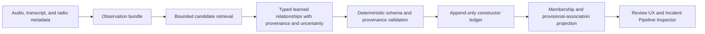

# Incident Pipeline Blank-Slate Architecture Decision

Date: 2026-07-17

Status: Accepted design baseline for the next incident-pipeline experiment.

## Decision

PizzaWave will not extend the semantic decision logic in the legacy, V2, or V3
incident pipelines. The next experiment will use a new, learned, open-world
event-state architecture running beside production in read-only shadow mode.

Existing incident implementations remain available only as production behavior,
comparison baselines, and sources of historical failure examples. They are not
the design foundation for the new pipeline.

The new pipeline must not use hard-coded words, regular expressions, event
categories, talkgroup lists, role labels, or hand-tuned score combinations to
decide:

- whether an incident exists;
- whether two observations describe the same event;
- which calls belong to an event;
- what an event means;
- whether a call is routine, administrative, logistical, or emergency traffic;
- which event should receive an update;
- what operator-facing title, detail, or category is correct.

Those decisions belong to learned event understanding and must remain explicit,
uncertainty-bearing, and traceable to source observations.

## Why A Blank Slate Is Required

The existing pipelines divide semantic authority across model output, retrieval,
regular expressions, extracted anchors, event-family tables, hand-tuned scores,
current incident titles, final validators, reconciliation, and repair logic.
V2 improved evidence visibility but retained fixed semantic policy. V3 introduced
candidate frames and guarded execution, but its resolver became another large
deterministic semantic policy engine and continued to depend on legacy
validation.

Historical replay scores do not prove that any of those semantic architectures
generalize. The evaluated sets were small, selected partly from known failures,
and repeatedly exposed to policy changes. Legacy decisions are also not ground
truth. Therefore the new architecture will not treat agreement with legacy, V2,
or V3 as correctness.

## Semantic Boundary

### Prohibited Semantic Authority

The following may not determine semantic outcomes, individually or in a
hand-authored combination:

- transcript keyword or phrase matching;
- regular-expression event detection;
- static event, call-role, or incident-type taxonomies;
- talkgroup allowlists, denylists, or talkgroup-to-event mappings;
- static category-to-event mappings;
- fixed lists of emergency, routine, transport, handoff, or administrative
  language;
- fixed compatibility matrices for people, vehicles, locations, or event types;
- hand-selected resolver weights, score margins, or semantic time windows;
- current titles or details treated as proof of event identity;
- retrieval similarity treated as proof of membership;
- legacy acceptance or rejection treated as truth.

Talkgroup, category, timing, location, unit, transcript, and radio-system data may
be provided to a learned model as observations. Their significance must be
inferred in context rather than imposed by application policy.

### Permitted Deterministic Controls

Deterministic code remains required for non-semantic integrity and safety:

- schema and type validation;
- call, incident, and observation identifier validation;
- source existence and referential integrity;
- authorization and feature-flag enforcement;
- transaction, concurrency, and idempotency controls;
- append-only audit integrity;
- model and prompt version recording;
- exact provenance checks, such as confirming that a cited transcript quotation
  or audio interval exists in its claimed source;
- resource limits, timeouts, retries, and malformed-output handling;
- fail-closed prevention of experimental production writes.

These controls may reject malformed or unauthorized operations. They may not
reinterpret evidence or make an incident decision.

## Architecture

### Production Resource Boundary

Paxan is the production compute target until it is explicitly replaced. As
observed on 2026-07-18, it has an Intel Core i9-13900K, 64 GB of system RAM, and
an RTX 4090 with 24 GB of VRAM. Its normal LM Studio workload already consumed
approximately 22.3 GB of VRAM during inspection. Designs must not treat nominal
GPU capacity as spare capacity while that workload is present.

Ventax, an RTX 5090 laptop used during development bakeoffs, is experiment
equipment only. It is not continuously available production infrastructure.
No production architecture, availability claim, throughput gate, or recovery
path may depend on Ventax.

Consequently, the production design may not require:

- multiple transcription models to remain resident concurrently;
- a second large audio model to coexist permanently with the production LLM;
- synchronous fan-out to multiple ASR models for every call;
- Ventax or another undeclared accelerator to keep ingestion current;
- benchmark throughput measured only on Ventax as evidence of Paxan viability.

Alternate transcription and direct-audio models remain valid experimental
comparators. A selective escalation path is eligible for production only after
it proves, on Paxan under representative concurrent load, that queue depth,
latency, VRAM transitions, and failure recovery remain acceptable. The default
architecture should preserve audio and uncertainty while minimizing always-on
model residency. A future dedicated production inference host is a separate,
explicit infrastructure decision rather than an assumption embedded in the
incident pipeline.

### Observation Bundle

The observation bundle is a lossless, bounded view of source material. It may
include:

- raw call audio or a stable reference to it;
- one or more transcript candidates;
- call start and stop times;
- system and talkgroup metadata;
- unit and radio identifiers when available;
- available location observations;
- recent learned event state;
- broadly retrieved neighboring observations.

Retrieval determines what the model can review. It does not establish event
identity or membership.

The bundle must preserve distinctions between source facts, derived metadata,
prior model claims, and operator corrections. Prior event state is context, not
proof.

### Rejected Required Observation-Normalization Stage

An experiment tested interpreting each observation independently before event
reasoning. Its contract had no event identifier, incident membership, event
category, or state-change field. It preserved possible readings, shared content,
unresolved questions, exact provenance, and uncertainty, followed by a separate
learned critique call.

The sparse development gate rejected that stage as a required production
boundary. Qwen and Gemma produced schema-valid but unsupported or incomplete
interpretations, and both same-model and cross-model critics approved the known
defects. One Qwen interpreter/critic pair took 74.8 seconds for a single
observation on Ventax. More model calls did not establish semantic grounding.

Raw transcript candidates and the audio reference therefore remain first-class
observation evidence. No learned paraphrase may replace or outrank them before
event reasoning. The interpretation contract and in-memory coordinator remain
available only as experiment scaffolding; they do not call the event proposer,
append the event-state ledger, or write production state.

A direct-audio sparse test reached the same boundary. Voxtral Mini's dedicated
transcription corrected a dangerous stored phrase, but its general
audio-instruction mode hallucinated a long repeated sentence on a nearly empty
clip. Direct access to audio is useful evidence access; it does not make a
generative semantic statement authoritative. Voxtral is not a production
candidate: it showed no established quality advantage on the reviewed difficult
clips, exhibited runaway repetition, and cannot coexist with Paxan's resident
production LLM within the observed 24 GB GPU boundary.

### Learned Event-State Proposer

The proposer consumes observations and the prior projected event state. It
returns open-world event hypotheses and proposed changes without choosing from a
fixed public-safety taxonomy.

Each proposal must express:

- a natural-language account of the possible real-world event;
- the observations believed to refer to it;
- claims about the event, each with source provenance;
- the proposed relationship between new observations and prior event state;
- alternative plausible interpretations;
- unresolved contradictions or missing information;
- uncertainty for the hypothesis, individual claims, and relationships;
- proposed additions, supersessions, or retractions to the event state.

The proposer must be allowed to conclude that the evidence is unresolved. It
must not be forced into a binary incident/non-incident answer.

The narrower pairwise relationship experiment failed after blind development
review. The admitted Gemma proposer output found only one of three
reviewer-confirmed relationships and preserved neither of two unresolved cases.
One omission appeared only in critic dissent and another relationship was
discarded for an inexact quote. The 10.4-to-77.9-second proposer-plus-critic
latency per pair is also incompatible with exhaustive real-time comparison on
Paxan. Pairwise calls are retained only as offline falsification scaffolding,
not a mandatory production boundary.

A separate hypothesis-transition contract proved that structural validation
can prevent uncited observation growth and that critic dissent cannot authorize
membership. Because its required pairwise evidence stage failed, that
coordinator will not become the next model experiment. It remains non-persisting
contract scaffolding with no store, scheduler, endpoint, or production writer.

The production-shaped single-generation experiment has now failed its
development gate. GLM 4.7 Flash produced no valid response in three fair
attempts at roughly 93 to 99 seconds each. Qwen 3.6 35B-A3B made the raw
relationship choice on four of six reviewed pairs, but forced both unresolved
pairs into distinct events and produced zero contract-valid state proposals.
Its requests took 54.7 to 70.6 seconds and the loaded model occupied about
20.55 GiB on the Ventax lab runtime. Neither model is a candidate live writer,
and these results do not justify moving inference to the 5090-class laptop.

The next boundary should make semantic model output evidence rather than a
state mutation. A bounded generator may propose typed, source-grounded evidence
about the new observation and a retrieved prior hypothesis. Application-owned
code validates exact sources and applies the ledger transition, or abstains.
Retrieval still limits context but never proves membership. Invalid output is
rejection, not input to a repair model. Learned critique remains an offline or
sampled evaluation instrument.

That narrower typed-evidence boundary has now been implemented and tested in a
standalone development harness. It removed state objects and observation
identifiers from model output and allowed invalid output only to defer. GPT-OSS
20B was fast and smaller (1.5 to 2.2 seconds, 11.28 GiB) but forced both
reviewer-unresolved cases into distinct events. Qwen 3.6 produced valid records
but falsely merged one unresolved pair, preserved only one of two uncertainties,
and took 23.6 to 46.4 seconds at 20.55 GiB. Neither earns automatic append or
create authority. The contract remains useful for non-mutating shadow evidence.

Using both models as a consensus stage is explicitly rejected. Their combined
Ventax residency was about 31.8 GiB, beyond Paxan's 24 GiB, and agreement is not
proof. The next evidence need is a larger blind development set enriched for
ambiguous continuity and generic acknowledgments, using clips not present in
the completed six-case review. Until then, automatic membership mutation is
blocked by insufficient and failed development evidence, not by implementation
work.

That 12-case blind expansion is now complete. GPT-OSS achieved 6 of 12 valid
correct decisions and preserved none of three unresolved cases. Qwen achieved
7 of 12 and preserved one of three. Each had one contract failure. Across all
18 reviewed development pairs, both recalled only 8 of 11 confirmed shared
relationships; GPT-OSS preserved 0 of 5 unresolved cases and Qwen preserved 2
of 5. The typed three-way decision therefore also fails as automatic mutation
authority, and the sealed held-out set must remain unopened.

If experimentation continues, the state model should remove
`supports_distinct_event` from learned authority. New observations remain
unresolved singletons unless a one-sided, source-grounded shared-event link is
admitted. A missing or rejected link does not prove a separate event. Even that
link-only form remains a non-mutating shadow proposal until it independently
meets precision, recall, stability, and Paxan gates.

### Current Constructor Decision (2026-07-21)

The successor to the binary link-only experiment is a typed, multi-candidate
incident constructor. For each observation passed to the constructor:

- application code creates a stable singleton event identity;
- retrieval supplies a bounded set of existing shadow events but grants no
  semantic authority;
- one model generation may return at most one `confirmed_membership` and zero
  or more `provisional_association` relationships;
- every relationship must cite exact transcript identifiers on both sides and
  preserve a natural-language explanation, alternatives, unresolved questions,
  and uncertainty;
- deterministic code validates only schema, identity, source ownership, and
  exact provenance;
- one valid confirmed membership assigns the observation to that existing
  shadow event;
- absent, invalid, or multiply confirmed output leaves the observation in its
  application-owned singleton;
- provisional associations are projected as reviewable edges and never merge
  events.

Omitted candidates remain unresolved. The model cannot assert that an omitted
candidate is a distinct event, and application code contains no semantic score,
keyword, category, talkgroup, label, or time threshold that upgrades a
relationship. The live service remains a sampled, disabled-by-default shadow
evaluation harness; it is not the future production ingestion adapter and does
not imply that production should perform one model request per radio call.

The previously described learned critic remains historical experiment
scaffolding. It is not in the constructor's admission path because prior tests
showed correlated approval of defects and unacceptable latency. A critic may be
used offline to evaluate new model or prompt versions, but cannot authorize
membership.

### Provenance

Provenance points to source observations rather than application-owned semantic
labels. Depending on the source, it may contain:

- call identifier;
- audio start and end offsets;
- transcript identifier and exact quotation;
- metadata field and observed value;
- prior ledger entry when the proposal revises an earlier claim.

Application code verifies that cited material exists. It does not decide what
the cited material means.

### Independent Learned Critic (Historical Evaluation Option)

The critic evaluates a proposal using the source bundle and prior state. It must
be invoked independently of the proposer response and should identify:

- unsupported claims;
- omitted plausible interpretations;
- unjustified call relationships;
- contradictions with source observations;
- identity changes that are insufficiently supported;
- uncertainty that the proposal understates;
- potential merges or splits that require additional evidence.

The critic returns an assessment with provenance and uncertainty, not a set of
static semantic rejection reasons. Agreement between proposer and critic is
evidence for evaluation; it is not by itself permission to write production
incidents.

### Append-Only Shadow Event Ledger

The experiment records observations, proposals, critiques, and superseding
decisions in an append-only ledger. It does not update `incidents` or
`incident_calls`.

The ledger must retain:

- source observation references;
- complete proposer output;
- complete critic output;
- model, prompt, configuration, and software versions;
- timestamps and processing latency;
- the prior state supplied to each model;
- the resulting projected state;
- operator adjudication when available;
- explicit links between an entry and any entry it supersedes.

No experimental decision is destructively overwritten. Corrections create new
entries and a new projection.

### Event-State Projection

The projection materializes the best current shadow interpretation from the
ledger. It exists for comparison and operator inspection only.

The projection contains open-ended event descriptions, supported claims,
observation membership, alternatives, contradictions, and uncertainty. Display
titles and summaries are generated from that current state and are never fed
back as authoritative identity evidence.

### Provisional Associations And Operator Review

A source-grounded relationship proposal that has not earned automatic incident
membership is a provisional association. It is not an incident and may not
change production incident membership, titles, summaries, lifecycle, alerts,
badges, notifications, or location aggregation merely because it exists.

The review unit is a provisional group of two or more calls, not a forced pair.
Each call remains independently reviewable so an operator can retain a supported
subset without accepting a weak member or discarding the whole group. The
evidence view must preserve which new call was connected to which prior calls;
membership is not inferred transitively from the fact that calls were displayed
together.

Dashboard placement follows current production ownership:

- a group touching one active incident appears inline as possible additions;
- a group touching multiple established incidents appears inline as a possible
  merge, with the effect requiring explicit review;
- a group without an active incident anchor appears in the Dashboard Review tab;
- evidence too weak to justify operator attention remains Inspector-only.

Operator actions are `confirm membership`, `reject membership`, and `defer`.
They are recorded as append-only adjudications against exact source calls and
the exact proposal version. During shadow evaluation, those actions do not write
`incidents` or `incident_calls`. Enabling an adjudication applier is a later,
separate production decision with its own authorization, transaction, audit,
undo, merge-preview, and rollout requirements.

Adjudications provide replay constraints, not uncontrolled online training. A
new model or prompt can be replayed against previously confirmed and rejected
relationships to measure confirmed-link recovery, rejected-link violations,
proposal workload per operating hour, latency, and malformed output. Because
operators see a selected subset of proposals, these measurements are regression
evidence and must not be presented as unbiased overall precision or recall.

## Relationship To Existing Work

### Retained Infrastructure

The following may be reused after confirming that it contains no semantic
policy:

- raw audio and call metadata access;
- read-only corpus export;
- replay orchestration;
- shadow scheduling and feature flags;
- model request accounting and health telemetry;
- append-only audit storage patterns;
- the Incident Pipeline Inspector presentation framework;
- transcription bakeoff collection tooling;
- deployment and health verification tooling.

### Retired Semantic Implementations

The following are not foundations for the new architecture:

- `IncidentCandidateValidator` semantic decisions;
- `IncidentEvidenceDecisionEngineV2` semantic policy;
- `IncidentFrameBuilderV3` frame membership, resolver, lifecycle, and scoring;
- V3 plan actions as the required model of incident behavior;
- regex-derived anchors used as incident proof;
- fixed call-role and event-type policies;
- legacy verifier, reconciliation, or audit decisions used as correctness
  labels.

Existing paths remain untouched while they operate production. The new shadow
experiment must not call them as an adjudication or validation stage.

## Evaluation

### Reference Outcomes

Evaluation requires human-adjudicated reference outcomes, but those outcomes
must not impose the old pipeline's categories. Reviewers describe, in ordinary
language:

- which real-world events appear to be present;
- which observations appear to describe each event;
- which claims are supported;
- which interpretations remain uncertain;
- where reviewers disagree.

Reference outcomes are evaluation evidence, not application rules. Reviewer
disagreement and unresolved cases remain part of the result rather than being
forced into artificial consensus.

### Corpus Discipline

Before model or prompt tuning, create versioned development and held-out sets
sampled from ordinary traffic as well as known failures. Include raw audio when
available. Known legacy, V2, and V3 failures may be included, but they must not
dominate the corpus.

The held-out set must remain unavailable to implementation iteration. Evaluation
criteria and rollout gates must be recorded before held-out results are viewed.

### Comparisons

Evaluate at least two new approaches over identical source observations:

1. transcript plus radio metadata;
2. audio plus transcript plus radio metadata.

Run legacy, V2, and V3 only as descriptive baselines. Do not optimize the new
system for agreement with them.

### Outcome Measures

Measure:

- event discovery and missed-event rate;
- observation membership precision and recall;
- incorrect event merges and splits;
- factual support and unsupported-claim rate;
- handling of genuine uncertainty;
- agreement with human reference outcomes and documented reviewer disagreement;
- stability across repeated runs;
- sensitivity to different transcript candidates;
- proposer/critic disagreement;
- latency, timeout, malformed-output, and cost behavior;
- operator ability to understand and correct the projected state.

Every reported improvement must identify regressions and held-out performance.
Anecdotes, unit tests, plan counts, and agreement with legacy are insufficient.

## Delivery Phases

### Phase 0: Production Containment

- Keep every experimental incident writer disabled.
- Verify current runtime flags before any deployment from `main`.
- Ensure a future deployment cannot enable an experimental writer through an
  incomplete flag combination.

This phase contains no semantic incident changes.

### Phase 1: Contract And Ledger

- Define the observation-bundle schema.
- Define the typed multi-candidate relationship schema.
- Add append-only shadow-ledger storage.
- Add provenance, versioning, and projection records.
- Add deterministic integrity tests only.

### Phase 2: Neutral Corpus

- Sample ordinary traffic before reviewing model output.
- Include known failures without allowing them to dominate selection.
- Create an independent human-adjudication protocol.
- Freeze development and held-out corpus versions.

### Phase 3: Shadow Prototypes

- Implement the transcript-based constructor proposer.
- Keep optional learned critique outside the admission path.
- Write only to the shadow ledger.
- Expose chronological evidence and state changes in the inspector.

### Phase 4: Evaluation

- Run repeated trials over development and held-out sets.
- Compare complete event stories, not isolated accept/reject decisions.
- Analyze model stability, provisional workload, and failure modes.
- Decide whether either approach merits live shadow observation.

### Phase 5: Read-Only Live Shadow

- Run the selected approach without production writes.
- Define the observation period and gates before starting.
- Review ordinary traffic, uncertain cases, regressions, latency, and cost.

Production persistence is a separate future architecture decision. It is not an
automatic final phase of this experiment.

## Acceptance Conditions For This Experiment

The blank-slate experiment may proceed when:

- the schemas contain no fixed event, role, category, or talkgroup ontology;
- application code contains no static semantic acceptance or membership policy;
- source provenance is verifiable without interpreting its meaning;
- every experiment output is append-only and shadow-only;
- the corpus and human-adjudication procedure are versioned;
- held-out gates are defined before results are viewed;
- the constructor can represent uncertainty and alternatives without forcing a
  semantic decision;
- production incident tables are unreachable from the experiment path.

## Open Questions

These require explicit decisions during the contract phase:

- Which audio-capable and transcript-only models should be compared?
- How much prior event state can be supplied without causing the model to copy
  stale interpretations?
- How should stable event identity be represented without making the current
  title or a model-generated identifier authoritative?
- How independent must the critic be from the proposer model and prompt family?
- What operator adjudication workflow is practical enough to produce reference
  outcomes without biasing reviewers toward existing incidents?
- What latency and cost envelope is acceptable for live shadow observation?
- What uncertainty should remain visible to operators rather than being collapsed
  into one projected story?

## Implementation Status On 2026-07-21

The development branch now contains the current constructor architecture as a
complete shadow path:

- typed multi-candidate proposal, transition, and projection contracts;
- exact source-side transcript citation validation and fail-closed transitions;
- append-only, hash-verified `incident_association_shadow_ledger` and
  `incident_association_shadow_projections` tables;
- application-owned singleton creation, one-confirmed-membership projection,
  and non-merging provisional-association edges;
- a disabled-by-default sampled runtime with bounded embedding retrieval and a
  single OpenAI-compatible model request per sampled observation;
- model identity and token-use recording;
- an Incident Constructor Shadow report in Performance > Incidents;
- Dashboard inline and Review-tab projections sourced from the new provisional
  association ledger;
- append-only operator adjudications that cannot mutate production membership.

The old link-only hosted service is retired. Its ledger, report endpoint, and
tests remain readable as historical experiment evidence. The production
`AutomaticInsightsService`, `incidents`, and `incident_calls` paths are not
called by the new constructor. No production cutover adapter exists, and both
the constructor runtime and any production writer remain disabled unless a
later deployment explicitly configures the shadow run.

### Production-Shaped Micro-Batch Constructor (2026-07-22)

Live recovery exposed that the production admission authority still depended
on `IncidentCandidateValidator`, including semantic regexes, fixed event
classes, and phrase-driven acceptance. It rejected current candidates such as
an MVC with critical injuries and a four-call hostage/knife proposal. That code
is not being tuned as the successor architecture.

The development branch now also contains a bounded micro-batch constructor
that preserves the source-cited association design while matching Paxan's
resource boundary:

- one model generation considers several fresh observations plus a bounded set
  of retrieved candidate events;
- the model may propose a new event, confirmed membership in one candidate, or
  a provisional association;
- every proposed event cites a transcript from every included new observation;
- confirmed and provisional relationships cite transcripts on both sides;
- omitted observations remain unresolved application-owned singletons;
- invalid output and proposer failure fail closed to those singletons;
- deterministic code validates only schema, identity, exact citations,
  ownership, and projection integrity;
- provisional associations never mutate candidate membership;
- only source-cited new events and confirmed membership become
  operator-visible in the shadow projection;
- the append-only shadow ledger and projections are hash verified and protected
  from update and delete by database triggers;
- the runtime pauses itself whenever production incident processing freshness
  is unhealthy and cannot write `incidents` or `incident_calls`.

The shadow runtime is disabled by default. Its report endpoint is
`/api/v1/incidents/batch-constructor-shadow`. Structural replay tests cover the
current tree, MVC, hostage, and unresolved-worker relationship shapes without
embedding their vocabulary as application policy.

### Initial micro-batch OT checkpoint

Commit `8d80080` was deployed to OT only on 2026-07-22. Run
`ot-batch-constructor-shadow-20260722-a` established a no-backfill startup fence
at call `1424239`, with a 600-second interval, 120-minute lookback, 12 fresh
observations per batch, and at most four retrieved candidate events. The prior
constructor shadows were disabled. The pre-run configuration is preserved at
`/etc/pizzawave/pizzad.json.pre-batch-constructor-shadow-20260722T024031Z.bak`;
its SHA-256 is
`6995bd11e4a0c873beea3bc346721c4f02a94b61edb0d7fd1fa515a0c4b9fb40`.

The first generation considered calls `1424353` through `1424375` and took
127.674 seconds on `qwen/qwen3.6-35b-a3b@q8_0`. It returned structured output
without a proposer error, but proposed a separate event for all 12 calls,
including routine identifiers, status traffic, a scheduled non-emergent
transfer, and low-information transcription fragments. The deterministic
contract rejected the entire proposal because each event left its required
basis statement empty. All 12 observations therefore remained invisible,
unresolved singletons and production incidents were unchanged.

That result is evidence against simply relaxing the validator. Prompt contract
v2 keeps the required basis statement but names and defines it as
`operator_basis`: the model must state what exact source words establish and
why the situation merits operator awareness or follow-up. It explicitly treats
an empty event array as valid and asks the model to omit observations that do
not clear that semantic bar. This decision remains model-owned; application
code does not introduce event labels, content categories, phrase lists,
talkgroup rules, or regex admission. V2 also requires the model to return short
exact quotes rather than allowing the application to materialize the entire
transcript as a nominal citation. Application code verifies those quotes
exactly and fails closed when they are absent or changed.

The first v2 batch considered 12 later observations plus two retrieved
candidate events. It returned one valid new event, a vehicle crash located by
the source at Armstrong Road and Bayfront Road, and left the other 11
observations unresolved. Its exact quote contained the crash and both roads;
the operator basis explained the concrete traffic situation, and unresolved
questions retained ambiguity about a poorly transcribed vehicle description
and whether injuries were involved. It did not force either retrieved
candidate into the event. Generation took 22.703 seconds and used 2,612 prompt
tokens plus 347 completion tokens (2,959 total), compared with 127.674 seconds
and 2,665 completion tokens for the indiscriminate v1 output. This single batch
is encouraging evidence for the contract correction, not yet a precision or
recall benchmark.

For broader relationship coverage, OT then started clean run
`ot-batch-constructor-shadow-20260722-b` with 24 observations every 300 seconds.
Run A's v1 and v2 entries remain append-only and selectable in the report. The
new cadence is still one bounded generation and is guarded by production
incident freshness; it should be disabled or reduced if that freshness or
model latency degrades. Its startup fence is call `1424703`. The prior
configuration is preserved at
`/etc/pizzawave/pizzad.json.pre-batch-constructor-v2b-20260722T031151Z.bak`;
its SHA-256 is
`9a4cde19b7190b2ea11c7406618de789023d27dee875c3a4d2ccd234a109d098`.
The report now exposes each batch's prompt and configuration identities so
mixed-version evidence cannot be mistaken for a single experiment.

Run B's first 24-observation batch took 86.624 seconds and proposed three
plausible events: an automatic fire alarm, a medical response for a hand
laceration, and an established fire command. Two citations inserted ellipses
that were not present in the source transcripts; the third citation was exact.
The then-current all-or-nothing validation correctly refused to treat the
altered quotes as evidence, but unnecessarily discarded the independently
valid third event as well.

The successor projection policy therefore validates and accepts each proposed
event independently. An event with invalid evidence remains an unresolved
singleton without poisoning a valid sibling. Cross-event ownership conflicts,
duplicate proposal identities, and duplicate confirmed membership targets
reject every conflicting sibling. The policy is versioned in the recorded
configuration identity as `acceptance=per-event-v1`, so historical all-or-none
runs retain their original interpretation. This changes only structural
failure isolation; it does not weaken exact-quote validation or add semantic
application authority.

Per-event acceptance began in clean OT run
`ot-batch-constructor-shadow-20260722-c`, retaining the 24-observation,
300-second cadence and establishing its startup fence at call `1424871`. The
pre-run configuration is preserved at
`/etc/pizzawave/pizzad.json.pre-batch-constructor-v2c-20260722T032430Z.bak`;
its SHA-256 is
`b18e12c2c458b9713ca6ee9ed4bdf3f4aa1d22822f8b99894f8b06a5590247e8`.

Run C's first batch proved the failure isolation: of two returned proposals,
one exact-source proposal was accepted and one proposal with a spliced quote
was rejected. Inspection also showed that the accepted proposal described
complaint-number coordination, while the same batch omitted source text about
an 18-year-old female, threats, and statements about a “next life.” That is a
semantic precision and recall failure even though the structural policy worked.

Prompt contract v3 responds at the model boundary. It defines relevance by the
underlying real-world condition affecting people, property, or public safety,
and says that communication, documentation, identification, or workflow
mechanics are not themselves an event when that underlying condition is absent
or unknown. It requires the model to review every observation before choosing
events. It also defines an exact quote as one contiguous verbatim substring and
explicitly forbids ellipses, omitted intervening words, normalized wording, or
joined spans. These are general evidence and relevance instructions, not a
content-category allowlist.

Prompt v3 began in clean OT run `ot-batch-constructor-shadow-20260722-d`
with the same 24-observation, 300-second cadence and startup fence at call
`1424985`. The prior configuration is preserved at
`/etc/pizzawave/pizzad.json.pre-batch-constructor-v3d-20260722T033426Z.bak`;
its SHA-256 is
`85522d72b1933729b086712c7c0218459686194b2674d9ac9900b7093f04a275`.

Run D's first five-minute window contained 20 eligible observations. V3
returned one valid event for firefighter emergency traffic, citing the exact
contiguous words `I'm 20 emergency traffic. One firefighter on board.` It
returned no administrative event, no spliced quote, and left 19 observations
unresolved. The source set also contained lower-certainty suspicious-activity
text and badly garbled suicide-related fragments; further batches are required
to determine whether v3's omission behavior is appropriately cautious or still
misses too much. Generation took 32.839 seconds and used 3,696 prompt tokens
plus 323 completion tokens (4,019 total). Immediately afterward, production
incident freshness was seven minutes, overall health was `ok`, and recent AI
completions had no failures.

Run D's second batch returned three exact-source new events from 24
observations: a level-one trauma/bypass notice, two suicidal-ideation patients,
and reported ingestion of 17 vodka shots. It proposed no administrative event
and rejected nothing. Generation took 60.356 seconds. Inspection found one
candidate-coverage miss: a new call about picking up “that firefighter” did not
receive the prior visible firefighter-emergency event as a candidate because
raw-call embedding search did not return its source transcript near the top.

Candidate selection now reserves bounded context for recent operator-visible
shadow events even without an embedding match, then fills remaining capacity
with embedding-matched unresolved events. This preserves the four-candidate
cap and does not make visibility, recency, or retrieval proof of membership;
the model must still cite both sides for confirmed or provisional association.

Run D's third batch found two materially important observations—a potential
suicide threat at a stated address and an unresponsive young child—but rejected
both because each returned quote spliced several source spans with ellipses.
The evidence checker correctly refused those altered strings. Prompt v3's prose
instruction alone was therefore insufficient to make a single quote field fit
multi-span evidence.

Prompt contract v4 changes the response shape: each cited transcript contains
an `exact_quotes` array of one to four short, separately contiguous source
spans. Application code expands and exact-checks every span. Multiple verified
spans from one transcript are allowed, while duplicate transcript-and-quote
pairs remain invalid. This lets a proposal cite location, condition, and
response from separate parts of one transcript without inserting omitted text
or weakening source verification.

Prompt v4 and the bounded visible-event candidate policy began in clean OT run
`ot-batch-constructor-shadow-20260722-e` with the same 24-observation,
300-second cadence and startup fence at call `1425193`. The prior configuration
is preserved at
`/etc/pizzawave/pizzad.json.pre-batch-constructor-v4e-20260722T035837Z.bak`;
its SHA-256 is
`fc2c31f377ffcaa98c58f0679f1ac5ccadd78a07cd15dbed55c8e7aaac0659c7`.
The deployment changed only the shadow path on OT. It did not backfill calls,
write production incident state, or deploy to RPI.

Run E's first batch considered 24 observations and returned three proposed new
events in 91.610 seconds. Two were independently accepted: a missing-juvenile
search and a self-harm/medical response. Each used several separately
contiguous, exact spans from one source transcript, demonstrating that the v4
evidence shape works with the deployed model. A lift-assist proposal was
rejected because one of its three proposed spans changed source punctuation;
the other two events survived under the per-event acceptance policy. No
proposer error occurred and production health remained `ok`.

The same source batch also included a later call stating that "this juvenile"
had turned a phone back on. The model left that call unresolved rather than
including it in the newly constructed missing-juvenile event. This is evidence
of a constructor recall gap, not a reason to weaken exact citation validation:
a plausible same-batch follow-up omitted by the model currently becomes an
unresolved singleton and is not automatically reconsidered against the event
created from its sibling observation. The architecture needs a bounded,
model-owned reconsideration path for such unresolved observations; it must not
be implemented with phrase rules or by treating retrieval similarity as event
membership.

Run E's second batch supplied four bounded candidates, including the visible
missing-juvenile event; this verifies that operator-visible events remain in
candidate context without an embedding match. Nevertheless, the model omitted
a new source saying `I have the juvenile` and also omitted separately supported
conditions involving breathing/shock and a child who blacked out. It accepted
one chest-pain event and independently rejected a routine unit-status draft
that the model itself described as something it intended to omit but still
returned without evidence. The result took 58.027 seconds and had no proposer
error.

Prompt contract v5 addresses this general decision-boundary failure without
introducing content labels or deterministic semantic checks. It tells the
model not to require complete locations, identities, chronology, or clean
surrounding transcription when exact words still establish a concrete
operator-relevant condition; missing details belong in uncertainty. After
drafting, it must compare every omitted observation with every drafted and
candidate event and use supported multi-observation membership, confirmed
membership, or provisional association as appropriate. A discarded draft
must be removed from the response rather than returned with empty evidence.

Prompt v5 began in clean OT run
`ot-batch-constructor-shadow-20260722-f`, retaining the 24-observation,
300-second cadence and establishing a startup fence at call `1425341`. The
prior configuration is preserved at
`/etc/pizzawave/pizzad.json.pre-batch-constructor-v5f-20260722T041447Z.bak`;
its SHA-256 is
`b631944a8378fca3c561f6cf1aeb08c1100b5bb0157b1bbe175e9221806373ce`.
Immediately after deployment, production incident analysis was current by six
minutes and overall, AI-completion, and embedding health were all `ok`.

Run F's first batch considered 24 observations in 111.558 seconds. V5 grouped
three calls into one missing-child event and two calls into one sparking-vehicle
event, demonstrating materially better multi-call construction than the prior
prompt. A separately plausible pediatric-seizure event was rejected because
one of four evidence spans changed a source ASCII apostrophe to a typographic
apostrophe; the other two events survived. The model still omitted a call that
said the sought juvenile had been positively identified.

Source inspection exposed a distinct narrative-provenance failure. The
accepted vehicle summary asserted that the road was "pretty tore up" using a
different observation from the same batch, but the model left that observation
outside the event and supplied no citation for it. Exact event citations alone
therefore do not prove that a free-form generated summary is limited to those
citations. Adding semantic string checks would recreate the brittle policy
layer this architecture is replacing, while a mandatory second live model pass
would materially increase resource use.

The shadow projection now separates those responsibilities under versioned
policy `projection=evidence-summary-v1`: the append-only ledger retains the
model's proposed narrative for audit, but the operator-visible projection
summary is composed only from exact citations that passed validation. Confirmed
updates append their validated new-source excerpts to the existing projected
evidence. The model-generated title remains a non-authoritative display label;
stable event identity and membership do not depend on either title or summary.

Run F's second batch showed that v5's permissive reconsideration language is
not a viable balance. The model found three plausible missing-child updates
and received the prior missing-child event as a candidate, but returned one
observation simultaneously in a new event and as confirmed membership. The
candidate relationship also omitted all required candidate evidence, so the
deterministic ownership and evidence checks rejected both proposals. Of five
proposals, the only two accepted events were routine airport/weather
coordination and a vehicle-registration lookup—the false-positive behavior the
relevance contract explicitly forbids. The request took 122.553 seconds.

V5 is therefore retired after two batches. Prompt v6 removes its permissive
incomplete-condition and exhaustive-reconsideration additions, returning to
the precision-first v4 relevance boundary while retaining multi-span exact
citations. It makes two structural obligations explicit: observations related
to a candidate cannot simultaneously create a new event, and an event's title,
summary, and basis may use only that event's own exact quotes, never omitted or
sibling observations. The evidence-only projection remains the operator-facing
summary authority even if the model violates the latter instruction.

Prompt v6 and the evidence-only projection began in clean OT run
`ot-batch-constructor-shadow-20260722-g`, retaining the 24-observation,
300-second cadence and establishing a startup fence at call `1425497`. The
prior configuration is preserved at
`/etc/pizzawave/pizzad.json.pre-batch-constructor-v6g-20260722T043224Z.bak`;
its SHA-256 is
`8d72647888e4a62c1bd7fbd4a079b400a1334c0bd45c750307b77e58bca2b303`.
Immediately after deployment, production incident analysis was current by
eight minutes and overall, AI-completion, and embedding health were all `ok`.

Run G's first batch accepted three structurally valid singleton events from 16
observations in 95.141 seconds. The evidence-only projection behaved as
designed: its summaries contained only exact validated source excerpts. The
semantic boundary remained inadequate. It promoted a highly uncertain fragment
about a young girl and an unclear `volo` as a full event while assigning 0.7
uncertainty and asking whether the girl was missing, at risk, or involved in an
incident. It also omitted a concrete medical update reporting three liters of
oxygen and 90 percent saturation. A custody/transport status update was also
promoted despite the precision-first instruction against workflow mechanics.

That result exposes a missing state type rather than a useful confidence
threshold. Candidate-free evidence currently has only two destinations: full
new-event membership or unresolved invisibility. Prompt v7 adds
`provisional_event` for a source-cited, candidate-free possible situation that
is worth operator review but too uncertain for a full event. Its observations
are grouped in the shadow projection with `operatorReview=true` and
`operatorVisible=false`; it does not create production membership. This is
distinct from `provisional_association`, which links new evidence to an existing
candidate without merging it. The report exposes both provisional-event and
review-queue counts. Application code does not convert model uncertainty scores
into outcomes or apply content-specific labels, categories, or thresholds.

Prompt v7 and the provisional-event projection began in clean OT run
`ot-batch-constructor-shadow-20260722-h`, retaining the 24-observation,
300-second cadence and establishing a startup fence at call `1425617`. The
prior configuration is preserved at
`/etc/pizzawave/pizzad.json.pre-batch-constructor-v7h-20260722T044452Z.bak`;
its SHA-256 is
`9330ad66a646983008cb297c9e21086cea1304fe20a3bc9d580b26671c2fa276`.
Immediately after deployment, production incident analysis was current by 14
minutes and overall, AI-completion, and embedding health were all `ok`.

Run H's first batch considered 19 observations in 85.231 seconds and returned
three exact-source full events: reported shots near a named entrance, a
high-speed vehicle, and a suspected theft. It returned no provisional event.
The evidence-only projected summaries remained limited to the accepted exact
quotes. Inspection still found omitted calls that plausibly continued the
shots/building response, so the new type does not by itself resolve same-batch
relationship recall.

That inspection also exposed a content-independent call-loss defect in the
runtime scheduler. When more than the configured batch size arrived, the
service selected the newest calls and advanced its cursor to the newest ID,
permanently skipping the older overflow. It also waited the full configured
interval after generation completed, so a 300-second interval plus 85–123
seconds of model time produced a roughly 6.5–7-minute actual cadence. The
runtime now selects the oldest unseen calls in ascending order and advances
only through the processed batch. Its delay is measured from batch start, with
a 30-second safety rest if generation exceeds the interval. The versioned
configuration tokens are `cursor=oldest-unseen-v1` and
`cadence=fixed-start-v1`. This provides bounded, exactly-once cursor coverage
for unseen calls that remain inside the configured lookback while improving
capacity without parallel model requests.

The corrected cursor and fixed-start cadence began in clean OT run
`ot-batch-constructor-shadow-20260722-i`, retaining the 24-observation,
300-second cadence and establishing a startup fence at call `1425715`. The
prior configuration is preserved at
`/etc/pizzawave/pizzad.json.pre-batch-constructor-v7i-20260722T045455Z.bak`;
its SHA-256 is
`4503ec16637428040ac2dea526b43fe0f30aee6ca2f70b35ea65d24197642425`.
Immediately after deployment, production incident analysis was current by 11
minutes and overall, AI-completion, and embedding health were all `ok`.

Run I verified the scheduler correction with live overflow. Its first batch
filled the 24-observation cap through call `1425765` and took 82.524 seconds.
The next batch began at exactly the next eligible call, `1425767`, processed 12
observations through `1425799`, and took 38.376 seconds. No call-ID gap was
introduced. The service started the second iteration on the fixed 300-second
schedule rather than waiting 300 seconds after the first generation finished.

The first batch accepted an exact-source seizure event and a burglary
cancellation, while rejecting a shooting proposal whose quote changed source
lowercase `that` to uppercase `That`. The second accepted an exact-source
vehicle/deer collision and a phone crash notification, made no candidate link,
and returned no provisional event. Production health remained `ok`. This is
positive evidence for cursor coverage, cadence, exact validation, and
evidence-only summaries; it is not yet evidence that the model uses the new
review type reliably.

Two further Run I batches kept the cursor caught up but failed the semantic
promotion boundary. The model interpreted the exact words `negative stolen` as
a stolen-vehicle incident, promoted routine vehicle-stop instructions, and
interpreted likely ASR text `homicidic` as a homicide investigation. In the
same traffic it omitted clear calls about a 91-year-old nearly passing out and
a 73-year-old with shortness of breath on oxygen. Across four batches and 66
observations, it produced nine accepted full events, no provisional events, no
confirmed memberships, and no provisional associations. Exact evidence made
the failures auditable but did not make the single-transcript interpretations
safe.

The successor projection policy is therefore
`visibility=corroborated-new-v1`. A model-proposed candidate-free new event is
operator-visible only when at least two separately cited new observations
support it. A valid single-observation proposal is retained with its exact
evidence but application code demotes it to `operatorReview=true`; it is not
discarded and does not become a full incident. Explicit `provisional_event`
proposals also remain in Review. Confirmed membership may contain one new
observation because it must independently cite both that observation and an
existing candidate event. The prompt names the same boundary, but application
projection enforces it even if the model returns `new_event` for a singleton.
This is a source-corroboration rule, not a semantic category, phrase check,
regex, static talkgroup policy, or threshold on model-reported confidence.

The corroborated-visibility policy began in clean OT run
`ot-batch-constructor-shadow-20260722-j`, retaining the 24-observation,
300-second cadence and establishing a startup fence at call `1425957`. The
prior configuration is preserved at
`/etc/pizzawave/pizzad.json.pre-batch-constructor-v8j-20260722T052315Z.bak`;
its SHA-256 is
`3063341fb4cbdd4822d18e2f4938e7aeb4efce42b9675f66a405991a20d9541a`.
Immediately after deployment, production incident analysis was current by 17
minutes and overall, AI-completion, and embedding health were all `ok`.

Run J's first two batches verified the intended visibility split but exposed a
mechanical citation-boundary defect. In the first batch, three valid
single-observation proposals were retained as Review events and none became
operator-visible. In the second batch, the model proposed three singleton
events plus a two-observation Ford Ranger tow event. The latter was the first
candidate-free proposal in this run with separate corroborating calls and
therefore qualified for full shadow visibility. All four proposals failed
exact-source validation because the model changed ASCII apostrophes in copied
quotes (`I'll`, `It's`, `ain't`, `She's`, and `I'm`) into typographic
apostrophes. The cited wording was otherwise present literally in the named
source transcript. This was a representation failure, not evidence that the
events were semantically invalid.

The citation ingestion boundary resolves only one-for-one typographic
apostrophe, quotation-mark, and dash variants against the named transcript,
then stores the literal source substring as the citation. It does not normalize
case or whitespace, repair changed words or numbers, perform fuzzy matching,
or weaken the exact-source validator.

The source-authoritative citation repair began in clean OT run
`ot-batch-constructor-shadow-20260722-k`, retaining the 24-observation,
300-second cadence and establishing a startup fence at call `1426155`. The
prior configuration is preserved at
`/etc/pizzawave/pizzad.json.pre-batch-constructor-v8k-20260722T053945Z.bak`;
its SHA-256 is
`fa207fcb255e0db93364764758f6c74e4c69bfa7653fc769b548d0a4e0b90fef`.
Immediately after deployment, production incident analysis was current by nine
minutes and overall, live-radio, AI-completion, and embedding health were all
`ok`. RPI was not changed.

Run K's first batch considered 22 observations in 65.068 seconds. A
single-observation fentanyl-overdose proposal was accepted and correctly routed
to Review rather than full visibility. A separately proposed EMS event cited
two calls at the same address: one reported an unresponsive patient and the
other described the vehicle scene. That corroborated proposal failed closed
because the model joined two non-contiguous literal passages with `...` inside
one quote despite the prompt requiring separate quote items.

The citation boundary now separates an ellipsis-joined quote only when every
non-empty segment resolves, in order, to literal text in the named transcript.
It stores those resolved passages as separate citations. If any segment is
absent, changed, or out of order, the original proposal remains invalid. This
is deterministic source extraction and does not infer that the passages or
calls describe the same event. The versioned configuration token is
`citations=source-segments-v2`; the full test suite passes with 648 tests.

The ordered-segment repair began in clean OT run
`ot-batch-constructor-shadow-20260722-l`, retaining the 24-observation,
300-second cadence and establishing a startup fence at call `1426259`. The
prior configuration is preserved at
`/etc/pizzawave/pizzad.json.pre-batch-constructor-v8l-20260722T055140Z.bak`;
its SHA-256 is
`382cfdc4b25e89fc932c859ec7b31cd53514b853fd8cab8e29d0a2da9ef34d5e`.
Immediately after deployment, production incident analysis was current by 14
minutes and overall, live-radio, AI-completion, and embedding health were all
`ok`. RPI was not changed.

Run L's first two batches considered 41 observations and accepted all five
proposals without a citation error. Four single-observation proposals were
routed to Review. One proposal joined an initial domestic-response call to a
later verbal-argument resolution and became the run's first corroborated,
operator-visible event. The two batches took 84.016 and 47.535 seconds, so the
oldest-unseen cursor remained caught up on the fixed cadence.

Run L also exposed a remaining narrative ownership defect. Projected summaries
were built only from validated exact quotes, but projected titles still copied
the model's free-form title. One review event added `Hamilton
County/Chattanooga` to its title even though neither location appeared in that
event's citations. The projection now builds its title from the same validated
evidence summary, capped at 120 characters for display. The model-authored
title remains in the append-only ledger for audit but cannot reach operator
projection. Confirmed membership retains the existing evidence-owned title
rather than replacing it with a new model title. The versioned configuration
token is `projection=evidence-narrative-v2`.

The complete evidence-narrative projection began in clean OT run
`ot-batch-constructor-shadow-20260722-m`, retaining the 24-observation,
300-second cadence and establishing a startup fence at call `1426375`. The
prior configuration is preserved at
`/etc/pizzawave/pizzad.json.pre-batch-constructor-v8m-20260722T060742Z.bak`;
its SHA-256 is
`7b566ee5d66f67305ab2e052f0e29e9521e8245e4fb6f812678983805da7c51e`.
Immediately after deployment, production incident analysis was current by 18
minutes and overall, live-radio, AI-completion, and embedding health were all
`ok`. RPI was not changed.

Run M's first batch considered 21 observations in 108.005 seconds and accepted
two proposals without a citation error. Three separately cited calls at the
same address formed one visible chest-pain event. A detailed missing-minor call
remained a single-observation Review event despite the model returning
`new_event`. Both projected titles and summaries contain only validated source
quotes; the model's polished title and summary paraphrases did not pass through
to projection. At this checkpoint the cursor remained current and
overall, live-radio, AI-completion, embedding, and incident-analysis health
were all `ok`.

Three further Run M iterations exposed two independent limits. A batch with 18
observations and four candidates reached the 4,000-token completion cap after
252.631 seconds. LM usage recorded `finish_reason=length`, 4,642 prompt tokens,
and exactly 4,000 completion tokens; the incomplete JSON failed closed and all
18 observations remained unresolved. Production incident analysis remained
current, and AI-completion health recovered after three subsequent successful
requests.

The preceding batch also produced two visible sibling events that likely
described different fragments of one vehicle-extraction response. One cited an
unconscious call at 6708 Ringgold Road, locked vehicle doors, and responders
getting occupants out. The other cited a command being established, shallow
breathing, and responders getting someone out of a vehicle. The second
proposal's own alternatives acknowledged that it might be related to the first,
but the contract had no safe sibling-uncertainty instruction, so both obtained
full visibility from two cited observations apiece.

Prompt v9 bounds each response to at most six strongest source-grounded events;
lower-priority observations remain unresolved rather than consuming an
unbounded completion. It also requires the proposer to compare sibling drafts
and combine possibly duplicate drafts into one `provisional_event` when the
cited evidence cannot reliably separate them. This does not infer membership
in application code: the model still owns the semantic proposal, while
uncertain sibling identity now fails toward Review rather than parallel full
events.

The bounded sibling-aware contract began in clean OT run
`ot-batch-constructor-shadow-20260722-n`, retaining the 24-observation,
300-second cadence and establishing a startup fence at call `1426597`. The
prior configuration is preserved at
`/etc/pizzawave/pizzad.json.pre-batch-constructor-v9n-20260722T063808Z.bak`;
its SHA-256 is
`f3565d35910714f5d14ffb6b11b9f7f0d77cda7d040458de7b7cfeaeeb3e80a7`.
Immediately after deployment, production incident analysis was current by 15
minutes and overall, live-radio, AI-completion, and embedding health were all
`ok`. RPI was not changed.

Run N's first batch considered 21 observations in 118.597 seconds and returned
four accepted proposals: one two-observation visible event for an AC unit
arcing at a specific address, plus three single-observation Review events. The
response stopped normally at 1,642 completion tokens, well below the 4,000-token
cap. It produced no invalid proposal, proposer error, confirmed membership,
provisional association, or parallel ambiguous full-event draft. This first
batch verifies bounded completion and the visibility split; it is not yet a
positive example of sibling consolidation. Production incident analysis was
current by 12 minutes with no stale calls, and overall, live-radio,
AI-completion, and embedding health were all `ok`.

Across five Run N batches and 82 observations, the bounded contract returned 16
accepted proposals with no invalid output, proposer error, or truncation. One
corroborated event became visible and 15 single-observation proposals remained
in Review. It still returned no confirmed membership or provisional
association.

One missed association isolates the cause. The initial alarm at 4940 Azalea
Avenue was supplied in a later batch as `candidate-2`. A new call cited the
same address and explicitly said it was the address responders had just
cleared, followed by a new 911 call. The proposer used that prior clearance to
explain why the situation was recurring and distinct, but returned a
candidate-free event. Retrieval therefore succeeded; prompt v9 had described
provisional association mainly as uncertain membership and did not make clear
that distinct but operationally related events can retain separate membership
while carrying a reviewable link.

Prompt v10 makes that boundary explicit. New evidence that refers back to,
recurs after, follows up on, or may be confused with a supplied candidate may
use `provisional_association` even when it is a distinct event. Both sides must
still be cited exactly, and the association remains review context without
merging observations. The model is also told not to return a candidate-free
event when its own explanation relies on a supplied candidate to establish
that relationship or distinction. Application code still performs no phrase,
address, category, or semantic matching.

The cross-event association contract began in clean OT run
`ot-batch-constructor-shadow-20260722-o`, retaining the 24-observation,
300-second cadence and establishing a startup fence at call `1426789`. The
prior configuration is preserved at
`/etc/pizzawave/pizzad.json.pre-batch-constructor-v10o-20260722T070628Z.bak`;
its SHA-256 is
`9955c62595b19fbfa0a41a241c0a446b6b7028376c5d16efddbd5ea044339e2d`.
Immediately after deployment, production incident analysis was current by
eight minutes and overall, live-radio, AI-completion, and embedding health were
all `ok`. RPI was not changed.

Run O's first two batches considered 21 observations and returned four accepted
proposals with no invalid output or proposer error. They exposed a state-context
gap before v10 could be meaningfully evaluated. The first batch retained a
single bleeding call at `9505 Thornberry Drive` in Review. The next batch
received a detailed heavy-bleeding call at `9505 Dornberry Drive`, but the only
candidate supplied to the model was an unrelated unresolved fire call. The
Review event had no completed embedding match and was therefore absent from
candidate context. Prompt v10 cannot propose a cited association to state it
never receives.

Candidate selection now reserves bounded context for the newest visible event
and newest Review event, then fills remaining slots from embedding-backed
retrieval. The versioned token is `candidate-context=balanced-state-v1`. This
makes provisional state capable of accumulating an immediate follow-up before
embedding indexing or similarity retrieval completes. Candidate inclusion
remains context only and cannot prove membership or an association.

Run O also promoted a two-observation DHS/CPS exchange that did not establish a
concrete underlying situation. Its exact-source projection makes the weak
evidence obvious, but the result confirms that two cited observations are not
by themselves a sufficient semantic relevance guarantee. No content rule,
confidence threshold, or static phrase check was added to conceal that failure;
promotion quality remains an open architecture issue for subsequent evidence.

Balanced visible-and-Review candidate context began in clean OT run
`ot-batch-constructor-shadow-20260722-p`, retaining prompt v10, the
24-observation, 300-second cadence, and establishing a startup fence at call
`1426879`. The prior configuration is preserved at
`/etc/pizzawave/pizzad.json.pre-batch-constructor-v10p-20260722T072237Z.bak`;
its SHA-256 is
`6a3384fbeedfac5da8211cd6f8b273b9c482059bc4d0eebc58cb31057e131bb1`.
Immediately after deployment, production incident analysis was current by
eight minutes and overall, live-radio, AI-completion, and embedding health were
all `ok`. RPI was not changed.

Run P verified that balanced state context works mechanically: its second
batch received four candidates after the first retained two Review events,
without waiting for those events to win embedding retrieval. It returned no
association or confirmed membership in the first two batches because the new
traffic did not clearly connect to the supplied state.

Run P also produced another false visible candidate-free event. Two short
observations said only `Can you come to me?` and gave a vague location, but the
model promoted them as a request-for-assistance event. Together with Run O's
DHS/CPS exchange, this disproves the application policy that two separately
cited observations are sufficient for automatic visibility. The failure is
semantic relevance, not citation integrity, source count, retrieval, or model
confidence calibration.

The successor state policy is `visibility=confirmed-membership-v2` and prompt
v11. Every candidate-free proposal remains in Review, whether it groups one or
several observations. Application code automatically makes an event visible
only when a later, separately evaluated `confirmed_membership` transition cites
both new evidence and that prior Review state. Operator action may eventually
provide the other promotion path. This replaces a weak source-count proxy with
a temporal state transition and adds no content taxonomy, phrase rule, address
parser, talkgroup rule, or confidence threshold.

Confirmation-gated visibility began in clean OT run
`ot-batch-constructor-shadow-20260722-q`, retaining balanced candidate context,
the 24-observation, 300-second cadence, and establishing a startup fence at
call `1426963`. The prior configuration is preserved at
`/etc/pizzawave/pizzad.json.pre-batch-constructor-v11q-20260722T073646Z.bak`;
its SHA-256 is
`3f27f4bdabf0a11047a62c50936c6ab10d6425fecf0357327159a5a7ad0c1485`.
Immediately after deployment, production incident analysis was current by four
minutes and overall, live-radio, AI-completion, and embedding health were all
`ok`. RPI was not changed.

Run Q's first two batches considered 32 observations and accepted five
candidate-free proposals into Review. None became visible, verifying the new
application-owned gate even though the model continued to return its normal
candidate-free dispositions. The second batch received four candidates;
`candidate-1` was the newest Review event from the preceding batch despite
having no required embedding match, which verifies balanced state carryover.
The new traffic did not clearly refer to that state, so the proposer correctly
returned no confirmed membership or provisional association. Both batches
completed without invalid output or proposer error in 100.769 and 46.186
seconds. Production incident analysis remained current and all monitored health
domains were `ok`.

Across five Run Q batches and 66 observations, 13 source-grounded groups
entered Review, none became visible, and no output was invalid or truncated.
The observed rate is approximately 31 Review groups per hour at this traffic
level, which is too high to expose as an undifferentiated operator queue. That
is a presentation and prioritization constraint; it is not evidence for
discarding the underlying append-only state.

Run Q still produced no confirmed membership or provisional association. A
weapon-related call after suicide-related traffic initially looked like a
possible missed transition, but inspection showed that the supplied candidate
was a different Hickson Pike mental-health/missing-person event while the new
call concerned transport seating and a weapon already secured. No relationship
was established by the cited words. The run therefore has not yet presented a
clear candidate-backed follow-up that would fairly test confirmation-gated
promotion. The safe state policy remains unchanged while such evidence
accumulates.

Later Run Q evidence disproved the one-pass constructor boundary. In batch
sequence 43, a prior Review candidate described a patient with Parkinson's who
had hit his head. A new observation described a different 75-year-old patient
who slid from a chair and reported tailbone pain. The model's own alternative
interpretation said the new call appeared to continue the candidate, but it
returned a candidate-free event, omitted the required provisional association,
and cited `He did hit his head` as new-event evidence even though that sentence
occurred only in the candidate transcript. It also returned a normalized,
ellipsis-joined quote that was absent from the source transcript. Deterministic
exact-source validation rejected the proposal, so no false state transition
occurred, but validation cannot make a contaminated one-pass proposal useful.

This establishes a new architectural constraint: construction and relationship
evaluation must be source-isolated model stages. The construction stage receives
only new observations and may create immutable provisional groups. A later,
bounded relationship stage receives those accepted groups plus prior candidate
evidence and may attach zero or more typed relationships. It cannot rewrite,
split, combine, or add facts to a constructed group. Every relationship cites
exact evidence independently from both source boundaries; at most one candidate
may receive confirmed membership for a group, while several provisional
associations may remain available for operator review without merging events.
The relationship contract is deliberately multi-candidate because a two-call
link abstraction would not support the agreed operator workflow. This is a
source-ownership rule, not a prompt-only preference, confidence threshold,
event taxonomy, phrase list, talkgroup rule, or static semantic classifier.

The local shadow implementation now enforces that split. The coordinator calls
the constructor with an empty candidate set and the constructor's JSON schema
does not offer relationship dispositions. Only accepted constructed groups are
passed to a second model request alongside the bounded candidate set. The
relationship result is stored with separate validation errors, latency, and
proposer-error provenance in the same append-only batch ledger. Valid confirmed
membership moves the immutable group's observations into one candidate event;
valid provisional associations retain separate membership and can connect the
group to several candidate events. Invalid or failed relationship output leaves
the constructed Review state unchanged. Legacy one-pass ledger rows remain
readable. This implementation is not a production incident writer.

The source-isolated implementation was deployed to OT only in clean shadow run
`ot-batch-constructor-shadow-20260722-r` on 2026-07-22. The service established
a no-backfill startup fence after call `1427315`. The prior configuration is
preserved at
`/etc/pizzawave/pizzad.json.pre-batch-constructor-v12r-20260722T084300Z.bak`;
its SHA-256 is
`92409fac774b02820ed1e7cb4e6aa93a2831e3e469c76d72a9baf52a34ab224a`.
Immediately after restart, overall health, live radio, AI completion, and
embedding health were `ok`, and production incident analysis was current by 15
minutes. Run R remains shadow-only and RPI was not changed.

Run R's first batch considered 21 new observations with no prior candidate
state. The isolated constructor proposed two groups and deterministic validation
rejected both. One otherwise source-grounded fire response quote differed from
the literal transcript only by capitalizing `Engine`; the source contained a
single case-insensitive match. The other proposal declared call `1427325` as
its only member but cited firearm evidence from call `1427327`, while its own
alternative interpretation said the custody and firearm reports might be
unrelated. The latter remains rejected; application code must not repair that
uncertainty by silently adding event membership. The citation resolver now maps
only a unique case-insensitive match back to the exact source span and fails
closed when that match is ambiguous. Constructor prompt v13 also states the
bidirectional provenance rule explicitly: every cited new transcript must
belong to an observation declared in that same group.

That scoped provenance repair began clean OT shadow run
`ot-batch-constructor-shadow-20260722-s`, fenced after call `1427399`. Its
pre-run configuration is preserved at
`/etc/pizzawave/pizzad.json.pre-batch-constructor-v13s-20260722T085300Z.bak`
with SHA-256
`8dcffe791988dcba2f8e5bb64788ac0a8460bc033442e28824baf391f5a4662f`.
Post-restart service, production incident freshness, AI completion, and
embedding health were `ok`; live-radio health was still in its normal startup
warming interval. RPI was not changed.

Run S's second batch verified the complete split under live candidate context:
the constructor received only 12 new observations, while the later relationship
stage received four prior candidates, completed in 8.103 seconds, and validly
abstained. Production incident freshness remained `ok`. Candidate inspection
also showed that only the single newest Review group was guaranteed context.
Consequently, a new white-passenger-car check did not receive the immediately
preceding shoulder-flashers Review group; embedding retrieval selected three
other groups. The relationship is not proven, but the architecture cannot
evaluate even a modest association unless both sides are supplied. Balanced
selection v2 therefore reserves bounded context for the two newest Review
groups before retrieval fills the remaining candidate slots. Candidate count
does not increase, and retrieval remains a context-bounding aid rather than
membership evidence.

Run S completed five batches covering 66 new observations. It accepted 15
Review groups, retained 50 observations as unresolved, and produced no invalid
proposal, proposer error, confirmed membership, or provisional association.
Four candidate-backed relationship requests validly abstained. Combined
constructor-plus-relationship latency averaged 63.379 seconds and peaked at
88.056 seconds. Production incident analysis remained current, most recently by
two minutes, with healthy AI completion and embedding services. The stream was
permissive—several Review groups represented routine or weakly contextualized
activity—but none became operator-visible. This is a prioritization constraint
for the future Review surface, not evidence for weakening the confirmed-
membership visibility gate.

Balanced selection v2 was deployed to OT only in clean shadow run
`ot-batch-constructor-shadow-20260722-t`, fenced after call `1427563`. The prior
configuration is preserved at
`/etc/pizzawave/pizzad.json.pre-batch-constructor-v13t-20260722T092100Z.bak`;
its SHA-256 is
`b4f3f20495ceecad78d63d2297d73e8c62589dbec49c87ac681d4a623a0b60bb`.
Post-restart service, production incident freshness, AI completion, and
embedding health were `ok`; live radio was in its normal startup warming
interval. RPI was not changed.

Run V's first candidate-backed cycle admitted one provisional association but
also demonstrated why provisional state must remain visibly non-authoritative.
The new group mentioned `Medical 17`; the candidate contained the ambiguous
phrase `mileage, 17.4`. The proposer retained that the candidate did not confirm
the new group's bank location or patient status and that `major 14` might be an
unrelated designation. The association did not merge membership or create a
visible incident, which is the correct safety result, but the semantic basis is
weak enough that an operator may reasonably reject it. The future Review UI
must therefore show the exact evidence from both sides, relationship statement,
counterinterpretations, and unresolved questions together. A provisional link
is a question for review, not a recommendation, score, or inferred membership.
No phrase-, number-, unit-, or incident-type rule was added for this example.

The Inspector attempt list previously displayed the model's free-form event
titles even though admitted projection state already derives its title and
summary only from validated exact evidence. This could make safe shadow state
look as though it had admitted unsupported narrative. The report now uses the
same evidence-title projection as state; raw model wording remains available
only in the append-only ledger for diagnosis.

Run T produced the first structurally valid `confirmed_membership`, and it was
semantically false. The candidate described a 19-year-old female with difficulty
breathing at 1487 Ringgold Road. The new group described a two-year-old female
receiving CPAP and contained no Ringgold location. The relationship proposer
nevertheless claimed a location match and confirmed membership, while its own
alternative interpretation and unresolved question explicitly retained the
19-versus-2 age conflict. Exact citations on both sides protected provenance but
could not make that disposition coherent. The typed relationship contract now
requires confirmed membership to have zero expressed uncertainty and no
alternative interpretation or unresolved question. Any model output that
retains material counterevidence must choose provisional association or abstain;
otherwise deterministic validation fails closed and leaves both memberships
unchanged. This rule reads typed epistemic state, not content strings, event
labels, categories, radio metadata, or model confidence thresholds.

The conflict-free confirmation invariant began clean OT shadow run
`ot-batch-constructor-shadow-20260722-u`, fenced after call `1427739`. The prior
configuration is preserved at
`/etc/pizzawave/pizzad.json.pre-batch-constructor-v13u-20260722T095200Z.bak`;
its SHA-256 is
`3588c35f3a89399f1c525e095be0bfc08bc2331b2f8ed246217c42bd87741aab`.
Post-restart service, live radio, production incident freshness, AI completion,
and embedding health were all `ok`. RPI was not changed.

Relationship admission now mirrors the constructor's per-item safety boundary.
A malformed or internally conflicted relationship is retained with its
deterministic validation errors but cannot discard an independent valid
relationship from another constructed group in the same response. Duplicate
source-candidate pairs and competing confirmations are excluded together;
remaining relationships are validated and projected independently. This keeps
failure closed at the smallest source-owned unit without converting or repairing
the model's semantic disposition.

Run U's second batch produced the first defensible live relationship response.
The confirmed link joined a prior report of a 24-year-old diabetic female found
unresponsive with a later report that the same 24-year-old female was beginning
to respond and had glucose 244. Both sides directly cited the age, sex, and
passed-out condition; the relationship retained no counterinterpretation or
unresolved question. In the same response, a Jeep plate-match investigation was
provisionally associated with a prior report of a male fleeing a transcribed
`GP`. The proposer explicitly retained the Jeep-versus-GP ambiguity and did not
merge membership. This is the first live result matching the intended operator
semantics: strong continuation becomes confirmed state while a modest related
hypothesis remains a non-merging review association.

Per-relationship admission began clean OT shadow run
`ot-batch-constructor-shadow-20260722-v`, fenced after call `1427853`. The prior
configuration is preserved at
`/etc/pizzawave/pizzad.json.pre-batch-constructor-v13v-20260722T100700Z.bak`;
its SHA-256 is
`ddc580fca8070d85f2dc3c7aa43f4dfe6186f60d96c80519479d33e4af9aa352`.
Post-restart service, production incident freshness, AI completion, and
embedding health were `ok`; live radio was in its normal startup warming
interval. RPI was not changed.

The micro-batch Inspector report now preserves the relationship-stage decision
surface instead of reducing it to aggregate counts. Each proposed relationship
is shown as accepted or rejected with its disposition, source and candidate
tokens, uncertainty, exact citations from both sides, alternative
interpretations, and unresolved questions. This makes weak provisional links
and failed-closed confirmations diagnosable without reading the raw ledger and
without promoting either kind of output into production incident state.

Run V also exposed an admission-granularity defect inside otherwise coherent
constructor groups. A repeated five-call missing-person broadcast supplied six
citations. Five were exact and collectively covered every claimed member call;
one citation copied wording from a different broadcast and failed exact-match
validation. Per-event admission correctly refused the contaminated raw event,
but unnecessarily discarded the five independently valid citations with it.
The constructor now applies the same fail-small boundary to citations: an
inexact citation is omitted, never repaired, and the event is revalidated from
scratch. The event remains rejected unless at least one exact citation survives
for every claimed observation (and, for candidate-backed dispositions, valid
evidence also survives on the candidate side). Projection wording continues to
come only from the surviving exact citations; model title, summary, and rejected
quotes never become projected facts. This is a typed provenance rule and does
not inspect incident labels, transcript phrases, talkgroups, categories, or
confidence thresholds.

Per-citation admission commit `81e02d0` began clean OT shadow run
`ot-batch-constructor-shadow-20260722-w`, fenced after call `1428083`. The prior
configuration is preserved at
`/etc/pizzawave/pizzad.json.pre-batch-constructor-v13w-20260722T105355Z.bak`;
its SHA-256 is
`2c8c1e231fe864e6ff9d550e2579bc1fddc3343515d198e5c575c995257bef20`.
The first configuration rewrite installed the file as `root:root` rather than
the service-required `root:pizzawave`, causing an approximately one-minute OT
restart loop. Restoring group ownership and mode `0640` recovered the service;
post-recovery service, live radio, production incident freshness, AI
completion, and embeddings were all `ok`. No production incident rows were
changed and RPI was not changed.

Run W then proved that conflict-free self-reporting by the relationship proposer
is not sufficient authority for membership. One source group explicitly cited
`Medical 13` at `3405 Brandon Avenue`; its candidate explicitly cited
`Medical 15` at `9701 Mountain Lake Drive`. The proposer nevertheless asserted
that location and medical nature matched, returned zero uncertainty, and
omitted all counterinterpretations, causing a false shadow merge. This is not a
transcription-normalization or static-anchor problem: the contradictory facts
were already present verbatim on the two source boundaries.

Confirmed membership now has an independent, confirmation-only verification
stage. The verifier receives only structurally valid proposed confirmations,
the immutable source and candidate transcripts, and the untrusted proposer
statement. It must independently verify or reject every pair with exact
citations from both boundaries. Verification fails closed if the response is
missing, malformed, cites outside either boundary, retains counterevidence or
unresolved questions, or encounters a model error. The raw relationship and
the separate verifier decision both remain in the append-only ledger and
Inspector. Provisional associations bypass this extra model call because they
cannot merge membership; candidate-free Review groups are likewise unchanged.
This concentrates the additional inference cost on rare merge proposals and
adds no phrase, address, incident-type, category, talkgroup, or score rule.

Independent-confirmation commit `a1cd46f` began clean OT shadow run
`ot-batch-constructor-shadow-20260722-x`, fenced after call `1428419`. The prior
configuration is preserved at
`/etc/pizzawave/pizzad.json.pre-batch-constructor-v13x-20260722T112840Z.bak`;
its SHA-256 is
`326d835669d61a57f7845fb720336a40c807218341ffa3bf6294bd9b4915eeac`.
The configuration replacement preserved the service-required
`root:pizzawave` ownership and mode `0660`. Post-restart service, live radio,
production incident freshness, AI completion, and embeddings were all `ok`.
No production incident rows were changed and RPI was not changed.

Run X sequence 80 exposed an unbounded-output failure in the relationship
stage. The constructor completed normally and retained four grounded Review
groups, but the relationship response used all 2,400 completion tokens and
ended with `finish_reason=length` before closing its JSON. Parsing failed after
182.7 seconds; the coordinator correctly retained the constructor output and
admitted no relationships. The relationship contract now caps one response at
six relationships and one constructed group at three relationships, so a group
can still surface more than two plausible candidates. It also bounds citation
groups, exact spans, alternatives, unresolved questions, and free-text length.
The prompt explicitly chooses the strongest specific relationships and omits
weaker pairs. These are resource and schema bounds, not semantic labels or
content-based admission rules.

Bounded-relationship commit `06e5922` began clean OT shadow run
`ot-batch-constructor-shadow-20260722-y`, fenced after call `1428957`. The prior
configuration is preserved at
`/etc/pizzawave/pizzad.json.pre-batch-constructor-v13y-20260722T120837Z.bak`;
its SHA-256 is
`d2a8a394fdf65a9954bf91c2bd3a727f6804c6ec697596199c0d041fdd45ecaa`.
Post-restart service, live radio, production incident freshness, AI completion,
and embeddings were all `ok`. No production incident rows were changed and RPI
was not changed.

Run Y confirmed that the response bounds eliminated truncation: both
candidate-backed relationship requests ended with `finish_reason=stop`, using
654 and 1,732 completion tokens. It also exposed a distinct semantic failure.
The model admitted eight provisional associations, including pairs it described
as having different locations, different patients, contradictory urgency, no
overlapping details, or as otherwise unrelated. Exact citations grounded the
individual transcript statements but did not establish the claimed connection.
The six-item response cap had become a target for generic similarity rather
than a ceiling for sparse evidence, so the run was ended early.

Selective-relationship commit `3cf0783` changes the model contract without
adding phrase matching, static categories, talkgroup rules, regex, or a numeric
admission threshold. Empty output is explicitly normal and expected. A
provisional association now requires a concrete cross-reference or operational
continuation between the two evidence boundaries; topical resemblance, shared
words, generic dispatch language, and citations that merely prove what each
side says are expressly insufficient.

That commit began clean OT shadow run
`ot-batch-constructor-shadow-20260722-z`, fenced after call `1429343`. The prior
configuration is preserved at
`/etc/pizzawave/pizzad.json.pre-batch-constructor-v13z-20260722T124059Z.bak`;
the active configuration SHA-256 is
`53235286b6f41aabb684865f57844cbb3175a9a8e100d0bbfad8a88215c62cb0`.
The configuration remains owned by `root:pizzawave` with mode `0660`.
Post-restart service, production incident freshness, AI completion, and
embeddings were all `ok`. No production incident rows were changed and RPI was
not changed.

Run Z eliminated the earlier response-filling behavior but proved that prompt
selectivity alone is not an admission boundary. Across its candidate-backed
batches, the proposer still returned weak provisional pairs based on concurrent
medical responses, different recovered vehicles, or statements that explicitly
said no direct operational link existed. Those provisionals bypassed the
confirmation-only verifier and were therefore admitted. In the same run, the
proposer found an apparently strong accident continuation at Blue Springs Road
South and Dockery Lane Southeast. The independent verifier agreed, citing the
same location and accident-with-injuries description on both sides, but also
borrowed one extra candidate quote into the source citation list. Deterministic
validation correctly rejected that citation, but the all-or-nothing decision
discarded the remaining sufficient exact evidence and the relationship.

Relationship-verification commit `ee3cc62` moves the verifier boundary to every
proposed relationship. A provisional association is now surfaced only when the
independent verifier establishes a concrete operational connection; generic
similarity and explicitly unconnected pairs fail closed. Confirmed membership
retains its stricter same-event standard. Verification evidence now uses
configuration-pinned per-citation acceptance: an invalid extra citation is
discarded independently, while a decision still requires at least one exact
source citation and one exact candidate citation. The raw proposal, raw
verification response, and validation errors remain in the ledger and
Inspector. Legacy runs keep their original confirmation-only and all-or-nothing
semantics.

That commit began clean OT shadow run
`ot-batch-constructor-shadow-20260722-aa`, fenced after call `1429989`. The prior
configuration is preserved at
`/etc/pizzawave/pizzad.json.pre-batch-constructor-v13aa-20260722T132555Z.bak`;
the active configuration SHA-256 is
`6c8119cfbe0c840a5477fbdc7b8188d511b0b93e12bec410a2918471dac1f51a`.
The configuration remains owned by `root:pizzawave` with mode `0660`.
Post-restart service, production incident freshness, AI completion, and
embeddings were all `ok`. No production incident rows were changed and RPI was
not changed.

### Run AA checkpoint

Run AA reached its planned checkpoint after 22 attempts, including 21
candidate-backed batches and three raw confirmed-membership proposals. It
processed 528 new observations, constructed 72 source-grounded Review groups,
and left 450 observations unresolved. The relationship proposer returned 13
pairs: three claimed confirmations and ten claimed provisional associations.
The independent verifier admitted one confirmation and rejected the other 12
pairs. It admitted no provisional associations.

The admitted pair was a concrete continuation: both sides independently
described a male motorcyclist slumped over or passed out on the roadside, one
about 70 seconds after the other. The verifier supplied exact evidence from
both boundaries. It also emitted one borrowed extra source citation; the
per-citation acceptance boundary discarded that citation while retaining the
sufficient exact source and candidate evidence.

Rejected pairs included different recovered vehicles, unrelated welfare
checks, concurrent but unconnected medical responses, a truck driver versus a
motorcyclist, generic `force 3` wording, conflicting fire-alarm addresses, and
an invented address match where the candidate contained no Buchanan Road
reference. These are the same generic-similarity and source-boundary failures
that previously entered the provisional projection. The independent verifier
prevented every one from becoming membership or an operator Review item.

Across the run, 22 constructor calls, 21 relationship calls, and eight batched
verifier calls used 183,438 model tokens. Every model request succeeded and
ended with `finish_reason=stop`; none hit the response limit. Seven
deterministic validation errors were retained in the ledger, primarily
fail-small citation errors. OT production incident analysis remained current,
with no completion-failure streak. The checkpoint supports the verifier as an
effective precision boundary, but does not establish recall: only one true
continuation was admitted and no useful uncertain association appeared. The
live shadow remains non-mutating. Disabling it requires an OT `pizzad` restart
and was deferred to avoid disturbing the concurrent RF experiment.

After the RF experiment made an OT restart safe, Run AA was stopped at
2026-07-22 15:53 UTC by disabling only
`incidentBatchConstructorShadowEnabled`. The completed run identifier remains
in configuration for inspection. The pre-stop configuration is preserved at
`/etc/pizzawave/pizzad.json.pre-batch-constructor-v13aa-stop-20260722T155318Z.bak`;
the disabled active configuration SHA-256 is
`d5eb54ebaee210159f71ddd516401e951648520047bbd2fc4bf7ab980734e8d3`.
Ownership remains `root:pizzawave` with mode `0660`. After restart, `pizzad`,
live radio activity, production incident freshness, AI completion, and
embeddings were all `ok`. No production incident rows were changed and RPI was
not changed.

### Park Hill missed-candidate replay

OT alerts exposed a useful failure case after Run AA stopped. Calls `1426373`,
`1426513`, and `1426529` independently described the same Park Hill lift-assist
event, including complementary references to 1159 Harrison Pike, apartment
2208, Engine 1, and EMS 509. Production incident `6945` contained only the last
call plus two weak calls. The Alerts UI correctly showed separate alert-match
records; the upstream incident state had never supplied the complete event to
group them under.

A read-only, calls-only snapshot froze 494 OT observations in the surrounding
two-hour window. The failure occurred before semantic construction. Call
`1426373`, which contained the strongest address and apartment evidence, was
excluded from both embedding and batch input because its transcription was
labeled `poor_quality` / `repetitive`. Call `1426513` arrived through North
Bradley while the other two arrived through Cleveland, and the existing vector
search required an exact system match. Transcription quality and radio-system
identity are operational metadata, not evidence that observations describe
different events.

The snapshot contained 451 `complete` / `ok` usable transcripts and 31 usable
transcripts labeled `poor_quality` / `repetitive`; admitting the latter expands
the retrieval corpus by about 6.9 percent rather than admitting empty or tiny
fragments. A diagnostic embedding of `1426373` ranked it tenth for `1426513`
with score 0.6361 and third for `1426529` with score 0.7424 when the system and
quality filters were removed. Both ranks fit the existing per-call limit of 12.
The scores remain routing evidence only.

The durable correction defines usable retrieval evidence as a nonblank
transcript of at least 12 characters, indexes such evidence regardless of
transcription status or quality label, and gives only the new batch constructor
a cross-system, quality-label-neutral search. Existing embedding consumers keep
their legacy filters. Imported-call and configured downstream-profile scope
remain operational admission boundaries. No address, phrase, category,
talkgroup, system, or quality label gains semantic membership authority.

The focused scenario replay then ran the actual constructor, relationship
proposer, independent verifier, deterministic contracts, and append-only shadow
ledger. The two later calls formed one new lift-assist event, and the verifier
confirmed only `1426373` as prior membership. It rejected a vague EMS 509
fragment and did not accept two unrelated candidates. Both new calls were
covered; all validation-error lists were empty. Constructor, relationship, and
verification calls took 24.528, 30.571, and 39.515 seconds respectively. This
is a successful regression of the known failure, not general accuracy proof.
The next safe step is a fresh OT-only, non-mutating shadow run on newly indexed
traffic; no production incident rows or RPI service were changed by this replay.

Commit `5c48102` was deployed to OT only on 2026-07-22. The fresh non-mutating
run is `ot-batch-constructor-shadow-20260722-ab`, with the existing 300-second
interval, 120-minute lookback, batch size of 24, and candidate limit of four.
The service established its no-backfill fence after call `1433087`. The
pre-run configuration is preserved at
`/etc/pizzawave/pizzad.json.pre-batch-constructor-v14ab-20260722T161932Z.bak`;
the active configuration SHA-256 is
`822bf8ca47728bd9fce06b8a23a36ae0edf4c6e4552b4dcc2c00c8495457563d`.
The active file and backup remain owned by `root:pizzawave` with mode `0660`.
Post-restart service, ingestion, production incident freshness, AI completion,
and embedding health were all `ok`. The run will stop at the earlier of 25
candidate-backed batches or eight hours. RPI and production incident rows were
not changed.

The first live audit after that deployment found a second ownership boundary:
`EnginePipeline` still placed embedding and incident-analysis enqueueing behind
the transcription classifier's `IncludeInSummaries` decision. Four new usable
repetitive transcripts therefore had no embedding job even though
`EmbeddingService` would now accept them. Commit `7f22d3c` separates those
routes: usable transcript evidence may enter retrieval, while poor-quality
transcripts remain excluded from production incident analysis. All 674 backend
tests passed. The correction was deployed to OT only at about 16:30 UTC; Run AB
resumed from its latest append-only ledger boundary after call `1433135`. It did
not backfill old embedding jobs. New numeric-noise call `1433265` and repetitive
call `1433343` were both subsequently embedded, directly verifying the complete
live enqueue path.

Run AB's seed batch processed 24 observations with no prior candidates, formed
two source-grounded Review groups, left 21 observations unresolved, and had no
validation or request error. Its first candidate-backed batch processed another
24 observations with four prior-event candidates. The relationship proposer
offered two weak associations based on the word `Gordon` and a party reference;
the independent verifier rejected both, so neither entered shadow membership.
The constructor took 184.959 seconds under concurrent production-model load.
The attempt also retained three fail-closed validation errors: one inexact
constructor quote and two rejected verification records with empty confirmation
statements. These did not admit a relationship, but latency and rejected-output
contract quality remain explicit checkpoint gates rather than accepted noise.

### Run AB checkpoint

Run AB stopped at its planned boundary after 25 candidate-backed batches plus
one seed batch. It processed 624 observations from 2026-07-22 16:25 UTC through
18:47 UTC. The final projection admitted five confirmed memberships and two
provisional associations. Direct transcript inspection supports all five
confirmations: one missing-person/vehicle continuation, one breathing-emergency
continuation, and three successive continuations of the same wanted silver
Cadillac. The two provisional records concern that Cadillac but lack the exact
identifier evidence required for membership; retaining them only as uncertain
Review associations is appropriate. Nineteen other proposed relationships were
rejected, including shared names, generic medical language, unrelated gas-line
and gas-leak calls, unrelated uses of `North`, and distinct vehicle or welfare
events. No evident high-impact false relationship entered confirmed membership.

The metadata-neutral retrieval correction worked end to end. All 81 usable
post-boundary transcripts carrying a non-`ok` quality or status label received
an embedding job and were embedded; none failed and none lacked a job. This is
the intended use of quality-neutral transcript evidence as candidate routing,
not proof of event membership.

Run AB does not establish standalone replacement capacity. It processed 624
observations in 142.2 minutes, or 4.39 observations per minute, while its source
cursor fell 5,008 seconds (83.5 minutes) behind current radio traffic. That lag
has two deliberate confounders: the shadow shared one inference endpoint with
the legacy production incident pipeline, and its configured 300-second cadence
caps a 24-observation batch at 4.8 observations per minute even with zero model
latency. Constructor request time, including endpoint queueing, averaged 167.364
seconds and reached 427.714 seconds. The run made 26 constructor, 23
relationship, and 11 confirmation calls, consuming 191,952 prompt tokens and
51,850 completion tokens. All 60 requests succeeded. These measurements prove
that side-by-side shadow execution cannot keep up under that cadence; they do
not prove that the new pipeline cannot replace the inference load of the legacy
pipeline on Paxan.

Six of 26 batches retained deterministic validation errors: inexact quotes,
duplicate event ownership or relationship pairs, multiple confirmed targets
for one source event, missing rejection statements, and out-of-range
uncertainty. Fail-closed validation prevented these defects from authorizing
membership, but the 23.1 percent invalid-batch rate causes material recall loss.
The multiple-target failures also expose fragmented prior state: later exact
missing-person evidence matched more than one earlier projection fragment, but
the current contract cannot merge those fragments safely.

The architectural conclusion is therefore narrower. Cross-system,
quality-neutral embedding retrieval, opaque candidate boundaries, exact source
citations, separate confirmation, confirmed versus provisional projection
state, and fail-closed ledger validation survive. Capacity remains unresolved;
Run AB does not justify removing a model stage or pivoting back to a previously
rejected link-only design. Do not connect Run AB to production incident
persistence. The next experiment must measure the unchanged semantic pipeline
under replacement-load conditions: retain transcription and permanent services,
remove only the legacy incident-inference work that this pipeline would replace,
and remove the artificial five-minute shadow cadence. Only that controlled run
can decide whether execution optimization or different production hardware is
needed. Multi-fragment merge remains a separate correctness problem and must
stay provisional for operator review.

Run AB was disabled at 2026-07-22 18:50 UTC. The pre-stop configuration is
preserved at
`/etc/pizzawave/pizzad.json.pre-batch-constructor-v14ab-stop-20260722T185043Z.bak`;
the disabled active configuration SHA-256 is
`60f2079c7477170f23d273367433e0cda281951d0554ee31cf5027e3bc8042fe`.
Post-restart production incident analysis, AI completion, embeddings, ingestion,
and overall health were all `ok`. `trunk-recorder` was not restarted and retained
PID `3068317`. No production incident rows or RPI services were changed.

### Run B replacement-load capacity checkpoint

Run `ot-batch-constructor-capacity-20260722-b` removed both Run AB capacity
confounders. From 19:17 through 19:47 UTC, legacy production incident inference
was paused while its durable jobs continued to accumulate, the constructor ran
continuously instead of on a 300-second cadence, and transcription, ingestion,
embeddings, alerts, and all other permanent services remained active. The
constructor remained shadow-only and did not write production incidents. Qwen
3.6 35B A3B Q8 was verified as physically loaded on Paxan during the run; it was
not served by Ventax.

The exclusive constructor completed nine 24-observation batches, including
eight candidate-backed batches: 216 observations in 28.59 minutes, or 7.56
observations per minute. In the same bounded window OT received 266 calls, 262
of which had usable transcript evidence, or 8.82 usable observations per
minute. The constructor therefore fell 46 usable observations behind even with
legacy inference paused and missed the 1.5-times-arrival recovery target by a
wide margin. It made 20 successful requests with no request failures, consuming
64,333 prompt tokens and 15,703 completion tokens. Model-stage time totaled
18.53 minutes; average model time per batch was 123.532 seconds and the maximum
was 285.735 seconds.

This result corrects rather than reinstates the earlier overclaim. Run AB's
side-by-side lag did not prove replacement capacity. Run B does show that the
current serial implementation lacks production headroom on Paxan. It does not
show that the evidence architecture or Paxan itself is unsuitable. Before each
candidate-backed model pass, the service issued one embedding and one Qdrant
search per new observation in series. That retrieval added approximately 50 to
88 seconds to typical cycles. Both live endpoints were verified to support a
single 24-input embedding request and a single Qdrant batch-search request.
Removing those serial round trips is therefore the next bounded optimization;
the semantic candidates, prompts, validation, and persistence boundary remain
unchanged. A repeat replacement-load run must measure explicit retrieval time
and total throughput before considering model-stage reduction or different
hardware.

The run produced one confirmed membership, one provisional association, 30
Review events, three fail-closed invalid batches, and no proposer errors. These
are correctness observations, not a basis for relaxing validation. At stop,
legacy execution was restored from its durable queue. Within about one minute
its latest completed source-call age recovered to 3.9 minutes while ingestion,
transcription, AI completion, embeddings, and overall health were all `ok`.
The pre-stop configuration is preserved at
`/etc/pizzawave/pizzad.json.pre-batch-capacity-v15b-stop-20260722T194710Z.bak`.
`trunk-recorder` retained PID `3068317`; RPI and production incident rows were
not changed.

Run `ot-batch-constructor-capacity-20260722-c` tested an initial batching
implementation and was aborted after seven completed batches. Sending all 24
transcripts to the shared embedding endpoint in one request repeatedly produced
`LM Link connection closed` and `No models loaded` responses. The retrieval
helper converted those errors to empty matches, and a later successful health
probe could clear the shared embedding error. Consequently, Run C's apparent
sub-second retrievals and throughput are invalid as capacity evidence: those
cycles did not have reliable vector candidates. Legacy incident execution was
restored immediately; production health recovered and no production incident
rows were changed.

The durable correction removes online embedding inference from constructor
retrieval. Eligible calls already have durable vectors in Qdrant, keyed by call
ID. The constructor now retrieves those exact stored vectors by ID and submits
one Qdrant batch search. A missing vector receives one explicit single-call
embedding fallback; a malformed vector or failed fallback aborts the shadow
cycle without advancing its cursor instead of silently removing candidate evidence.
A live 24-call protocol probe returned all 24 stored 768-dimensional vectors
and 24 sets of 12 search results in 147 milliseconds without contacting LM
Link. The ordinary single-text embedding path remains unchanged for production
ingestion. A fresh run ID is required for the next capacity measurement; Run C
must not be combined with it.

Run `ot-batch-constructor-capacity-20260722-d` supplied that clean measurement.
It completed 12 batches, including 11 candidate-backed batches, from 20:27:14
through 20:55:40 UTC. The constructor processed 288 observations in 28.43
minutes, or 10.13 observations per minute. OT received 301 usable transcript
observations in the identical interval, or 10.59 per minute. The optimized
pipeline therefore achieved 95.7 percent of arrival rate and fell 13
observations behind. It cannot recover a backlog or absorb a sustained traffic
burst and remains well below the 1.5-times-arrival checkpoint gate.

Stored-vector retrieval is no longer the capacity problem. It averaged 262
milliseconds per batch and reached 1.263 seconds once, when one missing stored
vector successfully used the explicit single-call fallback. There were no
retrieval failures or silent omissions. Model work averaged 137.249 seconds per
batch and reached 276.235 seconds. Constructor requests consumed 1,163.537
seconds, relationship requests 280.155 seconds, and four independently invoked
confirmation requests 203.290 seconds: approximately 70.6, 17.0, and 12.3
percent of model time respectively. All 27 requests succeeded, consuming 87,736
prompt tokens and 24,806 completion tokens. Two invalid batches remained
fail-closed. The projection admitted one confirmed membership, no provisional
association, 47 Review events, and no production incident change.

This checkpoint resolves the capacity question for the current 24-observation,
three-stage implementation on Paxan. The evidence architecture remains viable,
and the retrieval implementation is now production-shaped, but this execution
shape does not have enough headroom. Removing independent confirmation solely
for speed is not justified: earlier runs showed that it rejects plausible but
false links, and it represents only 12.3 percent of measured model time. The
next low-risk capacity experiment should retain every semantic and validation
stage while varying only micro-batch size. A 12-observation replacement-load
run can determine whether smaller prompts improve observations per minute and
tail latency before considering pipelined concurrency or a different local
model. Run D was stopped at its planned boundary; legacy incident freshness
recovered to 4.9 minutes, all health domains were `ok`, `trunk-recorder`
retained PID `3068317`, and RPI was not changed.

### Run E micro-batch and cursor checkpoint

Run `ot-batch-constructor-capacity-20260722-e` varied only the batch size from
24 to 12 observations under the same replacement-load conditions and stored-
vector retrieval architecture. It completed 15 batches, including 14
candidate-backed batches, from 21:58:09 through 22:27:41 UTC. The constructor
processed 161 observations in 29.53 minutes, or 5.45 observations per minute.
OT received 250 usable transcript observations in the identical interval, or
8.46 per minute. Run E therefore achieved only 64.4 percent of arrival rate and
fell 89 observations behind. Batch size 12 is rejected for production capacity;
it is materially worse than Run D's 24-observation result.

The smaller prompts did not amortize the fixed semantic-stage work. All 35
model requests succeeded, consuming 72,583 prompt tokens and 24,464 completion
tokens. Run E used approximately 603 tokens and 10.53 seconds of model work per
observation, compared with approximately 391 tokens and 5.72 seconds in Run D.
Total model time was 1,695.462 seconds: 1,114.106 seconds in construction,
302.829 seconds in relationship review, and 278.527 seconds in independent
confirmation. Average total model time was 113.031 seconds per batch and the
maximum was 229.497 seconds. Stored-vector retrieval remained negligible at
5.535 seconds total; one missing vector used the explicit single-call fallback
in 4.025 seconds and every other batch retrieved in 156 milliseconds or less.

The projection admitted 43 Review events and one provisional association, with
no confirmed memberships. Four invalid stage outputs remained fail-closed and
there were no proposer or retrieval errors. These correctness outcomes do not
justify removing the relationship or confirmation stages. The next capacity
work must return to 24-observation batches and improve the dominant model
execution shape or compare a smaller capable local model on Paxan. It must not
retry batch size 12, remove independent validation merely for speed, or restore
online embedding inference.

Run E also exposed a cursor correctness defect independent of throughput. Calls
`1439627` and `1439629` were above the run's startup fence but their
transcriptions completed a few seconds after the first selection pass. The old
highest-call-ID cursor advanced through `1439631`, permanently excluding both
late-ready calls. The durable correction hydrates the set of already processed
call IDs from the append-only run ledger, selects every usable unprocessed call
above the original startup fence, and adds IDs to that set only after a
successful ledger append. This remains restart-safe and makes no semantic
decision from call IDs, transcript strings, categories, talkgroups, or quality
labels. A regression test simulates a lower-ID call becoming usable after
higher IDs were processed. The incident-batch tests pass 20/20 and the complete
backend suite passes 680/680.

Run E stopped at its planned boundary and legacy incident execution recovered
to an 8.4-minute latest-source age while overall, AI completion, embedding, and
incident health were all `ok`. The start and stop configurations are preserved
at `/etc/pizzawave/pizzad.json.pre-batch-capacity-v18e-20260722T215733Z.bak`
and
`/etc/pizzawave/pizzad.json.pre-batch-capacity-v18e-stop-20260722T222754Z.bak`.
`trunk-recorder` retained PID `3068317`; RPI and production incident rows were
not changed.

### Asynchronous provisional-construction replacement

The Run D and Run E results end optimization of the synchronous three-stage
execution shape. The deployed shadow service had performed construction,
relationship evaluation, and independent confirmation serially before it could
advance intake. That shape is retired rather than tuned further. The durable
observation ledger, stored-vector candidate retrieval, exact-citation
validation, provisional projection, and independent verification contracts are
retained.

The replacement shadow architecture has two independently scheduled paths:

1. Intake retrieves candidate state and makes one candidate-aware constructor
   request for a 24-observation batch. It atomically persists the batch ledger,
   a provisional projection, and any consequential candidate-relationship
   requests. Even a model disposition named `confirmed_membership` remains a
   Review event plus a provisional association at this boundary; intake cannot
   merge it.
2. A separate verifier worker consumes the append-only request queue. It writes
   an append-only result and an optimistic, validated shadow projection
   transition in one transaction. A verified membership may merge shadow event
   state; a rejection removes the pending association; an invalid verifier
   output remains fail-closed and visible in telemetry.

The verifier has its own `incidentBatchVerificationShadowEnabled` switch. It is
disabled for the first intake-capacity run so the run measures whether the
single-pass constructor can keep up without hidden competing inference. Queue
arrival volume is measured at the same time. Verification can then be enabled
separately to measure drain capacity and scheduling policy. This is an
execution-boundary test, not another batch-size or prompt-model bakeoff.

Requests and results live in append-only SQLite tables and are exposed through
`GET /api/v1/incidents/batch-verification-shadow`. Batch persistence and queue
enqueue are transactional, so a crash cannot advance the durable processed-call
set without preserving its required verification work. Projection writes use
optimistic concurrency and reapply a completed verification to the newest
shadow projection if intake advanced while inference was running. All of this
remains shadow-only: it does not write production incidents or require static
semantic rules, labels, categories, talkgroups, phrases, or quality classes.

### Run F asynchronous intake-capacity checkpoint

Run `ot-batch-provisional-intake-20260722-f` exercised the replacement intake
path on OT with legacy incident construction paused, the independent verifier
disabled, a fresh no-backfill fence at call `1442645`, and a 24-observation
maximum batch size. The evidence stop was reached after 27.68 minutes, including
the final in-flight request that completed while the stop restart began. The
append-only ledger retained 22 completed batches, including 21 candidate-backed
batches, and 184 distinct observations. OT received 200 usable transcript
observations during the same fenced interval. Intake therefore achieved 6.65
observations per minute against 7.22 arrivals per minute and ended 16
observations behind. This is a substantial improvement over the retired
three-stage execution shape, but it does not provide real-time recovery
headroom on Paxan with `qwen/qwen3.6-35b-a3b@q8_0`.

All 22 constructor requests succeeded and consumed 64,727 prompt tokens and
22,793 completion tokens. OT constructor requests were outstanding for
1,462.910 seconds, or 88.1 percent of the complete run. Mean constructor
latency was 66.50 seconds, median latency was 64.53 seconds, the measured
90th-percentile value was 126.45 seconds, and the maximum was 142.83 seconds.
Retrieval used 55.311 seconds total, including one 31.067-second outlier.
Constructor plus retrieval therefore occupied approximately 91.4 percent of
the OT runner's wall time before scheduling delays. These durations include any
wait inside the shared inference path; they are not measurements of exclusive
Paxan GPU time.

Run F did not have exclusive use of Paxan. RPI routes its incident pipeline to
the same Paxan model through LM Link, and its separate host-local usage ledger
recorded 19 successful `automatic insights` requests totaling 41,709 tokens
during the Run F interval. Several completed inside OT's longest constructor
interval. The earlier OT-only ledger check could not observe those requests and
must not be used to attribute tail latency to the constructor alone. RPI also
received 64 usable observations during the interval, making future combined
new-architecture demand 264 observations, or approximately 9.54 observations
per minute, rather than OT's 7.22. Applying Run F's average constructor token
cost to both systems gives a rough 125,600-token combined intake demand. Paxan
served approximately 129,200 OT-plus-RPI tokens in the measured interval. That
comparison is not a capacity benchmark because the request shapes differ, but
it shows that two independent constructors would have essentially no measured
margin before verification, bursts, or other AI work.

An aligned clean legacy control from 2026-07-20 17:00 through 20:00 UTC changes
the capacity diagnosis without changing the safety result. OT and RPI jointly
received 2,476 usable observations, or 13.76 per minute, while completing 200
successful legacy requests with zero failed requests, no incident shadow, and
485,048 tokens,
or 2,695 per minute. Run F's quieter new-old mix consumed 4,668 tokens per
minute while covering only 92 percent of OT replacement intake. At the proven
control demand, two replacement constructors project to approximately 6,543
tokens per minute before verification, 2.43 times the successful legacy
control. The 1.5-times headroom gate is 20.63 observations and approximately
9,814 constructor tokens per minute. This does not show that Paxan is generally
overloaded; it shows that the replacement request shape is too expensive.

The model proposed 62 events. Per-event validation admitted 47 as Review-only
provisional events and rejected 15; no constructor output became an
operator-visible incident or confirmed membership. Five batches contained
one or more exact-citation, duplicate-observation, or duplicate-candidate
contract violations. Those failures remained fail-closed without discarding
valid sibling events. Only six accepted candidate relationships were enqueued
for independent verification, and no verifier ran during the capacity test.
This confirms both sides of the replacement boundary: candidate-aware intake
can sharply reduce downstream verification demand, but its semantic output is
not safe to merge without the independent verifier.

The durable cursor audit found zero usable, transcription-ready calls omitted
at or below the highest processed call ID (`1443017`). Run F wrote no
production incident state. The constructor and verifier shadows were disabled
at the stop boundary, legacy incident execution was restored, `pizzad` alone
was restarted, and `trunk-recorder` retained PID `3068317`. Configuration
snapshots are preserved at
`/etc/pizzawave/pizzad.json.pre-ot-batch-provisional-intake-20260722-f-20260723T005957Z.bak`
and
`/etc/pizzawave/pizzad.json.post-ot-batch-provisional-intake-20260722-f-20260723T012728Z.bak`.

Run F closes the architecture-selection experiment. The asynchronous
provisional boundary is retained; the serial three-stage constructor is not
restored and batch-size tuning is not repeated. The verifier must remain
disabled until a Paxan-wide scheduler, rather than either PizzaWave instance
acting alone, can establish idle capacity and prevent verification from
competing with either system's intake. Before changing hardware or assuming a
new model is required, the replacement must reduce its request frequency and
prompt/output cost against the combined replay while preserving the evidence
contract. Any remaining model or production-compute change must then be proven
against the combined OT and RPI workload. Those are explicit capacity gates,
not reasons to weaken citation validation, introduce static semantic rules, or
resume prompt-by-prompt architecture pivots.

The first local capacity correction follows directly from that combined replay.
It does not treat two PizzaWave systems as a new load condition: Paxan already
served the clean legacy control at 13.76 usable observations per minute without
failed requests. Instead, it corrects the replacement's inefficient request
shape. Continuous intake now accumulates up to the configured 24-observation
maximum, runs as soon as 12 observations are ready, and otherwise runs after a
bounded 120-second dwell. Non-continuous replay cadence remains immediate. The
asynchronous provisional schema also no longer asks the model for `title` or
`summary`, because the projector already ignores that prose and derives both
fields deterministically from validated exact citations. Citation, ownership,
uncertainty, disposition, and membership validation are unchanged. These local,
default-disabled changes must be measured with another aligned combined trace
before enabling verification or changing production persistence.

Run `ot-batch-provisional-intake-20260723-g` then measured that correction for
180.7 minutes with the legacy production pipeline still enabled on both OT and
RPI. The no-backfill fence was call `1444079`. The append-only ledger completed
68 successful constructor requests, including 67 candidate-backed batches, and
processed 884 of 892 eligible observations through call `1445905`. Average
batch size was 13.0 observations; the bounded dwell produced 15 smaller batches
during lower overnight traffic. There were no proposer failures. Per-event and
per-citation validation accepted 226 Review events and rejected 42 of 268
proposals across 13 invalid batches without discarding valid siblings. Nothing
became operator-visible and no production incident state changed.

The compact schema and admission dwell reduced replacement cost from Run F's
approximately 476 to 390 tokens per processed observation, an 18 percent
improvement, but did not close the architecture gate. The transcript-free
combined replay projects two replacement constructors at 5,363 tokens per
minute at the proven clean-control demand, still 1.99 times the clean legacy
control's 2,695 tokens per minute. The 1.5-times demand projection is 8,044
constructor tokens per minute and still excludes verification.

Candidate context is now the next isolated variable. It appeared in 67 of 68
requests while only 23 accepted relationship proposals survived validation.
Exact-transcript inspection found candidate anchoring that related unrelated
alarms at different addresses, generic hospital traffic, unrelated identifier
checks, and distinct disputes. Deterministic validation contained malformed and
duplicate proposals, and every surviving relationship remained provisional,
but the candidate transcripts still consumed prompt capacity and influenced
source-event construction. Run H therefore removed all retrieved candidate
state from the constructor request. Relationship discovery and verification
remain separate future work; neither is silently replaced by retrieval
similarity or a static rule.

Run `ot-batch-source-isolated-20260723-h` measured that boundary for 186.8
minutes with the legacy production pipeline still enabled on OT and RPI. Its
no-backfill fence was call `1445975`. The append-only ledger completed 64
successful constructor requests and processed 391 of 392 usable observations,
or 99.7 percent. Every request had zero candidates and the
`sourceContext=isolated-v1` configuration identity. There were no proposer
failures or configuration leaks. The bounded dwell produced an average batch
of 6.1 observations, with 60 of 64 batches below the configured 12-observation
minimum during low traffic; the minimum remained a readiness threshold rather
than permission to exceed the 120-second dwell.

The run consumed 114,542 prompt and 29,006 completion tokens, or 367 tokens per
processed observation. This is only a 5.8 percent improvement over Run G's 390
tokens per observation. The aligned transcript-free combined replay projects
two source-isolated constructors at 5,050 tokens per minute at the proven
clean-control demand, 1.87 times the legacy control's 2,695 tokens per minute.
It also projects 2.25 constructor requests per minute because Run H averaged
only 6.1 observations per request, compared with 1.11 successful legacy
requests per minute in the control. The 1.5-times demand projection is 7,575
constructor tokens and 3.38 requests per minute before any relationship
verification. The replay artifact is
`artifacts/incident-event-microbatch-replay/ot-rpi-capacity-v5/report.json`;
its content hash is
`A7C222345E9813E988A401B9E8ECB2491041F1C85FC6A5884C53CF5CAE36E051`.

Source isolation removed Run G's candidate anchoring, but did not make the
constructor semantically safe. The model proposed 84 Review-only events, 15 of
which joined more than one new observation. Exact-transcript audit found a
five-observation batch that invented a traffic-collision interpretation to join
two independent calls, assigned zero uncertainty to that relationship, and
also promoted a CAD/eAgent outage, an address correction, and an administrative
record lookup into separate Review events. A different batch invented the
exact quote `common traffic stop`; exact-citation validation removed that quote
while retaining its valid sibling citation under the configured per-citation
policy. No output became operator-visible, no membership was confirmed, and no
production incident state changed.

Run H therefore closes this constructor shape rather than starting another
prompt or dwell-tuning loop. Candidate context must not return to source
construction. The retained architectural boundary is batched but
observation-isolated intake: each source proposal may own evidence from exactly
one new observation, while any cross-observation relationship must be proposed
and verified in the separate relationship path. That is a structural evidence
contract, not a semantic keyword rule. The relationship path remains disabled
until legacy incident generation is deliberately paused for an exclusive,
non-mutating capacity proof. The
source constructor also still needs a measured way to reduce Review volume
without address, phrase, category, talkgroup, quality-label, regex, or other
static semantic admission rules.

At the stop boundary the constructor shadow was disabled and only `pizzad` was
restarted. OT health, production incidents, transcription, embeddings, and AI
completions were healthy; `trunk-recorder` retained PID `3068317`. Configuration
snapshots are preserved at
`/etc/pizzawave/pizzad.json.pre-ot-batch-source-isolated-20260723-h-20260723T055242Z.bak`
and
`/etc/pizzawave/pizzad.json.post-ot-batch-source-isolated-20260723-h-20260723T090040Z.bak`.

The local implementation checkpoint after Run H makes that conclusion
structural. Observation-isolated construction has its own prompt identity and
JSON schema. Every returned event must own exactly one new observation, and
the application independently rejects any event that owns zero or multiple
new observations while retaining valid singleton siblings. Candidate
transcripts can be retrieved for the relationship stage without appearing in
the constructor request. Enabling the relationship stage forces
observation-isolated source ownership.

The frozen Run H ledger was audited read-only with
`incident-observation-isolation-audit-v1`. Across 64 ledger entries and 84
proposals, the new contract rejected all 15 multi-observation proposals,
retained 69 singleton proposals, and admitted zero multi-observation events.
This is a structural regression result, not a claim that all 69 singleton
proposals are useful incidents.

No new inference service is part of this checkpoint. The final architecture
experiment uses a bounded maintenance window instead: pause legacy incident
generation on OT and RPI, leave capture, transcription, embeddings, and the
rest of each PizzaWave instance online, and give the non-mutating replacement
exclusive use of the existing Paxan inference path. Relationship and
confirmation shadows fail closed unless the OT configuration explicitly marks
the exclusive window and disables its production incident executor. No
configuration default silently disables production work.

The experiment runs observation-isolated source construction, performs
candidate comparison only in the relationship stage, and leaves every result
in the append-only shadow ledger. RPI needs no replacement code deployment.
Its legacy incident executor is paused by a backed-up configuration change
while the combined frozen OT/RPI workload is exercised from OT. At the stop
boundary, restore legacy generation on both hosts and verify that their durable
queues return to current processing before declaring the maintenance complete.
The gates are complete replay coverage, zero cross-observation source
ownership, no repeated model failures, useful source-cited relationship output,
and combined-workload completion within the maintenance budget. Passing that
experiment ends architecture experimentation and moves the work to a
reversible production canary; it is not a reason to resume prompt or batch-size
tuning.

#### Bounded integrated maintenance-window result

Run `ot-batch-integrated-exclusive-20260723-i` exercised the staged path on OT
from 2026-07-23 13:01 UTC until approximately 13:12 UTC. Legacy incident
generation was temporarily paused on OT and RPI so the replacement could use
the existing Paxan inference path without competing with production incident
requests. Capture, transcription, embeddings, alerts, and `trunk-recorder`
remained online. RPI received no replacement code, and the replacement made no
production incident changes.

Five constructor batches processed 79 new OT observations. The structural
source contract admitted 22 singleton Review proposals, rejected one proposal
with an invalid exact citation, admitted no multi-observation source proposal,
and exposed no event to operators. The separate relationship stage proposed
six possible connections. Five independent confirmations completed before the
maintenance window ended, and all five were rejected. The remaining weak
association stayed pending in the append-only shadow ledger when the shadow
was disabled.

The rejected relationships included several important negative controls:

- a traffic blockage joined to a different collision report;
- shoulder-pain medical traffic joined to a generic traffic-control call;
- a location-only road call joined to the shoulder-pain call;
- a proposed confirmed membership between `611` and a candidate transcript
  that corrected itself from `611` to `613`; and
- a semi blocking a road joined to an earlier lane-blockage report.

This validates the staged safety boundary: a relationship-stage suggestion,
including one labeled as confirmed membership, cannot become incident
membership without a separate confirmation decision. It does not establish
that the path has useful recall because the bounded sample contained no
independently verified positive relationship.

The run also did not prove combined OT-and-RPI capacity. OT source construction
averaged 106,577 milliseconds per batch and peaked at 188,695 milliseconds.
Completed confirmations averaged 40,654 milliseconds and peaked at 49,248
milliseconds. RPI was paused rather than replayed through the replacement.
Those measurements are sufficient to reject an always-on parallel deployment
with the current inference scheduling, but they are not grounds for another
prompt-tuning loop or a separate gateway service.

At the stop boundary, constructor, relationship, and confirmation shadows were
disabled and legacy incident generation was restored on both hosts. OT's
latest completed source cursor advanced from `12:46:30Z` to `12:57:23Z` during
post-window verification, and RPI advanced to `13:04:25Z`. Both health
endpoints were `ok`, AI completion failures remained zero, and
`trunk-recorder` retained PID `3068317` on OT and PID `884754` on RPI.

#### Reversible production-canary boundary

The production canary remains inside the existing `pizzad` process. It does not
introduce a gateway, inference proxy, scheduler service, or second deployment.
The existing batch constructor and asynchronous verifier perform the work.

The disabled-by-default `incidentBatchCanaryPersistenceEnabled` switch has a
fail-closed gate. Persistence is allowed only when all of the following are
simultaneously true:

- legacy `incidentAnalysisExecutionEnabled` is false;
- the explicit exclusive-inference-window switch is true;
- constructor, separate relationship, and independent verification stages are
  enabled;
- source construction is both source-isolated and observation-isolated; and
- the configured run identifier is the same run that produced the verification.

Even inside that mode, only an independently verified
`ConfirmedMembership` result can reach production persistence. The application
recomputes the expected projection from the append-only request and result and
rejects any altered title, evidence ownership, call set, or transition.
Verified provisional associations remain non-membership Review items.
Rejected, invalid, pending, or constructor-only output cannot write an
incident.

The verification result, verified projection, production incident change,
incident-operation audit row, and append-only canary-commit record share one
SQLite transaction. Existing call ownership is checked before any incident is
created or updated. If another incident owns any proposed call, the entire
incident write is refused and a canary conflict is recorded; the canary never
steals or partially attaches evidence. Incident evidence display no longer
uses the transcript quality label as a visibility or membership gate.

The existing Incident Pipeline Inspector reports verification outcomes,
canary writes, ownership conflicts, and persisted incident IDs. Independently
verified provisional associations feed the existing Dashboard Review
workflow. Operator review remains append-only evidence during this first
canary; it does not silently merge membership.

The first live canary should be OT-only and time-bounded. It uses a fresh run
identifier and no-backfill fence, pauses OT legacy incident generation, and
leaves RPI on the legacy pipeline. The stop procedure disables canary
persistence, constructor, relationship, and verifier switches; restores OT
legacy incident execution; restarts only `pizzad`; verifies production
incident currency; and confirms the `trunk-recorder` PID did not change. Any
production-health degradation, repeated model failure, unexpected write,
ownership conflict, or inability to keep up ends the canary immediately.

#### First reversible OT production-canary result

Commit `475fd3f` was deployed to OT only. Run
`ot-batch-production-canary-20260723-j` operated from approximately
2026-07-23 13:57:49 UTC through 14:23:37 UTC above no-backfill fence
`1449561`. OT legacy incident execution was disabled for the run. RPI remained
on its legacy pipeline and continued using the shared Paxan inference path.
Capture, transcription, embeddings, alerts, and `trunk-recorder` remained
online.

Ten batches processed 117 new observations. They retained 27 grounded singleton
Review events and left 90 observations unresolved. The source constructor made
no multi-observation event. The relationship stage proposed one provisional
association and one confirmed membership. Independent verification rejected
both proposals in 20,489 and 17,894 milliseconds respectively. Consequently,
no proposal reached canary persistence.

The constructor and relationship work averaged 59,582 milliseconds per batch
and peaked at 125,185 milliseconds. There were no constructor errors, invalid
proposals, AI completion failures, transcription backlog, embedding backlog,
ownership conflicts, or canary commits. Before the run and immediately before
legacy restoration, OT remained at 5,686 production incidents, maximum
incident ID 7,100, and 53,449 incident-operation audit rows. This demonstrates
that the live veto and no-write paths fail closed under concurrent RPI legacy
demand. It does not prove the live positive-write path because neither proposed
relationship earned independent confirmation; that path is covered only by
the atomic persistence tests in this checkpoint.

At the stop boundary, all replacement switches and canary persistence were
disabled and OT legacy incident execution was restored. OT's legacy latest
completed source recovered from 45 minutes old to 4.2 minutes old without an
AI failure. RPI remained current. OT `trunk-recorder` retained PID `3068317`.
The pre-run configuration is preserved at
`/etc/pizzawave/pizzad.json.pre-ot-batch-production-canary-20260723-j-20260723T135718Z.bak`;
the stopped-run configuration is preserved at
`/etc/pizzawave/pizzad.json.post-ot-batch-production-canary-20260723-j-20260723T142337Z.bak`.

#### Deterministic positive-control result

The live canary exercised only rejection paths, so a bounded maintenance test
used the previously reviewed `relationship-case-04` pair from the local
relationship-review package. Both OT and RPI legacy incident executors were
paused to give the existing Paxan Q8 model an exclusive request window.
Capture, transcription, embeddings, alerts, and both `trunk-recorder`
processes remained online. The control used a temporary database and could not
write production incident state.

The relationship stage correctly proposed confirmed membership for the two
transmissions describing 260 Low Circle and the same 38-year-old female. The
v2 independent verifier rejected it because the shorter follow-up did not
repeat Apartment 7A and the clinical details. That is a demonstrated false
negative: detail present on only one side was incorrectly treated as
counterevidence.

Verifier contract v3 corrects that ownership boundary. It states that
elliptical radio follow-ups need not repeat every detail, omission is not a
contradiction, and an explicit conflict or unresolved material mismatch still
requires rejection. It does not add address lists, phrases, categories,
talkgroups, quality labels, or other static membership rules. Previously
stored v1 and v2 verifier results remain readable.

The same unmodified positive-control evidence then passed on
`qwen/qwen3.6-35b-a3b@q8_0`: the relationship stage produced a valid
zero-uncertainty confirmed membership in 14,880 milliseconds, and verifier v3
independently verified it with exact citations and no counterevidence or
unresolved questions in 26,137 milliseconds. All 706 tests passed before the
replay; the added backward-compatibility test raises the suite to 707 tests.
Both production executors were restored immediately afterward. OT and RPI
health were `ok`, AI failures remained zero, and `trunk-recorder` retained PID
`3068317` on OT and `884754` on RPI.

#### Phased OT cutover result

Run `ot-batch-production-cutover-20260723-k` started on OT at approximately
2026-07-23 15:45:06 UTC above no-backfill fence `1451110`. OT legacy incident
execution was disabled while the source-isolated constructor, relationship
stage, independent verifier, exclusive inference window, and verified canary
persistence were enabled. RPI remained on the legacy pipeline and was not
deployed or reconfigured.

Ten batches processed 145 observations. They retained 39 singleton Review
events, proposed four confirmed memberships and ten provisional associations,
and left 106 observations unresolved. Fourteen relationships entered
independent verification. At the rollback boundary, one was still pending,
nine had been rejected, one had been verified, and three were invalid.

The three invalid verifier results repeatedly supplied non-exact transcript
quotes; one also duplicated a citation. The deterministic evidence contract
rejected all three before projection or persistence, so the failure remained
fail-closed. Repeated ungrounded verifier output nevertheless met the
predeclared rollback condition.

One independently verified membership completed while the rollback restart was
in progress and exercised the live positive-write path. Calls `1451384` and
`1451406` are adjacent Hamilton County medical transmissions about the same
86-year-old female being transported to Memorial. The verifier cited exact
quotes from both stored transcripts and returned no validation errors. The
atomic canary transaction created incident `7106`, attached exactly those two
calls, and added audit row `53507` with operation
`incident_batch_canary_persist`. There was no ownership conflict or partial
write. Production counts therefore advanced from 5,691 incidents, maximum ID
7,105, and 53,506 audits to 5,692 incidents, maximum ID 7,106, and 53,507
audits. This is an intended, grounded canary write, not a manual data change.

OT was rolled back at approximately 16:07 UTC: canary persistence,
constructor, relationship, verifier, and exclusive-window switches are off,
and legacy incident execution is on. Only `pizzad` was restarted. OT and RPI
health were `ok`, AI completion failures were zero, and `trunk-recorder`
retained PID `3068317` on OT and `884754` on RPI. The configuration immediately
before rollback is preserved at
`/etc/pizzawave/pizzad.json.pre-rollback-20260723T160719Z.bak`.

The run proves that the atomic verified-write boundary works on live evidence,
but verifier v3 is not reliable enough for continued production ownership.

The first corrective checkpoint removes free-form quote generation from the
verifier contract. Application code now divides each stored transcript into
deterministic, bounded, overlapping exact spans and assigns opaque evidence
identifiers. The prompt exposes the identifiers and application-owned text for
reasoning, but the response schema permits the model to return only evidence
identifiers. Application code resolves those identifiers back to the original
transcript and quote. Duplicate selections are canonicalized, unknown
identifiers fail closed, and existing source/candidate ownership validation
still applies. This adds no semantic label, phrase list, address rule,
talkgroup rule, category rule, regex, or other static incident-membership
authority.

The final implementation was replayed read-only against the three exact live
requests that verifier v3 made invalid and the exact request that created
incident `7106`. The former invalid requests produced, respectively, one clean
rejection, one verified confirmed membership, and one verified provisional
association. The successful medical membership remained verified. All four
results had zero validation errors and application-owned evidence from both
sides; final verifier latency ranged from 11,661 to 13,564 milliseconds. The
full test suite passed with 709 tests.

This is ready for a short non-mutating OT shadow checkpoint with OT legacy
execution paused so the measurement does not repeat the invalid side-by-side
capacity experiment. RPI legacy execution remains on and canary persistence
remains off. OT legacy execution is restored after the bounded sample. Another
production cutover remains blocked until that shadow confirms that invalid
citations stay at zero on new traffic and that verified decisions remain
semantically sound.

### Initial OT shadow checkpoint

Commit `f571fd3` was deployed to OT only on 2026-07-21. RPI was not changed.
The new run is `ot-association-shadow-20260721-a`, configured for a 300-second
sample interval, 120-minute lookback, and four candidate events. The retired
link shadow remains disabled. The pre-run configuration is preserved on OT at:

`/etc/pizzawave/pizzad.json.pre-association-shadow-20260721T205446Z.bak`

Its SHA-256 is
`64c9b503379ec9bd4b9afe2eeba4a6495c701200adcfecac27d03848869aaa2a`.

The runtime established a no-backfill startup fence at call `1418733`. The
first three sampled observations produced three valid singleton events. The
third attempt was the first candidate-backed model path: Qwen reviewed one
candidate in 3.448 seconds, returned no relationship, and the constructor
retained the new singleton. At that checkpoint the report showed one model
request, 496 prompt tokens, 10 completion tokens, zero invalid proposals, zero
proposer errors, zero provisional associations, and zero production incident
changes. OT health, ingestion, transcription, embeddings, and AI completion
health were all `ok` with clear queues.

At approximately 2026-07-22 00:22 UTC, operator observation exposed a separate
production incident-analysis queue failure. Production AI completions were
successful, but strict oldest-first processing had accumulated 11,521 pending
jobs and was constructing incidents from calls approximately 29.5 hours old.
The health endpoint incorrectly remained `ok` because it measured completion
request success without measuring incident-source age. OT was receiving about
457 incident-analysis jobs per hour while clearing about 230, so the queue could
not recover. The oldest jobs retained repeated `LM Link connection closed`
errors from the earlier outage.

The constructor shadow was not the source of that backlog, but it was disabled
immediately to stop consuming inference capacity. Run
`ot-association-shadow-20260721-a` retained 38 append-only attempts. No shadow
rows or production incidents were deleted.

The local corrective change establishes the missing operational boundary:

- pending incident analysis is limited to a configurable live window, 60
  minutes by default;
- stale pending jobs are retained as `skipped_stale` rather than deleted or
  processed into misleading late incidents;
- durable retrieval is newest-first;
- each generation cycle is bounded by the configured batch size and selects
  recent calls fairly across radio systems;
- `/api/v1/health` reports pending count, stale count, oldest pending source age,
  skipped count, latest completed source age, and a degraded status when
  completed work is no longer current. Transient rows awaiting the next
  30-second cleanup remain visible without creating an oscillating false alarm.

The operator approved the production transition. Commit `c27cabf` deployed to
OT at 2026-07-22 01:06 UTC. Startup retained 11,227 old rows as
`skipped_stale`, then completed a bounded batch of 20 recent calls across North
Bradley, Cleveland, and Hamilton without failure or truncation. The resulting
decision audit referenced 13 source calls from 00:12 through 01:03 UTC, proving
that incident analysis had moved from the July 20 backlog to current-hour
traffic. The batch admitted no production incidents; that is a separate
precision/admission result rather than queue starvation. Subsequent maintenance
passes retained another 51 aged-out rows as skipped. No RPI deployment or
production-row deletion occurred.

Live verification also showed that degrading health for any row a few seconds
past the cleanup boundary would make the System badge oscillate during normal
model work. Follow-up commit `9db524b`, deployed to OT at 01:18 UTC, makes the
latest completed source-call age the health authority while retaining oldest
pending age and stale counts as diagnostics. After restart, overall health was
`ok`; the latest completed source call was 13 minutes old, 386 calls were
pending, AI completion health was `ok`, and the worker immediately began the
next current North Bradley batch.

### Earlier implementation history

The isolated development branch now contains the Phase 0 and Phase 1 safety
boundary:

- the V3 executor is retired to shadow-only behavior and cannot perform its
  mutating actions;
- open-world observation, proposal, critique, ledger, and projection contracts;
- deterministic provenance and reference-integrity validation;
- append-only, hash-verified shadow ledger and projection tables isolated from
  `incidents` and `incident_calls`;
- a neutral corpus adapter that retains source and application-derived metadata
  with explicit origin rather than treating either as semantic authority;
- separately invoked proposer and critic interfaces with validation before
  append.

Nothing schedules the new coordinator, exposes an endpoint, or writes
production incident state. Standalone development harnesses have now tested
observation interpretation, direct audio understanding, transcription, and
bounded pairwise relationship proposals. All three learned semantic approaches
were rejected as mandatory pipeline stages. Their deterministic failures and
proposer/critic disagreements remain experiment records, never membership
decisions.

The development and sealed held-out corpus split is already extracted. The
held-out directory remains unopened. A single bounded incremental proposal was
tested and rejected: GLM did not return usable content and all six Qwen state
proposals failed deterministic validation. A subsequent typed-evidence contract
improved structure and latency but failed to preserve reviewer uncertainty with
either GPT-OSS 20B or Qwen 3.6. It remains non-mutating shadow scaffolding. The
next development corpus expansion must contain no static event taxonomy,
talkgroup mapping, automatic semantic membership rule, production writer, or
scheduler. The already-frozen human adjudication criteria and quantitative
gates apply before any sealed held-out evaluation.

On 2026-07-20, the surviving link-only boundary was implemented locally as an
isolated shadow contract. A model may propose one exact-source-cited link from a
new observation to one bounded retrieved event, or abstain. It cannot assert a
distinct event or construct state. Application code validates the citations and
candidate token, appends the attempt to a dedicated hash-verified ledger, and
projects either the admitted link or an unresolved singleton. The implementation
has no scheduler, endpoint, production writer, or deployment configuration. See
`docs/incident-event-link-shadow.md`.
