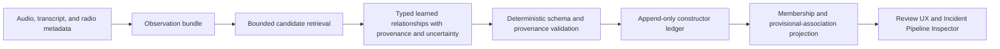

# Incident Pipeline Blank-Slate Architecture Decision

Date: 2026-07-17

Status: Accepted design baseline for the next incident-pipeline experiment.

## Decision

PizzaWave will not extend the semantic decision logic in the legacy, V2, or V3
incident pipelines. The next experiment will use a new, learned, open-world
event-state architecture running beside production in read-only shadow mode.

Existing incident implementations remain available only as production behavior,
comparison baselines, and sources of historical failure examples. They are not
the design foundation for the new pipeline.

The new pipeline must not use hard-coded words, regular expressions, event
categories, talkgroup lists, role labels, or hand-tuned score combinations to
decide:

- whether an incident exists;
- whether two observations describe the same event;
- which calls belong to an event;
- what an event means;
- whether a call is routine, administrative, logistical, or emergency traffic;
- which event should receive an update;
- what operator-facing title, detail, or category is correct.

Those decisions belong to learned event understanding and must remain explicit,
uncertainty-bearing, and traceable to source observations.

## Why A Blank Slate Is Required

The existing pipelines divide semantic authority across model output, retrieval,
regular expressions, extracted anchors, event-family tables, hand-tuned scores,
current incident titles, final validators, reconciliation, and repair logic.
V2 improved evidence visibility but retained fixed semantic policy. V3 introduced
candidate frames and guarded execution, but its resolver became another large
deterministic semantic policy engine and continued to depend on legacy
validation.

Historical replay scores do not prove that any of those semantic architectures
generalize. The evaluated sets were small, selected partly from known failures,
and repeatedly exposed to policy changes. Legacy decisions are also not ground
truth. Therefore the new architecture will not treat agreement with legacy, V2,
or V3 as correctness.

## Semantic Boundary

### Prohibited Semantic Authority

The following may not determine semantic outcomes, individually or in a
hand-authored combination:

- transcript keyword or phrase matching;
- regular-expression event detection;
- static event, call-role, or incident-type taxonomies;
- talkgroup allowlists, denylists, or talkgroup-to-event mappings;
- static category-to-event mappings;
- fixed lists of emergency, routine, transport, handoff, or administrative
  language;
- fixed compatibility matrices for people, vehicles, locations, or event types;
- hand-selected resolver weights, score margins, or semantic time windows;
- current titles or details treated as proof of event identity;
- retrieval similarity treated as proof of membership;
- legacy acceptance or rejection treated as truth.

Talkgroup, category, timing, location, unit, transcript, and radio-system data may
be provided to a learned model as observations. Their significance must be
inferred in context rather than imposed by application policy.

### Permitted Deterministic Controls

Deterministic code remains required for non-semantic integrity and safety:

- schema and type validation;
- call, incident, and observation identifier validation;
- source existence and referential integrity;
- authorization and feature-flag enforcement;
- transaction, concurrency, and idempotency controls;
- append-only audit integrity;
- model and prompt version recording;
- exact provenance checks, such as confirming that a cited transcript quotation
  or audio interval exists in its claimed source;
- resource limits, timeouts, retries, and malformed-output handling;
- fail-closed prevention of experimental production writes.

These controls may reject malformed or unauthorized operations. They may not
reinterpret evidence or make an incident decision.

## Architecture

### Production Resource Boundary

Paxan is the production compute target until it is explicitly replaced. As
observed on 2026-07-18, it has an Intel Core i9-13900K, 64 GB of system RAM, and
an RTX 4090 with 24 GB of VRAM. Its normal LM Studio workload already consumed
approximately 22.3 GB of VRAM during inspection. Designs must not treat nominal
GPU capacity as spare capacity while that workload is present.

Ventax, an RTX 5090 laptop used during development bakeoffs, is experiment
equipment only. It is not continuously available production infrastructure.
No production architecture, availability claim, throughput gate, or recovery
path may depend on Ventax.

Consequently, the production design may not require:

- multiple transcription models to remain resident concurrently;
- a second large audio model to coexist permanently with the production LLM;
- synchronous fan-out to multiple ASR models for every call;
- Ventax or another undeclared accelerator to keep ingestion current;
- benchmark throughput measured only on Ventax as evidence of Paxan viability.

Alternate transcription and direct-audio models remain valid experimental
comparators. A selective escalation path is eligible for production only after
it proves, on Paxan under representative concurrent load, that queue depth,
latency, VRAM transitions, and failure recovery remain acceptable. The default
architecture should preserve audio and uncertainty while minimizing always-on
model residency. A future dedicated production inference host is a separate,
explicit infrastructure decision rather than an assumption embedded in the
incident pipeline.

### Observation Bundle

The observation bundle is a lossless, bounded view of source material. It may
include:

- raw call audio or a stable reference to it;
- one or more transcript candidates;
- call start and stop times;
- system and talkgroup metadata;
- unit and radio identifiers when available;
- available location observations;
- recent learned event state;
- broadly retrieved neighboring observations.

Retrieval determines what the model can review. It does not establish event
identity or membership.

The bundle must preserve distinctions between source facts, derived metadata,
prior model claims, and operator corrections. Prior event state is context, not
proof.

### Rejected Required Observation-Normalization Stage

An experiment tested interpreting each observation independently before event
reasoning. Its contract had no event identifier, incident membership, event
category, or state-change field. It preserved possible readings, shared content,
unresolved questions, exact provenance, and uncertainty, followed by a separate
learned critique call.

The sparse development gate rejected that stage as a required production
boundary. Qwen and Gemma produced schema-valid but unsupported or incomplete
interpretations, and both same-model and cross-model critics approved the known
defects. One Qwen interpreter/critic pair took 74.8 seconds for a single
observation on Ventax. More model calls did not establish semantic grounding.

Raw transcript candidates and the audio reference therefore remain first-class
observation evidence. No learned paraphrase may replace or outrank them before
event reasoning. The interpretation contract and in-memory coordinator remain
available only as experiment scaffolding; they do not call the event proposer,
append the event-state ledger, or write production state.

A direct-audio sparse test reached the same boundary. Voxtral Mini's dedicated
transcription corrected a dangerous stored phrase, but its general
audio-instruction mode hallucinated a long repeated sentence on a nearly empty
clip. Direct access to audio is useful evidence access; it does not make a
generative semantic statement authoritative. Voxtral is not a production
candidate: it showed no established quality advantage on the reviewed difficult
clips, exhibited runaway repetition, and cannot coexist with Paxan's resident
production LLM within the observed 24 GB GPU boundary.

### Learned Event-State Proposer

The proposer consumes observations and the prior projected event state. It
returns open-world event hypotheses and proposed changes without choosing from a
fixed public-safety taxonomy.

Each proposal must express:

- a natural-language account of the possible real-world event;
- the observations believed to refer to it;
- claims about the event, each with source provenance;
- the proposed relationship between new observations and prior event state;
- alternative plausible interpretations;
- unresolved contradictions or missing information;
- uncertainty for the hypothesis, individual claims, and relationships;
- proposed additions, supersessions, or retractions to the event state.

The proposer must be allowed to conclude that the evidence is unresolved. It
must not be forced into a binary incident/non-incident answer.

The narrower pairwise relationship experiment failed after blind development
review. The admitted Gemma proposer output found only one of three
reviewer-confirmed relationships and preserved neither of two unresolved cases.
One omission appeared only in critic dissent and another relationship was
discarded for an inexact quote. The 10.4-to-77.9-second proposer-plus-critic
latency per pair is also incompatible with exhaustive real-time comparison on
Paxan. Pairwise calls are retained only as offline falsification scaffolding,
not a mandatory production boundary.

A separate hypothesis-transition contract proved that structural validation
can prevent uncited observation growth and that critic dissent cannot authorize
membership. Because its required pairwise evidence stage failed, that
coordinator will not become the next model experiment. It remains non-persisting
contract scaffolding with no store, scheduler, endpoint, or production writer.

The production-shaped single-generation experiment has now failed its
development gate. GLM 4.7 Flash produced no valid response in three fair
attempts at roughly 93 to 99 seconds each. Qwen 3.6 35B-A3B made the raw
relationship choice on four of six reviewed pairs, but forced both unresolved
pairs into distinct events and produced zero contract-valid state proposals.
Its requests took 54.7 to 70.6 seconds and the loaded model occupied about
20.55 GiB on the Ventax lab runtime. Neither model is a candidate live writer,
and these results do not justify moving inference to the 5090-class laptop.

The next boundary should make semantic model output evidence rather than a
state mutation. A bounded generator may propose typed, source-grounded evidence
about the new observation and a retrieved prior hypothesis. Application-owned
code validates exact sources and applies the ledger transition, or abstains.
Retrieval still limits context but never proves membership. Invalid output is
rejection, not input to a repair model. Learned critique remains an offline or
sampled evaluation instrument.

That narrower typed-evidence boundary has now been implemented and tested in a
standalone development harness. It removed state objects and observation
identifiers from model output and allowed invalid output only to defer. GPT-OSS
20B was fast and smaller (1.5 to 2.2 seconds, 11.28 GiB) but forced both
reviewer-unresolved cases into distinct events. Qwen 3.6 produced valid records
but falsely merged one unresolved pair, preserved only one of two uncertainties,
and took 23.6 to 46.4 seconds at 20.55 GiB. Neither earns automatic append or
create authority. The contract remains useful for non-mutating shadow evidence.

Using both models as a consensus stage is explicitly rejected. Their combined
Ventax residency was about 31.8 GiB, beyond Paxan's 24 GiB, and agreement is not
proof. The next evidence need is a larger blind development set enriched for
ambiguous continuity and generic acknowledgments, using clips not present in
the completed six-case review. Until then, automatic membership mutation is
blocked by insufficient and failed development evidence, not by implementation
work.

That 12-case blind expansion is now complete. GPT-OSS achieved 6 of 12 valid
correct decisions and preserved none of three unresolved cases. Qwen achieved
7 of 12 and preserved one of three. Each had one contract failure. Across all
18 reviewed development pairs, both recalled only 8 of 11 confirmed shared
relationships; GPT-OSS preserved 0 of 5 unresolved cases and Qwen preserved 2
of 5. The typed three-way decision therefore also fails as automatic mutation
authority, and the sealed held-out set must remain unopened.

If experimentation continues, the state model should remove
`supports_distinct_event` from learned authority. New observations remain
unresolved singletons unless a one-sided, source-grounded shared-event link is
admitted. A missing or rejected link does not prove a separate event. Even that
link-only form remains a non-mutating shadow proposal until it independently
meets precision, recall, stability, and Paxan gates.

### Current Constructor Decision (2026-07-21)

The successor to the binary link-only experiment is a typed, multi-candidate
incident constructor. For each observation passed to the constructor:

- application code creates a stable singleton event identity;
- retrieval supplies a bounded set of existing shadow events but grants no
  semantic authority;
- one model generation may return at most one `confirmed_membership` and zero
  or more `provisional_association` relationships;
- every relationship must cite exact transcript identifiers on both sides and
  preserve a natural-language explanation, alternatives, unresolved questions,
  and uncertainty;
- deterministic code validates only schema, identity, source ownership, and
  exact provenance;
- one valid confirmed membership assigns the observation to that existing
  shadow event;
- absent, invalid, or multiply confirmed output leaves the observation in its
  application-owned singleton;
- provisional associations are projected as reviewable edges and never merge
  events.

Omitted candidates remain unresolved. The model cannot assert that an omitted
candidate is a distinct event, and application code contains no semantic score,
keyword, category, talkgroup, label, or time threshold that upgrades a
relationship. The live service remains a sampled, disabled-by-default shadow
evaluation harness; it is not the future production ingestion adapter and does
not imply that production should perform one model request per radio call.

The previously described learned critic remains historical experiment
scaffolding. It is not in the constructor's admission path because prior tests
showed correlated approval of defects and unacceptable latency. A critic may be
used offline to evaluate new model or prompt versions, but cannot authorize
membership.

### Provenance

Provenance points to source observations rather than application-owned semantic
labels. Depending on the source, it may contain:

- call identifier;
- audio start and end offsets;
- transcript identifier and exact quotation;
- metadata field and observed value;
- prior ledger entry when the proposal revises an earlier claim.

Application code verifies that cited material exists. It does not decide what
the cited material means.

### Independent Learned Critic (Historical Evaluation Option)

The critic evaluates a proposal using the source bundle and prior state. It must
be invoked independently of the proposer response and should identify:

- unsupported claims;
- omitted plausible interpretations;
- unjustified call relationships;
- contradictions with source observations;
- identity changes that are insufficiently supported;
- uncertainty that the proposal understates;
- potential merges or splits that require additional evidence.

The critic returns an assessment with provenance and uncertainty, not a set of
static semantic rejection reasons. Agreement between proposer and critic is
evidence for evaluation; it is not by itself permission to write production
incidents.

### Append-Only Shadow Event Ledger

The experiment records observations, proposals, critiques, and superseding
decisions in an append-only ledger. It does not update `incidents` or
`incident_calls`.

The ledger must retain:

- source observation references;
- complete proposer output;
- complete critic output;
- model, prompt, configuration, and software versions;
- timestamps and processing latency;
- the prior state supplied to each model;
- the resulting projected state;
- operator adjudication when available;
- explicit links between an entry and any entry it supersedes.

No experimental decision is destructively overwritten. Corrections create new
entries and a new projection.

### Event-State Projection

The projection materializes the best current shadow interpretation from the
ledger. It exists for comparison and operator inspection only.

The projection contains open-ended event descriptions, supported claims,
observation membership, alternatives, contradictions, and uncertainty. Display
titles and summaries are generated from that current state and are never fed
back as authoritative identity evidence.

### Provisional Associations And Operator Review

A source-grounded relationship proposal that has not earned automatic incident
membership is a provisional association. It is not an incident and may not
change production incident membership, titles, summaries, lifecycle, alerts,
badges, notifications, or location aggregation merely because it exists.

The review unit is a provisional group of two or more calls, not a forced pair.
Each call remains independently reviewable so an operator can retain a supported
subset without accepting a weak member or discarding the whole group. The
evidence view must preserve which new call was connected to which prior calls;
membership is not inferred transitively from the fact that calls were displayed
together.

Dashboard placement follows current production ownership:

- a group touching one active incident appears inline as possible additions;
- a group touching multiple established incidents appears inline as a possible
  merge, with the effect requiring explicit review;
- a group without an active incident anchor appears in the Dashboard Review tab;
- evidence too weak to justify operator attention remains Inspector-only.

Operator actions are `confirm membership`, `reject membership`, and `defer`.
They are recorded as append-only adjudications against exact source calls and
the exact proposal version. During shadow evaluation, those actions do not write
`incidents` or `incident_calls`. Enabling an adjudication applier is a later,
separate production decision with its own authorization, transaction, audit,
undo, merge-preview, and rollout requirements.

Adjudications provide replay constraints, not uncontrolled online training. A
new model or prompt can be replayed against previously confirmed and rejected
relationships to measure confirmed-link recovery, rejected-link violations,
proposal workload per operating hour, latency, and malformed output. Because
operators see a selected subset of proposals, these measurements are regression
evidence and must not be presented as unbiased overall precision or recall.

## Relationship To Existing Work

### Retained Infrastructure

The following may be reused after confirming that it contains no semantic
policy:

- raw audio and call metadata access;
- read-only corpus export;
- replay orchestration;
- shadow scheduling and feature flags;
- model request accounting and health telemetry;
- append-only audit storage patterns;
- the Incident Pipeline Inspector presentation framework;
- transcription bakeoff collection tooling;
- deployment and health verification tooling.

### Retired Semantic Implementations

The following are not foundations for the new architecture:

- `IncidentCandidateValidator` semantic decisions;
- `IncidentEvidenceDecisionEngineV2` semantic policy;
- `IncidentFrameBuilderV3` frame membership, resolver, lifecycle, and scoring;
- V3 plan actions as the required model of incident behavior;
- regex-derived anchors used as incident proof;
- fixed call-role and event-type policies;
- legacy verifier, reconciliation, or audit decisions used as correctness
  labels.

Existing paths remain untouched while they operate production. The new shadow
experiment must not call them as an adjudication or validation stage.

## Evaluation

### Reference Outcomes

Evaluation requires human-adjudicated reference outcomes, but those outcomes
must not impose the old pipeline's categories. Reviewers describe, in ordinary
language:

- which real-world events appear to be present;
- which observations appear to describe each event;
- which claims are supported;
- which interpretations remain uncertain;
- where reviewers disagree.

Reference outcomes are evaluation evidence, not application rules. Reviewer
disagreement and unresolved cases remain part of the result rather than being
forced into artificial consensus.

### Corpus Discipline

Before model or prompt tuning, create versioned development and held-out sets
sampled from ordinary traffic as well as known failures. Include raw audio when
available. Known legacy, V2, and V3 failures may be included, but they must not
dominate the corpus.

The held-out set must remain unavailable to implementation iteration. Evaluation
criteria and rollout gates must be recorded before held-out results are viewed.

### Comparisons

Evaluate at least two new approaches over identical source observations:

1. transcript plus radio metadata;
2. audio plus transcript plus radio metadata.

Run legacy, V2, and V3 only as descriptive baselines. Do not optimize the new
system for agreement with them.

### Outcome Measures

Measure:

- event discovery and missed-event rate;
- observation membership precision and recall;
- incorrect event merges and splits;
- factual support and unsupported-claim rate;
- handling of genuine uncertainty;
- agreement with human reference outcomes and documented reviewer disagreement;
- stability across repeated runs;
- sensitivity to different transcript candidates;
- proposer/critic disagreement;
- latency, timeout, malformed-output, and cost behavior;
- operator ability to understand and correct the projected state.

Every reported improvement must identify regressions and held-out performance.
Anecdotes, unit tests, plan counts, and agreement with legacy are insufficient.

## Delivery Phases

### Phase 0: Production Containment

- Keep every experimental incident writer disabled.
- Verify current runtime flags before any deployment from `main`.
- Ensure a future deployment cannot enable an experimental writer through an
  incomplete flag combination.

This phase contains no semantic incident changes.

### Phase 1: Contract And Ledger

- Define the observation-bundle schema.
- Define the typed multi-candidate relationship schema.
- Add append-only shadow-ledger storage.
- Add provenance, versioning, and projection records.
- Add deterministic integrity tests only.

### Phase 2: Neutral Corpus

- Sample ordinary traffic before reviewing model output.
- Include known failures without allowing them to dominate selection.
- Create an independent human-adjudication protocol.
- Freeze development and held-out corpus versions.

### Phase 3: Shadow Prototypes

- Implement the transcript-based constructor proposer.
- Keep optional learned critique outside the admission path.
- Write only to the shadow ledger.
- Expose chronological evidence and state changes in the inspector.

### Phase 4: Evaluation

- Run repeated trials over development and held-out sets.
- Compare complete event stories, not isolated accept/reject decisions.
- Analyze model stability, provisional workload, and failure modes.
- Decide whether either approach merits live shadow observation.

### Phase 5: Read-Only Live Shadow

- Run the selected approach without production writes.
- Define the observation period and gates before starting.
- Review ordinary traffic, uncertain cases, regressions, latency, and cost.

Production persistence is a separate future architecture decision. It is not an
automatic final phase of this experiment.

## Acceptance Conditions For This Experiment

The blank-slate experiment may proceed when:

- the schemas contain no fixed event, role, category, or talkgroup ontology;
- application code contains no static semantic acceptance or membership policy;
- source provenance is verifiable without interpreting its meaning;
- every experiment output is append-only and shadow-only;
- the corpus and human-adjudication procedure are versioned;
- held-out gates are defined before results are viewed;
- the constructor can represent uncertainty and alternatives without forcing a
  semantic decision;
- production incident tables are unreachable from the experiment path.

## Open Questions

These require explicit decisions during the contract phase:

- Which audio-capable and transcript-only models should be compared?
- How much prior event state can be supplied without causing the model to copy
  stale interpretations?
- How should stable event identity be represented without making the current
  title or a model-generated identifier authoritative?
- How independent must the critic be from the proposer model and prompt family?
- What operator adjudication workflow is practical enough to produce reference
  outcomes without biasing reviewers toward existing incidents?
- What latency and cost envelope is acceptable for live shadow observation?
- What uncertainty should remain visible to operators rather than being collapsed
  into one projected story?

## Implementation Status On 2026-07-21

The development branch now contains the current constructor architecture as a
complete shadow path:

- typed multi-candidate proposal, transition, and projection contracts;
- exact source-side transcript citation validation and fail-closed transitions;
- append-only, hash-verified `incident_association_shadow_ledger` and
  `incident_association_shadow_projections` tables;
- application-owned singleton creation, one-confirmed-membership projection,
  and non-merging provisional-association edges;
- a disabled-by-default sampled runtime with bounded embedding retrieval and a
  single OpenAI-compatible model request per sampled observation;
- model identity and token-use recording;
- an Incident Constructor Shadow report in Performance > Incidents;
- Dashboard inline and Review-tab projections sourced from the new provisional
  association ledger;
- append-only operator adjudications that cannot mutate production membership.

The old link-only hosted service is retired. Its ledger, report endpoint, and
tests remain readable as historical experiment evidence. The production
`AutomaticInsightsService`, `incidents`, and `incident_calls` paths are not
called by the new constructor. No production cutover adapter exists, and both
the constructor runtime and any production writer remain disabled unless a
later deployment explicitly configures the shadow run.

### Earlier implementation history

The isolated development branch now contains the Phase 0 and Phase 1 safety
boundary:

- the V3 executor is retired to shadow-only behavior and cannot perform its
  mutating actions;
- open-world observation, proposal, critique, ledger, and projection contracts;
- deterministic provenance and reference-integrity validation;
- append-only, hash-verified shadow ledger and projection tables isolated from
  `incidents` and `incident_calls`;
- a neutral corpus adapter that retains source and application-derived metadata
  with explicit origin rather than treating either as semantic authority;
- separately invoked proposer and critic interfaces with validation before
  append.

Nothing schedules the new coordinator, exposes an endpoint, or writes
production incident state. Standalone development harnesses have now tested
observation interpretation, direct audio understanding, transcription, and
bounded pairwise relationship proposals. All three learned semantic approaches
were rejected as mandatory pipeline stages. Their deterministic failures and
proposer/critic disagreements remain experiment records, never membership
decisions.

The development and sealed held-out corpus split is already extracted. The
held-out directory remains unopened. A single bounded incremental proposal was
tested and rejected: GLM did not return usable content and all six Qwen state
proposals failed deterministic validation. A subsequent typed-evidence contract
improved structure and latency but failed to preserve reviewer uncertainty with
either GPT-OSS 20B or Qwen 3.6. It remains non-mutating shadow scaffolding. The
next development corpus expansion must contain no static event taxonomy,
talkgroup mapping, automatic semantic membership rule, production writer, or
scheduler. The already-frozen human adjudication criteria and quantitative
gates apply before any sealed held-out evaluation.

On 2026-07-20, the surviving link-only boundary was implemented locally as an
isolated shadow contract. A model may propose one exact-source-cited link from a
new observation to one bounded retrieved event, or abstain. It cannot assert a
distinct event or construct state. Application code validates the citations and
candidate token, appends the attempt to a dedicated hash-verified ledger, and
projects either the admitted link or an unresolved singleton. The implementation
has no scheduler, endpoint, production writer, or deployment configuration. See
`docs/incident-event-link-shadow.md`.
