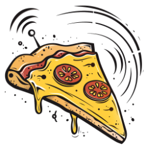
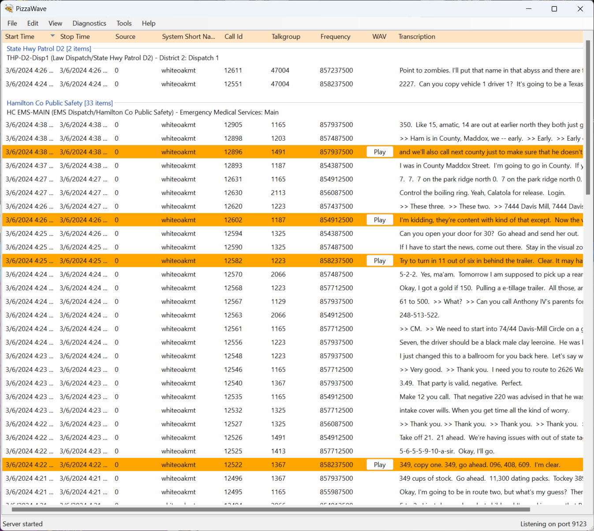
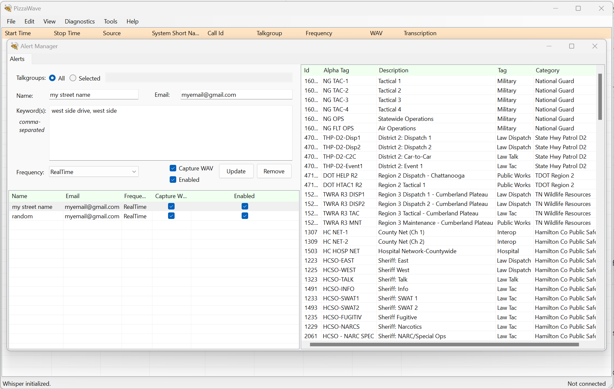

# pizzapi - Cross-Platform UI



`pizzapi` is a cross-platform .NET UI application built on [Avalonia UI](https://avaloniaui.net/). It provides the same functionality as [`pizzaui`](../pizzaui/README.md) but runs on Linux, macOS, and Windows.

## Requirements

* [.NET 9.0 runtime](https://dotnet.microsoft.com/download/dotnet/9.0)
* Linux (with X11/Wayland), macOS, or Windows
* For Raspberry Pi: Raspberry Pi OS (Debian-based) with desktop environment

## Installation

### Raspberry Pi / Debian-based Linux (Recommended)

Download and install the `.deb` package:

```bash
# Download the latest release
wget https://github.com/lilhoser/pizzawave/releases/latest/download/pizzapi_*_arm64.deb

# Install the package
sudo dpkg -i pizzapi_*_arm64.deb

# Fix any missing dependencies
sudo apt-get install -f
```

### WSL2 / Ubuntu (x64)

```bash
# Download the x64 package
wget https://github.com/lilhoser/pizzawave/releases/latest/download/pizzapi_*_amd64.deb

# Install
sudo dpkg -i pizzapi_*_amd64.deb
sudo apt-get install -f
```

### Manual Installation (All Platforms)

```bash
# Build from source
git clone https://github.com/lilhoser/pizzawave.git
cd pizzawave
dotnet publish pizzapi/pizzapi.csproj -c Release -r <RID> --self-contained true -o ./publish

# Run
./publish/pizzapi
```

Replace `<RID>` with your runtime identifier:
- `linux-arm64` - Raspberry Pi 5, ARM64 Linux
- `linux-x64` - Standard Linux (WSL2, Ubuntu, etc.)
- `osx-arm64` - Apple Silicon Mac
- `osx-x64` - Intel Mac
- `win-x64` - Windows

## Configuration

`pizzapi` shares the same configuration file as other pizzawave applications:

| Platform | Configuration Path |
|----------|-------------------|
| Linux | `~/.config/pizzawave/settings.json` |
| macOS | `~/.config/pizzawave/settings.json` |
| Windows | `%APPDATA%\pizzawave\settings.json` |

### First Run

On first run, `pizzapi` will create a default configuration file. You can edit it manually or use the built-in settings editor:

1. Launch `pizzapi`
2. Navigate to **Edit → Settings**
3. Configure your trunk-recorder connection, talkgroups, and alerts

### Key Settings

* **Listen Port** (default: 9123) - Port for callstream plugin to connect
* **Talkgroups** - CSV file with talkgroup definitions
* **Alerts** - Rules for keyword-based notifications
* **WavFileLocation** - Optional path to save call recordings

See [pizzalib README](../pizzalib/README.md) for complete settings reference.

## Usage

### Live Capture

1. Launch `pizzapi`
2. Navigate to **File → Call Manager → Start**
3. Calls will appear as they are received from trunk-recorder

### Open Existing Capture

1. Navigate to **File → Open Capture**
2. Browse to a previous capture folder
3. Review transcribed calls

### Alerts

1. Navigate to **Edit → Alerts**
2. Create rules with keywords and talkgroups
3. Matched calls are highlighted

### Export Data

- **View → Export → JSON** - Export all calls as JSON
- **View → Export → CSV** - Export all calls as CSV
- Right-click any call to copy or save individually

## Running Headless

`pizzapi` can run without a GUI for server deployments:

```bash
pizzapi --headless
```

Optional parameters:
- `--settings=<path>` - Custom settings file location
- `--help` - Show all command-line options

## Running as a Service

### systemd (Linux)

The `.deb` package installs a systemd service file. To enable:

```bash
sudo systemctl enable pizzapi
sudo systemctl start pizzapi
```

View logs:
```bash
journalctl -u pizzapi -f
```

### Launchd (macOS)

Create `/Library/LaunchDaemons/com.pizzawave.pizzapi.plist`:

```xml
<?xml version="1.0" encoding="UTF-8"?>
<!DOCTYPE plist PUBLIC "-//Apple//DTD PLIST 1.0//EN" "http://www.apple.com/DTDs/PropertyList-1.0.dtd">
<plist version="1.0">
<dict>
    <key>Label</key>
    <string>com.pizzawave.pizzapi</string>
    <key>ProgramArguments</key>
    <array>
        <string>/opt/pizzapi/pizzapi</string>
        <string>--headless</string>
    </array>
    <key>RunAtLoad</key>
    <true/>
    <key>KeepAlive</key>
    <true/>
</dict>
</plist>
```

```bash
sudo launchctl load /Library/LaunchDaemons/com.pizzawave.pizzapi.plist
```

## Troubleshooting

### Display Issues (Linux)

If you see errors about missing displays:

```bash
# Ensure X11 is running
echo $DISPLAY

# For Wayland, try X11 session instead
```

### Missing Libraries

```bash
# Debian/Ubuntu
sudo apt-get install libicu-dev libssl3 zlib1g libfontconfig1 libx11-6
```

### Permission Denied (Raspberry Pi)

```bash
# Ensure executable permission
sudo chmod +x /opt/pizzapi/pizzapi
```

### No Audio from trunk-recorder

1. Verify trunk-recorder callstream plugin is configured with correct IP
2. Check firewall allows port 9123
3. Verify `pizzapi` is listening: `netstat -tlnp | grep 9123`

## Comparison with pizzaui

| Feature | pizzapi | pizzaui |
|---------|---------|---------|
| Platform | Linux/macOS/Windows | Windows only |
| UI Framework | Avalonia | WinForms |
| Package | .deb, manual | MSI, manual |
| Service | systemd, launchd | Windows Service |
| Performance | Similar | Similar |

**Recommendation**: Use `pizzapi` for Linux/macOS deployments. Use `pizzaui` for Windows-only environments.

## Screenshots

### Main Window


### Settings Editor


## See Also

* [Main README](README.md) - Overview of pizzawave project
* [Deployment Guide](deployment.md) - Detailed deployment instructions
* [Building Guide](building.md) - Build from source instructions
* [pizzaui README](../pizzaui/README.md) - Windows UI alternative
