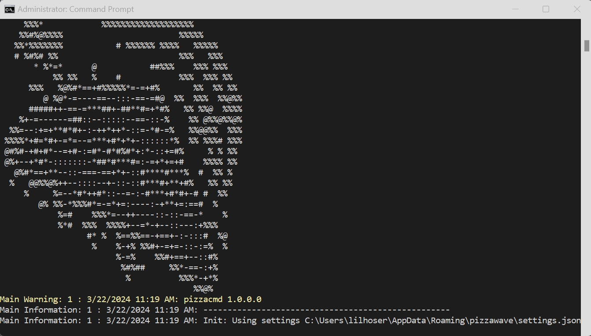

# pizzacmd - Command Line Application


`pizzacmd` is a .NET command line application built on top of the [`pizzalib`](../pizzalib/README.md) library.



## Requirements

* [Requirements as specified in the `pizzawave` README](../docs/README.md)
* [Requirements as specified in the `pizzalib` README](../pizzalib/README.md)
* A supported operating system (Windows, Linux, macOS) running .NET 9.0 or later

## Installation

### From Source

```bash
# Clone and build
git clone https://github.com/lilhoser/pizzawave.git
cd pizzawave
dotnet publish pizzacmd/pizzacmd.csproj \
  -c Release \
  -r <RID> \
  --self-contained true \
  -o ./publish
```

Replace `<RID>` with your runtime identifier:
- `win-x64` - Windows
- `linux-x64` - Linux (WSL2, Ubuntu, etc.)
- `linux-arm64` - Raspberry Pi 5
- `osx-arm64` - Apple Silicon Mac
- `osx-x64` - Intel Mac

Build output is organized in the `artifacts/` folder by project.

## Usage

### Basic Usage

```bash
# Run with talkgroups file
pizzacmd --talkgroups=/path/to/talkgroups.csv

# Run with custom settings
pizzacmd --settings=/path/to/settings.json
```

### Command Line Options

| Option | Description |
|--------|-------------|
| `--talkgroups=<path>` | Path to talkgroups CSV file |
| `--settings=<path>` | Custom settings file location |
| `--help` | Show help information |

## Configuration

`pizzacmd` uses the same configuration as other pizzawave applications:

| Platform | Configuration Path |
|----------|-------------------|
| Windows | `%APPDATA%\pizzawave\settings.json` |
| Linux | `~/.config/pizzawave/settings.json` |
| macOS | `~/.config/pizzawave/settings.json` |

See [`pizzalib` README](../pizzalib/README.md) for complete settings reference.

## Running on WSL2

### Port Forwarding

Remember that `trunk-recorder` needs to be configured to communicate with the server. If you're running `pizzacmd` from within a Linux OS in WSL2 on Windows, you'll need to make sure the WSL2 instance is configured to receive the network traffic:

```powershell
# From Windows PowerShell (Admin)
netsh interface portproxy add v4tov4 listenport=[PORT] listenaddress=0.0.0.0 connectport=[PORT] connectaddress=[WSL_IP]
```

Replace `[PORT]` with your listen port, such as `9123` and `[WSL_IP]` with your WSL instance IP address, e.g., `172.23.192.16`.

### Running as a Service (WSL2/Linux)

Create a systemd service file:

```bash
sudo nano /etc/systemd/system/pizzacmd.service
```

```ini
[Unit]
Description=Pizzawave Command Line
After=network.target

[Service]
Type=simple
ExecStart=/home/username/pizzacmd/pizzacmd --talkgroups=/home/username/talkgroups.csv
WorkingDirectory=/home/username/pizzacmd
Restart=always
User=username

[Install]
WantedBy=multi-user.target
```

```bash
sudo systemctl enable pizzacmd
sudo systemctl start pizzacmd
sudo systemctl status pizzacmd
```

## Troubleshooting

### Whisper Runtime Issues

If you receive an error like this:

```
Whisper Error: Failed to transcribe WAV data: Failed to load native whisper library. Error: Unknown error
```

It most likely means you have the wrong `Whisper.net` runtime installed. For Linux, you must install either:

* `Whisper.net.Runtime.Cuda` - For NVIDIA GPUs with CUDA support
* `Whisper.net.Runtime` - CPU-only inference (works everywhere)

### Linux Dependencies

```bash
# Install required libraries
sudo apt-get install -y libicu-dev libssl3 zlib1g
```

### No Audio from trunk-recorder

1. Verify trunk-recorder callstream plugin is configured with correct IP
2. Check firewall allows port 9123
3. Verify `pizzacmd` is listening: `netstat -tlnp | grep 9123`

## See Also

* [pizzaui](../pizzaui/README.md) - Windows UI application
* [pizzapi](../docs/pizzapi.md) - Cross-platform UI application
* [pizzalib](../pizzalib/README.md) - Core library
* [Main README](../docs/README.md) - Project overview
* [Deployment Guide](../docs/deployment.md) - Deployment instructions
