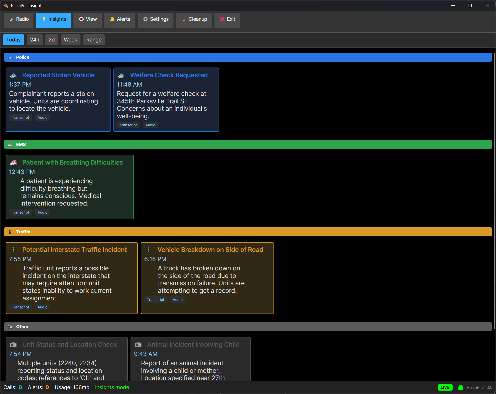

# PizzaPi

An [Avalonia](https://avaloniaui.net/)-based cross-platform user interface for monitoring trunked radio communications using Trunk-Recorder and the Callstream plugin.

Note: While I encourage the use of the cross-platform PizzaPi UI App, for a Windows-only solution, please see [pizzaui](../pizzaui).

## Overview

PizzaPi provides a real-time display of trunked radio communications, allowing users to:
- View live and recorded calls
- Display talkgroup information
- Monitor multiple control channels
- Manage alerts and offline modes

## Setup on Raspberry Pi

For complete installation and configuration instructions, see [WALK-THROUGH.md](./WALK-THROUGH.md).
