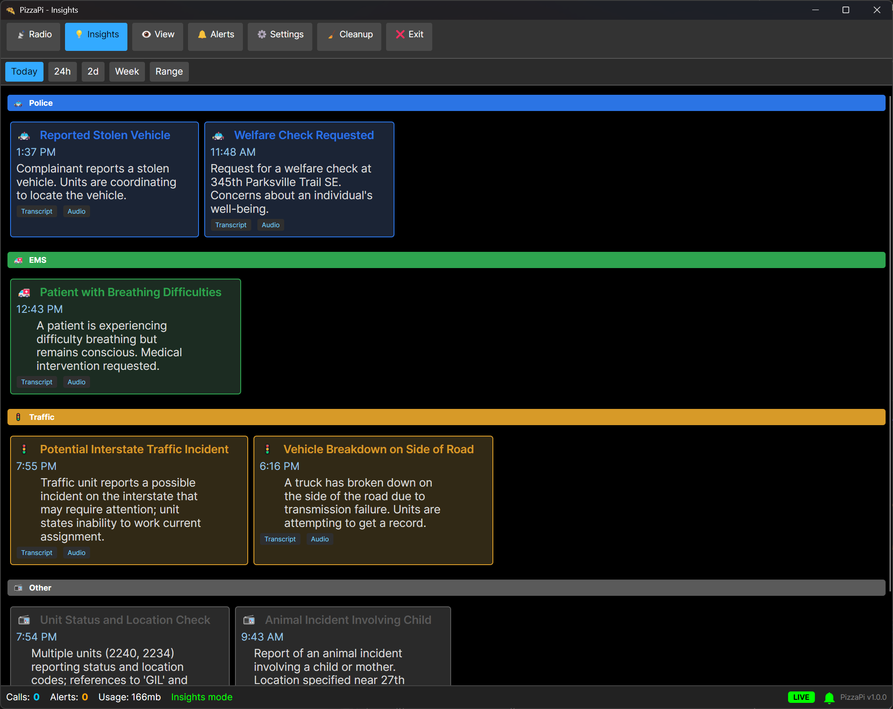

# PizzaPi (pizzapi)

Avalonia-based cross-platform UI for PizzaWave.
Recommended for all new deployments. (`pizzaui` is deprecated and maintenance-only.)

## Summary

PizzaPi receives callstream traffic from trunk-recorder, transcribes calls, shows live/range views, and supports AI Insights summaries.

## Documentation

- Main project docs: [../docs/README.md](../docs/README.md)
- pizzapi guide: [../docs/pizzapi.md](../docs/pizzapi.md)
- Raspberry Pi walkthrough: [WALK-THROUGH.md](./WALK-THROUGH.md)
- Settings schema: [../docs/settings-schema.md](../docs/settings-schema.md)
- Insights behavior matrix: [../docs/insights-behavior-matrix.md](../docs/insights-behavior-matrix.md)
- Operational limits: [../docs/operational-limits.md](../docs/operational-limits.md)

## Quick Start

1. Install package or publish from source.
2. Launch `pizzapi` once to create `settings.json`.
3. Open `Settings` pane and configure:
   - `listenPort`
   - transcription model/engine
   - optional email/app password
   - optional LM Link settings for Insights
4. Point trunk-recorder callstream to this host/port.

## UI Basics

- `Radio`: Live call flow and historical call ranges
  - defaults to `24h`
  - `24h` is a rolling memory window primed from disk at startup
  - `2d/week/range` are historical disk lookups
- `Insights`: Summary tiles by category/time range
- `Alerts`: Alert rule management
- `Settings`: App/runtime/LM/email configuration
- `View`: display options (including font size)

## Talkgroups (Current)

- `Settings -> Talkgroups` is the primary talkgroup workflow.
- `Import CSV` loads RR/TR-style CSV data into staged mappings.
- `Build CSV` crawls a RadioReference SID page (`https://www.radioreference.com/db/sid/<SID>`), parses Talkgroups tables, stages mappings, and auto-exports a Trunk Recorder CSV.
- `Apply` performs the live switchover (stop live manager, publish new snapshot, restart manager).

Authoritative store:
- `talkgroup-mappings.json` (working directory).
- `settings.json` `Talkgroups` is not used as the source of truth for resolving calls in `pizzapi`.

Trunk Recorder export:
- Output file: `talkgroups-tr-<sid>.csv`
- Header: `Decimal,Hex,Mode,Alpha Tag,Description,Tag,Category`

## Notes

- Opening `Insights` auto-selects `Today`.
- `Today` may trigger summarization for current live backlog.
- `24h`, `2d`, `Week`, `Range` in Insights load persisted summaries.
